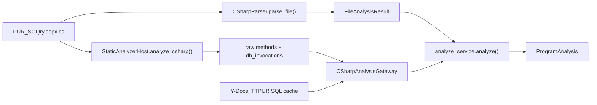

# PUR C# Analyzer 實例：`PUR_SOQry`

這份文件使用 TTPUR 的真實原始碼，展示 C# analyzer 實際產出的三層結果：

1. `CSharpParser` 的 `FileAnalysisResult`：類別、方法、行號、inline SQL 與 legacy SP name。
2. `StaticAnalyzerHost` 的 raw Roslyn facts：方法 source span 與 database invocation facts。
3. `analyze_service.analyze()` 對外組出的 `ProgramAnalysis`：RAG/Agentic 可以消費的 API 形狀。

本例不使用 synthetic C#。原始檔案是：

```text
D:\PUR\TTPUR\Orders\PUR_SOQry.aspx.cs
```

SQL 對照來自本機的真實 cache：[data/sql_cache/Y-Docs_TTPUR__dbo.json](../data/sql_cache/Y-Docs_TTPUR__dbo.json)。

## 1. 實際分析流程

相關實作位於 [code_analyzer/csharp_parser.py](../code_analyzer/csharp_parser.py)、[code_analyzer/static_analyzer_host.py](../code_analyzer/static_analyzer_host.py)、[service/analyze_service.py](../service/analyze_service.py) 與 [service/schemas.py](../service/schemas.py)。



實際專案掃描時，`ProjectScanner.scan_project()` 先執行 `StaticAnalyzerHost`，再把同一個檔案交給 `CSharpParser`；結果會保存到 `ProjectScanResult` 與 `data/scan_cache`。本文件另外直接對單一 PUR 檔案執行兩個 analyzer，讓輸出容易閱讀。

## 2. 原始 C# 對照

### 查詢流程

`PUR_SOQry.aspx.cs` 的查詢入口是 `btnQry_Click`，先執行 `CheckQryData()`，再進入 `BindData("Qry")`。`BindData` 把畫面條件組成 13 個 `SqlParameter`，最後呼叫 `usp_SO_Qry`：

```csharp
protected void btnQry_Click(object sender, EventArgs e) {
    if (CheckQryData()) {
        gvData.DataSource = BindData("Qry");
        gvData.DataBind();
    }
}

DataTable BindData(string type) {
    // ... 建立 @CusID、@SONO、日期、廠商、訂單種類等 13 個參數
    DataTable dt = obj.CreateTable("usp_SO_Qry", par, "table", "SP");
    return dt;
}
```

### 取消流程

ASPX 的 GridView 在 `PUR_SOQry.aspx` 綁定 `OnRowDeleting="gvData_RowDeleting"`，取消按鈕的 `CommandName="Delete"` 會進入下列 C# handler：

```csharp
protected void gvData_RowDeleting(object sender, GridViewDeleteEventArgs e) {
    string syskey = gvData.DataKeys[e.RowIndex]["SysKey"].ToString().Trim();

    DeleteData(syskey);
}

void DeleteData(string syskey) {
    SqlParameter[] par = new SqlParameter[2];
    par[0] = new SqlParameter("@SysKey", syskey);
    par[1] = new SqlParameter("@EditAccount", UserAccount.UserID);

    SqlDataReader dr = obj.ExeProcRead("sp_SO_Delete_Edit1", par);
    // ...依回傳值 0/1/2/3 顯示訊息或導向確認頁
}
```

這裡可以先看到一條完整的 C# method chain：

```text
gvData_RowDeleting -> DeleteData -> sp_SO_Delete_Edit1
```

但 `sp_SO_Delete_Edit1` 是 SQL module，不是 `call_chain_builder.py` 所建立的同檔 C# method，因此它不會出現在純 C# `call_chains` 裡；它需要經過 database invocation 與 SQL Execution Graph join。

## 3. `CSharpParser` 輸出

執行 `CSharpParser().parse_file(...)` 後，這個檔案的摘要如下：

```json
{
  "file_path": "D:\\PUR\\TTPUR\\Orders\\PUR_SOQry.aspx.cs",
  "file_type": "cs",
  "framework": "ASP.NET WebForms",
  "namespace": "TTPUR.Orders",
  "class": "PUR_SOQry",
  "method_count": 15,
  "stored_procedure_call_count": 2,
  "inline_sql_query_count": 4,
  "line_count": 314,
  "code_line_count": 251,
  "comment_line_count": 17,
  "blank_line_count": 46,
  "errors": [],
  "warnings": []
}
```

### 方法清單

| 方法 | access | return type | 行號 | 行數 | 這個案例的意義 |
|---|---|---:|---:|---:|---|
| `Page_Load` | `protected` | `void` | 15 | 8 | 初次載入時綁定四個下拉選單 |
| `BindSelCustomer` | implicit `private` | `void` | 23 | 8 | 讀取 `view_selCustomer` |
| `BindSelVendor` | implicit `private` | `void` | 32 | 8 | 讀取 `view_selVendors` |
| `BindSelOrderType` | implicit `private` | `void` | 41 | 8 | 讀取 `OrderType` |
| `BindSelMOT` | implicit `private` | `void` | 50 | 8 | 讀取 `MOT` |
| `CheckQryData` | implicit `private` | `bool` | 59 | 73 | 檢查查詢條件與日期格式 |
| `BindData` | implicit `private` | `DataTable` | 133 | 43 | 組參數並呼叫 `usp_SO_Qry` |
| `DeleteData` | implicit `private` | `void` | 177 | 40 | 呼叫 `sp_SO_Delete_Edit1` 並重新查詢 |
| `SetColumnsName` | implicit `private` | `DataTable` | 218 | 16 | 將欄位名稱轉成畫面文字 |
| `btnQry_Click` | `protected` | `void` | 236 | 12 | 查詢按鈕事件 |
| `btnExportToExcel_Click` | `protected` | `void` | 249 | 17 | 匯出 Excel 事件 |
| `btnNew_Click` | `protected` | `void` | 267 | 3 | 導向新增頁 |
| `gvData_RowDataBound` | `protected` | `void` | 271 | 28 | 控制取消/更新圖示與按鈕可見性 |
| `gvData_RowDeleting` | `protected` | `void` | 300 | 5 | GridView 取消事件 |
| `gvData_Sorting` | `protected` | `void` | 306 | 7 | 查詢結果排序 |

### SP 呼叫

`FileAnalysisResult.stored_procedure_calls` 找到兩筆：

| C# method | line | SP | database source | 呼叫 wrapper |
|---|---:|---|---|---|
| `BindData` | 174 | `usp_SO_Qry` | `PUR` | `obj.CreateTable(..., "SP")` |
| `DeleteData` | 183 | `sp_SO_Delete_Edit1` | `PUR` | `obj.ExeProcRead(...)` |

### inline SQL

`FileAnalysisResult.sql_queries` 只包含直接寫在 C# 字串裡的 SQL，不會自動展開 SP 內部 SQL：

| method | line | type | analyzer 找到的 table/view |
|---|---:|---|---|
| `BindSelCustomer` | 25 | `SELECT` | `VIEW_SELCUSTOMER` |
| `BindSelVendor` | 34 | `SELECT` | `VIEW_SELVENDORS` |
| `BindSelOrderType` | 43 | `SELECT` | `ORDERTYPE` |
| `BindSelMOT` | 52 | `SELECT` | `MOT` |

因此，單看 C# parser 結果時看不到 `SOrder` 是合理的：`SOrder` 出現在 `usp_SO_Qry` 的 SQL definition 裡，不在 `PUR_SOQry.aspx.cs` 的 inline SQL 字串裡。

### 同檔 C# call chains

使用 [service/call_chain_builder.py](../service/call_chain_builder.py) 的 `build_call_chains()`，本例得到的代表性結果是：

```text
Page_Load -> BindSelCustomer
Page_Load -> BindSelVendor
Page_Load -> BindSelOrderType
Page_Load -> BindSelMOT
btnQry_Click -> CheckQryData
btnQry_Click -> BindData
btnExportToExcel_Click -> CheckQryData
btnExportToExcel_Click -> BindData
btnExportToExcel_Click -> SetColumnsName
gvData_RowDeleting -> DeleteData -> BindData
gvData_Sorting -> BindData
```

這個結果回答的是「C# 方法之間如何互相呼叫」，不是「SP 內部如何存取資料表」。後者要看 SQL cache 或 Execution Path。

## 4. `StaticAnalyzerHost` raw output

`StaticAnalyzerHost` 是 repository-owned 的 Roslyn analyzer。對這個檔案執行 `analyze_csharp()` 後，回傳 `contract_version=1`、15 個 method source span，以及 2 個 raw `db_invocations`。

方法 span 的形狀如下，offset 是 source snapshot 的 UTF-16 offset：

```json
{
  "contract_version": 1,
  "source_id": "f2966c07576d3b23d823b6edbf4f65439c96f32f0a00cf1f47b34c2e0b8456f6",
  "methods": [
    {"class_name": "PUR_SOQry", "method_name": "Page_Load", "start_offset": 425, "end_offset": 675},
    {"class_name": "PUR_SOQry", "method_name": "BindData", "start_offset": 5430, "end_offset": 7896},
    {"class_name": "PUR_SOQry", "method_name": "DeleteData", "start_offset": 7908, "end_offset": 9876},
    {"class_name": "PUR_SOQry", "method_name": "gvData_RowDeleting", "start_offset": 13292, "end_offset": 13501}
  ]
}
```

上面只列出 15 個 span 中與本案例相關的 4 個；完整 method name 清單就是前一節的 15 個方法。

database invocation raw facts 的完整重點如下：

```json
{
  "db_invocations": [
    {
      "class_name": "PUR_SOQry",
      "method_name": "BindData",
      "command_text_kind": "literal",
      "command_text": "usp_SO_Qry",
      "command_type_stored_procedure": true,
      "connection_expression": "obj",
      "invocation_kind": "source_wrapper",
      "wrapper_method_name": "CreateTable",
      "wrapper_source_available": false,
      "wrapper_reaches_stored_procedure_sink": false,
      "wrapper_mode": "stored_procedure",
      "method_chain": ["BindData", "CreateTable"]
    },
    {
      "class_name": "PUR_SOQry",
      "method_name": "DeleteData",
      "command_text_kind": "literal",
      "command_text": "sp_SO_Delete_Edit1",
      "command_type_stored_procedure": false,
      "connection_expression": "obj",
      "invocation_kind": "source_wrapper",
      "wrapper_method_name": "ExeProcRead",
      "wrapper_source_available": false,
      "wrapper_reaches_stored_procedure_sink": false,
      "wrapper_mode": "unknown",
      "method_chain": ["DeleteData", "ExeProcRead"]
    }
  ]
}
```

這裡的 raw output 很重要：Roslyn 已經把兩個 literal SP name 與所在 method 找出來，但它也誠實保留了 wrapper source 尚未解析的事實。raw facts 本身不替資料庫存在性或呼叫可信度下結論。

## 5. `ProgramAnalysis` API projection

`ProgramAnalysis` 的欄位定義在 [service/schemas.py](../service/schemas.py)。使用真實 `PUR_SOQry.aspx.cs`、真實 Roslyn raw facts 與同一個 `analyze_service.analyze()` 組裝後，輸出的重要形狀如下：

> 驗證方式：這段 projection 是以真實原始碼與 raw facts 建立單檔 `ProjectScanResult`，再呼叫同一個 `analyze_service.analyze()` 組裝；為了隔離 API 欄位，範例使用 `include_execution_paths=False`，並在 in-memory harness 代入本機 PUR root。它不是完整 live HTTP scan，但 `ProgramAnalysis` 的組裝邏輯與正式服務相同。

```json
{
  "program": "PUR_SOQry",
  "file": "Orders\\PUR_SOQry.aspx.cs",
  "framework": "ASP.NET WebForms",
  "methods": [
    {"name": "Page_Load", "class": "PUR_SOQry"},
    {"name": "BindData", "class": "PUR_SOQry"},
    {"name": "DeleteData", "class": "PUR_SOQry"},
    {"name": "gvData_RowDeleting", "class": "PUR_SOQry"}
  ],
  "stored_procedures": [],
  "tables": ["VIEW_SELCUSTOMER", "VIEW_SELVENDORS", "ORDERTYPE", "MOT"],
  "call_chains": [
    ["btnQry_Click", "BindData"],
    ["gvData_RowDeleting", "DeleteData", "BindData"]
  ],
  "database_invocations": [
    {
      "method_name": "BindData",
      "database": "PUR",
      "procedure_name": null,
      "evidence": "unresolved",
      "reason": "wrapper_source_unavailable"
    },
    {
      "method_name": "DeleteData",
      "database": "PUR",
      "procedure_name": null,
      "evidence": "unresolved",
      "reason": "wrapper_source_unavailable"
    }
  ],
  "execution_paths": [],
  "compact_execution_paths": []
}
```

這個結果乍看會有一個差異：`CSharpParser` 找到兩支 SP，但 `ProgramAnalysis.stored_procedures` 是空的。原因不是原始碼沒有 SP name，而是正式 API 路徑使用 `CSharpAnalysisGateway` 的 evidence-rated invocation；目前這兩個企業自訂 wrapper 的 source 尚未納入 gateway 可驗證的 sink，因此兩筆被保留在 `database_invocations`，但評為 `unresolved`，不會被提升成 `stored_procedures` 或 proven Execution Path。

另外，`call_chains` 中的 `gvData_RowDeleting -> DeleteData -> BindData` 是「可到達的同檔方法鏈」。它不代表每一筆 invocation 的直接 caller 都是 `gvData_RowDeleting`；若要區分直接 caller、完整祖先鏈與跨 wrapper chain，應以 `method_chain`、source span 及 path evidence 一起閱讀。

## 6. PUR SQL 對照：`SOrder`

真實 SQL cache 的 `sp_SO_Delete_Edit1` definition 顯示它確實會讀寫 `SOrder`：

```sql
-- sp_SO_Delete_Edit1
SELECT @DeliveryFlag = InvFlag,
       @OrderCancel = OrderCancel,
       @SONO = SONO
FROM SOrder
WHERE SysKey = @SysKey;

DELETE SOrder
WHERE SysKey = @SysKey;

UPDATE SOrder
SET CancelTime = GETDATE(),
    CancelBy = @EditAccount
WHERE SysKey = @SysKey
  AND OrderCancel = 0;
```

`usp_SO_Qry` 則是查詢端：

```sql
-- usp_SO_Qry
SELECT ...
FROM dbo.SOrder
LEFT OUTER JOIN view_selVendors V
  ON SOrder.VendorNo = V.VendorNo
INNER JOIN dbo.Customers
  ON dbo.SOrder.CusID = dbo.Customers.CusID
INNER JOIN dbo.OrderType
  ON dbo.SOrder.SOType = dbo.OrderType.OrderTypeCode;
```

所以這個 PUR 案例的實際關係可以整理成：

| 使用者操作 | C# 入口 | C# method chain | SP | SQL 端資料表行為 |
|---|---|---|---|---|
| 查詢正式訂單 | `btnQry_Click` | `btnQry_Click -> BindData` | `usp_SO_Qry` | 讀取 `SOrder`，並 join `Customers`、`OrderType`、`view_selVendors` |
| GridView 取消訂單 | `gvData_RowDeleting` | `gvData_RowDeleting -> DeleteData` | `sp_SO_Delete_Edit1` | 依條件 `DELETE` 或 `UPDATE SOrder`，也處理 `POrder`、`POWork` |

這也是為什麼單看 C# inline `tables` 不足以回答「誰會寫入 `SOrder`」：真正的 write operation 在 SP definition 中。需要 SQL cache、SQL Execution Graph 與 source-backed path evidence 才能把兩層接起來。

## 7. 這份輸出能確定什麼

| 分析層 | 本例可以確定 | 本例目前不能直接確定 |
|---|---|---|
| `CSharpParser` | `PUR_SOQry` 是 WebForms；15 個方法；方法行號；4 個 inline SELECT；兩個 literal SP name | SP 內部讀寫哪些 table；wrapper 是否一定落到 SP sink |
| `StaticAnalyzerHost` | method source span；`BindData`/`DeleteData` 的 raw invocation；connection expression 是 `obj` | 未提供 wrapper source 時，不能自行證明 `CreateTable`/`ExeProcRead` 的完整 sink semantics |
| `CSharpAnalysisGateway` | database expression 可解析到 `PUR`；兩筆 invocation 需要進一步處理 | 目前不能把這兩個 wrapper invocation 評為 `proven` |
| SQL cache | `usp_SO_Qry` 讀取 `SOrder`；`sp_SO_Delete_Edit1` 會讀、刪除或更新 `SOrder` | 不能單靠 SQL cache 判斷哪個畫面事件呼叫它 |
| `ProgramAnalysis` | 對外提供 methods、inline tables、C# call chains、evidence diagnostics | 沒有 proven invocation 時，不會產生可信的 selected Execution Path |

另有一個 parser 讀取限制：此檔案原始 C# 明確有 `Page_Load(object sender, EventArgs e)` 與 `DeleteData(string syskey)`，但目前 `MethodInfo.parameters` 輸出仍是空清單。因此現階段應以 method name、行號、source span 與實際 snippet 為主，不應把 `parameters` 欄位當成完整 C# signature。

## 8. 結論

這份 PUR 實例呈現的不是單一「解析成功/失敗」結果，而是三種不同責任：

1. `CSharpParser` 適合快速回答「有哪些 C# method、inline SQL、傳了哪些 SP name」。
2. `StaticAnalyzerHost` 保留 Roslyn 可驗證的 source span 與 raw database facts。
3. `CSharpAnalysisGateway`、SQL cache 與 Execution Path layer 才負責把 raw fact 提升成 database-scoped、可引用的 evidence。

因此，`PUR_SOQry` 的真實流程目前可以可靠地讀成：

```text
GridView 取消事件
  -> PUR_SOQry.gvData_RowDeleting
  -> PUR_SOQry.DeleteData
  -> sp_SO_Delete_Edit1
  -> SOrder 的 DELETE / UPDATE（由 SQL cache definition 證明）
```

但要讓這條鏈在正式 `ProgramAnalysis.compact_execution_paths` 中成為 `proven` path，下一個工程工作會是補足 `CreateTable` 與 `ExeProcRead` 這類 TTPUR wrapper 的可驗證 sink metadata；這與 `select_relevant` 是不同層次的問題，不能用語意 snippet selection 取代。