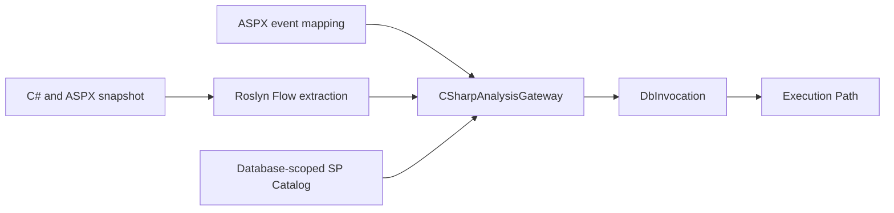
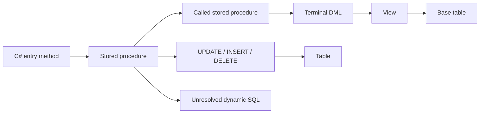
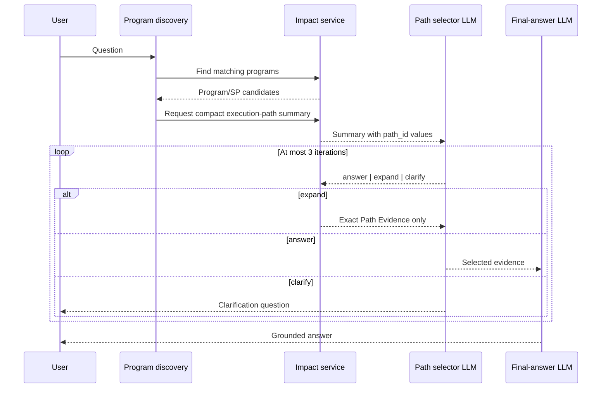

# SQL Execution Graph Design

## Goal

Replace the current SQL cache `dependencies` / `depends_on` / `depended_by` data with a typed, AST-backed graph. The graph lets the coordinator show compact SQL execution paths first, then expand only the path selected by an LLM.

The design preserves the boundary that Impact Analysis is deterministic and contains no LLM calls. The LLM runs only in `llamaindex-spec-rag`.

## Analyzer Comparison

| Capability | Existing Python `SQLAnalyzer` | `SQL_analyze` ScriptDom analyzer | Decision |
|---|---|---|---|
| Database connection and SQL cache | Owns the current refresh and cache flow | No database access | Keep in Python |
| Full SQL object definitions and schema | Retrieves SP/View/Function/Table definitions | Consumes one definition at a time | Keep in Python |
| DML order and branch conditions | Not available | `sequence_in_sp`, `branch_path`, `WHERE`, write columns | Move to ScriptDom |
| CTE and temp-table lineage | Regex fallback only | Structured CTE expansion and temp lineage | Move to ScriptDom |
| SP calls | Regex-based downstream expansion | Must be added as AST visitor output | Implement in ScriptDom |
| Dynamic SQL | Boolean detection only | Must emit an unresolved operation | Implement in ScriptDom |

The C# analyzer replaces SQL relationship analysis, not database connection, cache persistence, or object retrieval.

## Static Analyzer Host

Roslyn and ScriptDom remain separate analysis modules but are packaged behind one versioned `StaticAnalyzerHost` process. Python invokes one executable contract with distinct C# and SQL commands instead of locating and coordinating two unrelated DLL entry points.

The analyzer source projects are part of the repository. Generated `bin`, `obj`, DLL, and executable files are build outputs and are included only in deployment artifacts. Startup and refresh paths validate the .NET runtime, host availability, and JSON contract version before analysis begins.

## C# Analysis Gateway

`CSharpAnalysisGateway` is the single boundary for source-derived C# facts. It consumes C# source snapshots, ASPX event bindings, and the refreshed SP Catalog for the resolved database. It returns method Flow and `DbInvocation` records; Python-side orchestration persists these records and joins them with the SQL Execution Graph.



### Database Invocation Evidence

| Evidence | Example | Result |
|---|---|---|
| `proven` | `SqlCommand` with `CommandType.StoredProcedure` and a matching SP Catalog entry | Formal SP relationship |
| `proven` | Source-available wrapper reaches the same ADO.NET sink and the call supplies its SP mode | Formal SP relationship |
| `likely` | Literal first argument matches the resolved database's Catalog but the wrapper chain is incomplete | Candidate shown with evidence level |
| `unresolved` | Dynamic SQL, unknown variable value, missing wrapper source, or ambiguous cross-database name | Preserve the call without guessing a target |

Database resolution always scopes Catalog matching. When a connection source cannot be resolved, a candidate name is `likely` only if it is unique across known Catalogs; the same name in multiple databases remains `unresolved`.

### Source Storage

The scan cache stores one complete C# file snapshot per current scan root, addressed by a content hash. Method Flow, database invocations, and Execution Paths reference that snapshot through file identity and source spans. SQL cache continues to hold full SQL module definitions. This preserves complete C# and SQL evidence for path expansion without copying the same source text into every path.

Only the latest snapshot per scan root is retained. `refresh_cli` replaces it; historical comparisons belong to Git history rather than scan storage.

### Migration Gate

The existing regex SP detector is temporary comparison-only infrastructure. It stops producing formal relation data only after representative systems demonstrate that:

1. Existing direct SP detections are present in Gateway output or explicitly `unresolved` with a reason.
2. Direct `SqlClient`, source-available wrappers, variable branches, Dapper, and EF each have fixtures.
3. Inline SQL and ordinary methods are not falsely classified as `proven` SP calls.
4. New-versus-legacy differences are emitted as a reviewable report instead of requiring review of every call.

## Graph Model

`sql_execution_graph` is the only persisted relationship model. The cache no longer writes `dependencies` or `write_dependencies`.



### Node Types

| Type | Required identity | Purpose |
|---|---|---|
| `stored_procedure` | schema + name | Executable SQL module and call target |
| `view` | schema + name | Read-only SQL module |
| `function` | schema + name | UDF module |
| `table` | schema + name | Persistent data target/source |
| `dml_operation` | module + sequence | Ordered `SELECT`, `INSERT`, `UPDATE`, `DELETE`, or `SELECT_INTO` |
| `unresolved_dynamic_sql` | module + sequence | Dynamic execution whose target cannot be proven |

### Edge Types

| Edge | Meaning |
|---|---|
| `calls` | A module invokes a known stored procedure through `EXEC`/`EXECUTE` |
| `reads` | A DML operation reads a table, View, or Function |
| `writes` | A DML operation writes a table, with known columns when available |
| `contains` | A SQL module owns an ordered operation |
| `uses` | A View or Function references another SQL object |
| `unresolved` | A dynamic SQL operation has unknown targets |

Each edge retains its AST source location, `branch_path`, and a confidence state. AST-proven edges are `proven`; dynamic SQL is `unresolved`; no relationship is guessed.

## Execution Path

An `Execution Path` starts at a C# method and ends at one terminal DML operation. Its identifier is stable within one rebuilt SQL cache version.

```json
{
  "path_id": "P-017",
  "entry_method": "PUR_SOQry.gvData_RowDeleting",
  "method_chain": ["gvData_RowDeleting", "DeleteData"],
  "sp_chain": ["sp_SO_Delete_Edit1", "usp_OrderCancelToRevertIPC"],
  "terminal_operation": "UPDATE",
  "target": "dbo.SOrder",
  "written_columns": ["OrderCancel", "CancelBy", "CancelTime"],
  "conditions": ["@Publish <> 0", "@Confirm = 1"],
  "reads": ["dbo.POrder"],
  "risk_flags": []
}
```

One SP with multiple DML branches produces multiple paths. A dynamic-SQL execution produces an `unresolved_dynamic_sql` path candidate, not a path with an invented target.

## Request Flow

Both deterministic mode 2 and agentic mode 3 use the same path-selection phase after program/system discovery.



### Compact Summary

The selector sees no raw SQL or source code in the first request. Each path includes only:

- `path_id`
- C# entry and method chain
- SP chain
- branch conditions
- write operation, target table, and written columns
- read tables
- risk flags such as dynamic SQL, parse failure, or cross-database object

At most 20 paths per program are shown. Ordering prioritizes writes, question-keyword matches, then entry-method relevance.

### LLM Control Contract

```json
{
  "action": "expand",
  "path_ids": ["P-017"],
  "reason": "Need to verify the cancellation branch and downstream update.",
  "question": ""
}
```

Allowed actions are `answer`, `expand`, and `clarify`.

- `expand` must name one or more visible path IDs or graph-adjacent IDs.
- Re-expanding an already expanded path returns no duplicate evidence and does not consume an iteration.
- Invalid output is corrected once by returning valid IDs; a second invalid response ends as `clarify`.
- The iteration limit is three expansions. At the limit, the final answer must distinguish verified evidence from remaining uncertainty.

## Exact Path Evidence

For a selected path, return only:

1. The C# entry method and methods on its method chain.
2. Definitions of SPs on the selected SP chain.
3. The path's DML operations, including full branch predicates, `WHERE`, source tables, and written columns.
4. View or UDF definitions directly used by that path.

Do not automatically include sibling branches, unrelated DML in the same SP, FK extensions, or unrelated C# snippets. They require an explicit `expand` request.

## Cache Migration

The SQL cache version is incremented. A cache without `sql_execution_graph` is invalid and cannot fall back to `dependencies`.

After deployment, run:

```powershell
python -m impact_orch.refresh_sql_cli --system_id <system_id>
```

If no new graph exists, the analysis reports that SQL execution-flow cache has not been rebuilt.

## Acceptance Tests

Use ScriptDom fixtures plus a real cache smoke test to verify:

1. `UPDATE`, `INSERT ... SELECT`, and `DELETE` paths.
2. `IF/ELSE` branch-specific path IDs and predicates.
3. SP-to-SP call expansion.
4. CTE and temp-table lineage.
5. View and UDF nodes with typed edges.
6. Dynamic SQL represented as unresolved, never guessed.
7. `answer`, `expand`, `clarify`, duplicate/invalid IDs, and the three-iteration cap.
8. `find_by_table` and backward flow reconstruction from the graph to C# entries.
9. Direct `SqlClient` and source-available wrapper calls are matched to the database-scoped SP Catalog.
10. Branch-assigned SP variables create separate candidate invocations with their branch conditions.
11. Cross-database identical SP names remain unresolved when connection identity is unavailable.
12. Complete C# source is retrieved by snapshot identity and source span without duplication per path.