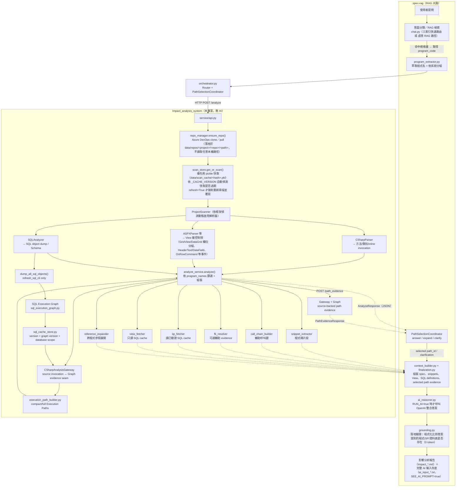

# 🔍 使用說明書 — 變更影響分析（RAG → 靜態分析 → AI 整合）

本說明書說明如何操作完整的「變更影響分析」流程。系統由兩個專案組成：

| 角色 | 專案 | 職責 |
|------|------|------|
| **RAG 大腦** | `llamaindex-spec-rag` | 理解問題、檢索規格書、萃取程式名、呼叫 Impact、用 AI 整合答案 |
| **靜態分析服務** | `Impact_analysis_system`（本專案） | 無 AI；clone 原始碼、解析 C#/ASPX/Razor/Vue，透過 `CSharpAnalysisGateway` join database-scoped `SQL Execution Graph`，回傳 source-backed evidence、compact Execution Paths、反查與 View layer |

## 📑 目錄

- [專案結構](#-專案結構)
- [系統架構](#-系統架構)
- [快速開始](#-快速開始)
- [完整操作流程](#-完整操作流程)
- [進階：內容品質與檢索控制](#-進階內容品質與檢索控制)
- [設計重點](#-設計重點)
- [常見問題排除](#-常見問題排除)
- [一頁速查](#-一頁速查)

---

## 🏗️ 專案結構

```
Impact_analysis_system/
├── .env                          # 機密設定（Azure PAT、服務埠號等，不進版控）
├── main.py                       # 互動式 CLI 入口（手動指定本機路徑或 Azure clone）
├── config/
│   ├── settings.py                # 全域設定（讀 .env）＋資料庫連線設定
│   ├── sp_detector_config.py       # 預存程序偵測規則設定
│   └── sp_detection_rules.json
├── code_analyzer/                 # 靜態分析核心（無 AI）
│   ├── project_scanner.py          # 掃描入口：依框架偵測結果分派給各解析器
│   ├── project_type_detector.py    # 偵測專案框架（WebForms/MVC/Vue…）
│   ├── csharp_parser.py            # C# 方法/類別/呼叫關係解析
│   ├── aspx_parser.py              # ASPX/ASCX 解析：控制項、GridView 欄位分組、事件
│   ├── razor_parser.py             # Razor .cshtml 解析
│   ├── vue_parser.py               # Vue 元件解析
│   ├── sql_analyzer.py             # SQL Server object dump、定義與 Schema 讀取
│   ├── csharp_analysis_gateway.py  # C# invocation 與 SQL Execution Graph 的 evidence seam
│   ├── db_connection_tracker.py    # DB 連線字串／資料表存取追蹤
│   ├── dependency_graph.py         # 呼叫鏈/依賴圖
│   ├── azure_fetcher.py            # Azure DevOps clone/pull
│   ├── smart_file_finder.py        # 依程式名定位檔案
│   └── models.py                   # 靜態分析共用資料模型（FileAnalysisResult 等）
├── service/                        # FastAPI 服務層（供 spec-rag 呼叫）
│   ├── api.py                       # /health /analyze /refresh /refresh_sql /refresh_sql/status /find_by_sp /find_by_table /path_evidence
│   ├── analyze_service.py           # 主分析流程：Gateway join、Graph readiness、path 與反查
│   ├── scan_store.py                # 掃描結果持久化快取（pickle + _CACHE_VERSION）
│   ├── sql_cache_store.py           # SQL object + Graph 本機快取（JSON + version/scope validation）
│   ├── sql_execution_graph.py       # typed SQL nodes/relationships、CALL 與 terminal operations
│   ├── execution_path_builder.py    # 建立 full/compact Execution Paths 與 path_id
│   ├── graph_queries.py             # query_table_accesses() 等 typed Graph query
│   ├── refresh_progress.py          # refresh_sql job 的 thread-safe progress state
│   ├── repo_manager.py              # 依 catalog 來源 clone/沿用本機 repo（path 支援單一字串或多子資料夾清單）
│   ├── snippet_extractor.py         # 依方法位置擷取程式碼片段
│   ├── call_chain_builder.py        # 組出呼叫鏈
│   ├── fk_resolver.py               # 外鍵連動資料表查詢
│   ├── sp_fetcher.py                # SP 完整定義（讀已驗證的本機 SQL 快取）
│   ├── view_fetcher.py              # SQL View 完整定義（只讀本機 SQL 快取）
│   ├── udf_fetcher.py               # UDF 完整定義（依程式內嵌 SQL 文字比對本機 UDF 名單）
│   ├── reference_expander.py        # 跨程式呼叫參照展開（類似「跟隨參照」）
│   └── schemas.py                   # 請求/回應 Pydantic 模型（含 FindBySPRequest/FindByTableRequest 等）
├── tools/
│   ├── list_azure_repos.py           # 列出 Azure DevOps 可用 repo（除錯用）
│   └── check_data_status.py         # 盤點各系統的規格書/程式碼/SQL 資料整理狀態（除錯用）
├── data/
│   ├── repos/                       # clone 下來的原始碼（依 project/repo/path）
│   ├── scan_cache/                  # 靜態掃描結果快取（*.pkl + *.meta.json）
│   ├── sql_cache/                   # SQL 物件與 SQL Execution Graph 快取（*.json，含 SP/View/Function/Schema）
│   └── code_embeddings/             # 程式碼 embedding／注記快取（USE_CODE_EMBEDDING）
├── output/
│   └── impact_analysis/             # AI 報告（impact_*.md）＋ AI 輸入存底（ai_input_*.txt）
├── docs/
│   ├── INTEGRATION_DESIGN.md        # 與 spec-rag 整合的設計文件
│   ├── 流程圖.md                     # 整體資料流程／run_cli／refresh_cli 的 Mermaid 流程圖
│   └── 使用說明書.md                 # 本文件
└── tests/                          # 驗證腳本
```

> 協作方 `llamaindex-spec-rag` 的呼叫端模組位於 `impact_orch/`：`rag_client.py`（HTTP 客戶端）、
> `program_extractor.py`（萃取程式名）、`context_builder.py`（組裝 AI 上下文）、`ai_reasoner.py`
> （呼叫 OpenAI）、`grounding.py`（落地驗證）、`run_cli.py` / `refresh_cli.py`（互動式 CLI／更新程式碼）
> / `refresh_sql_cli.py`（更新 SQL 快取與進度 polling）、`sp_lookup.py`（以 SP 名稱反查程式）、`table_lookup.py`
> （以資料表名稱反查程式，供 agent 模式與 CLI 模式 4 使用）、`agent_tools.py`（agent 模式工具集，含
> `search_specs`/`search_specs_by_sp`/`search_specs_by_table`/`analyze_system`）、`orchestrator.py`
> / `path_selection.py`（shared path selection）、`finalization.py`（selected evidence 組裝與 final answer）。

---

## 🔄 系統架構



---

## ⚡ 快速開始

### 1. 兩個獨立虛擬環境

| 專案 | venv 路徑 | 啟用 |
|------|-----------|------|
| Impact | `Impact_analysis_system\.venv` | `.\.venv\Scripts\Activate.ps1` |
| spec-rag | `llamaindex-spec-rag\.venv` | `.\.venv\Scripts\Activate.ps1` |

### 2. Impact 服務的 `.env`（機密只放這裡）

```env
AZURE_DEVOPS_ORG=topmost
AZURE_DEVOPS_PAT=<你的 PAT，需要 Code:Read 權限>
AZURE_DEVOPS_BRANCH=            # 留空用 repo 預設分支

SERVICE_HOST=127.0.0.1
SERVICE_PORT=8800
AZURE_CLONE_ROOT=./data/repos
SCAN_CACHE_ROOT=./data/scan_cache
SQL_CACHE_ROOT=./data/sql_cache   # SP/View/Function/資料表 Schema 的本機落地快取根目錄
```

> PAT 是機密，務必確認 `.env` 已在 `.gitignore`。請勿提交或在對話中貼出。

### 3. spec-rag 的 catalog 來源對應

`llamaindex-spec-rag\catalog\system_catalog.json` 中每個系統的 `azure` 區塊提供 Impact 的來源，
`database` 區塊提供 SQL refresh 與 Graph scope 的連線目標（SP/View/Function/資料表 Schema 用）：

```jsonc
{
  "system_id": "Y-Docs_TTPUR",
  "azure": { "project": "System Dept 1", "repo": "Y-DOCs", "branch": "", "path": "TTPUR" },
  "database": { "server": "SQLSRV01", "name": "PUR_Production" }
}
```

- `repo` 為空的系統目前無法分析（已停用讀取本機任意路徑）。
- 多系統共用 repo 時，以 `path` 子資料夾區分（如 `Y-DOCs/TTPUR`、`Y-DOCs/TTRDQ`）。
- `path` 也支援**同一個系統橫跨多個子資料夾**：填陣列即可，如
  `"path": ["TTPUR", "ATV", "Notification", "Response"]`（同一系統的功能分散在
  同一 repo 底下多個相鄰 VS 專案資料夾時使用）。Impact 會逐一 clone/掃描每個子
  資料夾，再合併成單一邏輯掃描結果（方法/呼叫鏈/SP/資料表關聯皆合併），下游比對
  邏輯不需感知這是多資料夾組成。
- `database.server`/`database.name` 為空的系統無法使用 SP 完整定義／View 定義／FK 連動表
  （`/refresh_sql` 會直接報錯拒絕連線；`/analyze` 的對應部分安全回空、不影響其餘分析）；
  每個系統的實際 SQL Server 主機/資料庫名稱需自行依實際環境填寫，不會有預設值。
- 帳號、密碼、連接埠、加密等**連線共用參數**仍在 Impact 端 `.env`（見下一節），不重複填在
  catalog；catalog 只標注「連去哪一台、哪個資料庫」。

### 4. spec-rag 的 `.env`（指向 Impact 服務）

```env
IMPACT_SERVICE_URL=http://127.0.0.1:8800
IMPACT_SERVICE_TIMEOUT=300
IMPACT_FK_DEPTH=0

# 影響分析 AI 控制（注意：AI 跑在 spec-rag，所以放這裡，不是 Impact 的 .env）
RUN_AI=true                # false → 不呼叫 OpenAI（省 token），只做靜態分析與組裝
SEE_AI_PROMPT=false        # true  → 寫出/顯示「送進 AI 的完整 prompt」供檢視

# 內容品質 / 檢索（皆可選；詳見下方「🧪 進階：內容品質與檢索控制」）
INCLUDE_SP_DEFS=false      # 連資料庫撈 SP 完整定義（讓 AI 看到 SP 邏輯；需 DB）
CONTEXT_MAX_CODE_CHARS=24000  # 送進 AI 的程式碼總量上限（避免大檔撐爆 prompt）
USE_CODE_EMBEDDING=false   # 用 embedding 語意檢索挑相關方法（中文問題也準）
CODE_EMBED_TOP_K=6         # 檢索取最相關的前幾個方法
USE_CODE_ANNOTATION=false  # 先用便宜模型把每個函式注記再檢索（更準，一次性成本）
```

> `RUN_AI` / `SEE_AI_PROMPT` 由 .env 強制決定，**忽略程式呼叫時傳入的 `run_ai=` / `dump_ai_input=`**；要改行為請改 .env。

---

## 📋 完整操作流程

### Step 1｜啟動 Impact 服務

在 **Impact 專案目錄**、用 **Impact 的 venv**：

```powershell
cd d:\pratice\Python\Impact_analysis_system

python -m uvicorn service.api:app --host 127.0.0.1 --port 8800
```

> ⚠️ **服務啟動後不會自動套用程式碼變更**：uvicorn 啟動時會把當下的 `.py` 讀進記憶體並常駐執行；之後你改了 `service/` 或 `code_analyzer/` 的程式碼，**已在跑的服務仍用記憶體裡的舊版**，即使重跑 `refresh_cli` 也是用舊邏輯。改完程式碼要生效，必須**先 `Ctrl+C` 停掉服務再重新啟動**，再重跑一次 `refresh_cli`（`refresh_cli` 本身已會強制重新掃描並自動覆寫快取，**不需要手動刪 `data/scan_cache/`**）。
>
> 💡 **開發階段建議加 `--reload`**：uvicorn 會自動監看 `.py` 檔案，一存檔就自動重啟並載入最新程式碼，免手動重啟（正式環境不建議開啟）：
>
> ```powershell
> python -m uvicorn service.api:app --host 127.0.0.1 --port 8800 --reload
> ```

確認上線：

```powershell
# 另開一個終端機
Invoke-RestMethod http://127.0.0.1:8800/health
# → @{status=ok}
```

---

### Step 2｜執行影響分析（互動式 CLI）

在 **spec-rag 專案目錄**、用 **spec-rag 的 venv** 執行互動式 CLI（免寫程式碼）：

```powershell
cd d:\pratice\Python\llamaindex-spec-rag

python -m impact_orch.run_cli
```

啟動後依選單操作；是否呼叫 AI 由 spec-rag `.env` 的 `RUN_AI` 決定（`config.py` fallback default 為 `true`）：

```
1) 直接輸入程式名分析（快速，不需 RAG/AI）
   → 選系統 → 輸入程式名（如 PUR_CostUpload, RMBudget_MT）
   → （可選）描述你打算做的變更／想了解的問題 → 立即看靜態分析結果
2) 用問題經 RAG 找程式再分析（完整流程，可選 AI）
   → 輸入問題 → 由 RAG 找出規格書與程式名 → 靜態分析 →（可選）AI 整合
3) 問題模糊／可能跨多系統 → 讓 agent 決定分析範圍或請你澄清
   → 輸入問題 → agent 自行判斷要分析哪個系統；問題不清時會反問你補充
4) 輸入資料表名稱，反查所有存取它的程式並一次分析（快速，不需 RAG/AI）
   → 適合「要改一張表，需要知道哪些程式會受影響」的情境
   → （可選）限定查詢的系統範圍 → 一次分析所有命中程式
0) 離開
```

- **第一次使用建議選 [1]**：不需載入 RAG，最快確認 repo、scan cache 與 Impact `/analyze` 是否可用；是否呼叫 final AI 仍由 `.env` 的 `RUN_AI` 決定。
- mode 1 的「變更描述」可留白；填了會讓「送給 AI 的內容」針對你的變更挑相關程式碼。
- 是否跑 AI、是否顯示送給 AI 的資料，皆由 `.env` 的 `RUN_AI` / `SEE_AI_PROMPT` 控制（見下方「🧪 進階：內容品質與檢索控制」）。
- 分析一律直接用快取結果，不會每次問問題都重新解析程式碼；原始碼有變動時另用 Step 3 的更新指令。
- CLI 會自動檢查 Impact 服務是否在線，沒開會提示你先啟動（見 Step 1）。
> 💡 **mode 3（agent）支援以 SP 名稱／資料表名稱反查程式**：當問題主要提到一支具體 SP（如「usp_POPublish 發生...」）時，agent 會自動改用 `search_specs_by_sp` 工具（對應 `POST /find_by_sp`）；當問題主要是「異動某張資料表」時，改用 `search_specs_by_table` 工具（對應 `POST /find_by_table`）——兩者都會逐系統反查哪些程式呼叫/存取過該 SP/資料表，找到後再自動取得對應規格書並進行靜態分析。即使問題同時提到畫面名稱與具體 SP/資料表，agent 也會兩者都呼叫（畫面對應的規格書程式，不一定涵蓋所有實際使用該 SP/資料表的程式）。`cache_only=True` 會用 `peek_scan_roots()` + `has_cache()` 檢查該系統列出的每個 scan root；未 clone/掃描完成的 root 直接跳過，不觸發 clone。若提供 `database`，正式 Graph lookup 還必須通過 database-scoped cache readiness，否則 API 回 HTTP 409 `sql_execution_graph_required`。命中不只一個系統時，agent 會先反問你要分析哪一個，不會把同名 candidate 靜默合併。
>
> 💡 **mode 4（依資料表反查）不經 RAG/AI，先做 deterministic lookup**：輸入資料表名稱後，會先列出系統清單讓你選擇要限定查詢的範圍（直接 Enter 為查全部），再逐系統查 C# inline facts；若呼叫端提供 `database`，也可由 `query_table_accesses()` 查 Graph-backed table access。命中不只一個系統時，CLI 會印出警告提醒你確認 database/schema 是否真的相同，不會自動把同名 table 視為同一張表。CLI mode 4 目前不暴露 `write_only`，維持回傳讀寫命中；API 與 Agent tool 可傳 `write_only=true`。
---

### Step 3｜更新程式碼（更新指令）

平常分析 **不會**重新 clone 或重新解析（沿用 `data/` 內的副本與快取）。同一個 system 若有多個 `azure.path`，`refresh_cli` 會逐一更新每個 scan root，後續 `cache_only=True` 也要求每個 root 都有有效 scan cache。
原始碼有變動、要取得最新程式碼時，在 **spec-rag 專案目錄**、用 **spec-rag 的 venv** 執行更新指令
（git pull + 重新解析 + 覆寫快取）：

```powershell
cd d:\pratice\Python\llamaindex-spec-rag
python -m impact_orch.refresh_cli Y-Docs_TTPUR

# 可一次更新多個系統
python -m impact_orch.refresh_cli Y-Docs_TTPUR PUR
```

> 首次更新會較久（git pull + 每個 scan root 完整重新解析）；完成後會覆寫 scan cache，之後分析即用新結果。這只代表程式碼分析軸完成，不代表 SQL Execution Graph 已 ready。

只更新指定 program 時，所有 `azure.path` 對應的 scan roots 都必須已有目前版本的有效 cache：

```powershell
python -m impact_orch.refresh_cli Y-Docs_TTPUR --program PUR_MasterEdit
```

> ⚠️ 若回應 `program_refresh_requires_current_cache`，代表至少一個 root 的 cache 過期、遺失或無法載入。系統會停止並**不會**偷偷進行整個 system 的 C# analyzer；請先不帶 `--program` 執行一次完整 refresh，再重試指定 program。

---

### Step 4｜更新 SQL 快取（更新指令，SP／View／Function／資料表 Schema）

`sp_fetcher.py`／`view_fetcher.py`／`udf_fetcher.py` 讀取經 `sql_cache_store.py` 驗證的本機 SQL cache（`data/sql_cache/`），
正式 Graph/path consumer 不會在 cache 缺失時逐物件 fallback 連線 SQL Server。快取需要**手動**觸發更新（資料庫是多系統共用資源，
跟 Step 3 的 git 程式碼是不同軸，不會隨 `refresh_cli` 自動更新）：

```powershell
cd d:\pratice\Python\llamaindex-spec-rag
python -m impact_orch.refresh_sql_cli Y-Docs_TTPUR

# 可一次更新多個系統
python -m impact_orch.refresh_sql_cli STC TTJournal
```

直接呼叫 API 時，可自行指定 `job_id` 並輪詢進度：

```powershell
$jobId = "manual-Y-Docs_TTPUR-001"
$sqlReq = @{
  database = "Y-Docs_TTPUR"
  server = "SQLSRV01"
  db_name = "PUR_Production"
  db_schema = "dbo"
  job_id = $jobId
} | ConvertTo-Json

Invoke-RestMethod -Uri http://127.0.0.1:8800/refresh_sql -Method Post -Body $sqlReq -ContentType "application/json"
Invoke-RestMethod -Uri "http://127.0.0.1:8800/refresh_sql/status/$jobId"
```

> 📌 **參數是 `system_id`（catalog 的 `system_catalog.json`），不是資料庫名稱**：
> 實際要連線的資料庫主機（server）與資料庫名稱（name）從該系統的 `database.server`／
> `database.name` 解析，**逐系統標注在 catalog**，不再依賴 Impact 端 `.env` 的
> `DB_SERVER`/`DB_DATABASES`（`.env` 只剩連線共用參數，如帳號/密碼/連接埠/加密等）。
> 若該系統在 catalog 未設定完整的 `database.server`/`database.name`（缺一即算），
> 指令會**直接在本機報錯，不會嘗試連線**（避免誤連到錯誤或未知的資料庫）。
>
> ⚠️ 資料庫端的 SP/View/Function 若被直接修改（未經程式碼部署），需要重跑這支指令
> 才會反映到之後的問答結果——這點與 Step 3（git 程式碼一改就該 refresh）不同，
> 請視資料庫異動頻率自行決定多久跑一次。
>
> 首次撈取會逐一查詢整庫所有 SP/View/Function 定義與資料表欄位，物件數量多時會
> 較久；完成後覆寫 `data/sql_cache/<system_id>__<schema>.json`。
>
> 📈 **進度顯示**：使用 `refresh_sql_cli` 時，CLI 會在**同一個 terminal** 輪詢
> `GET /refresh_sql/status/{job_id}`，依序顯示連線、SP、View、Function、資料表、
> Graph build、cache validation 與寫入 cache 的進度；不需要另外盯著啟動
> `uvicorn` 的 terminal。狀態生命週期為 `starting` → `running` → `completed`/
> `failed`；`completed` 只代表 refresh worker 正常結束，不代表正式 Graph 已通過
> readiness 驗證。直接呼叫同步 `POST /refresh_sql` 的整合程式，也可以自行提供
> `job_id` 後輪詢同一個 status endpoint。Graph readiness 仍由正式查詢邊界驗證，
> progress failure 與 graph-required failure 是兩種不同問題，progress polling 也
> 不是 Graph/Gateway migration release gate。指定的 `job_id` 是 refresh progress 的
> immutable progress identity；同一個 ID 已存在時會保留原 snapshot，不會重新開啟或
> 覆寫既有 job。
>
> 🔐 **正式關係來源**：refresh 會把 `SQL Execution Graph` 與 SQL 物件定義一起寫入
> `data/sql_cache/`；正式的 path、SP/table reverse lookup、lineage 與 flow consumer
> 只讀已驗證的 Graph。若 cache 缺失、過期或 database scope 不符，正式 API 回 HTTP 409、
> code `sql_execution_graph_required`，不猜測 relationship。migration 期間若仍計算
> legacy-shaped facts，只能提供給 `compare_legacy_gateway()`；`save_migration_report()`
> 輸出的 JSON/Markdown 是 review artifact，不是 SQL cache、Graph relationship 或
> runtime lookup source。

---

### Step 5｜檢查資料整理狀態（盤點用）

資料來源多（規格書原始檔、spec-rag 向量索引、Impact 程式碼 clone、靜態掃描快取、
SQL 快取），逐系統手動確認容易漏掉某個系統忘記 clone/掃描/更新 SQL。可用下列指令
一次盤點所有系統目前的狀態，並列出需要補跑的指令：

在 **Impact 專案目錄**、用 **Impact 的 venv** 執行：

```powershell
cd d:\pratice\Python\Impact_analysis_system
python tools\check_data_status.py
```

輸出範例：

```
system_id    | 規格書(原始) | 規格書(索引) | 程式碼(clone) | 程式碼(掃描)  | SQL快取
-------------+---------+---------+------------+----------+--------
STC          | ✅ 5份    | ✅ 5份    | ❌ 未clone   | ❌ 未clone | ❌ 未更新
Y-Docs_TTPUR | ✅ 212份  | ✅ 212份  | ✅ 已clone   | ✅ 已掃描    | ✅ 已更新
...

[程式碼 clone / 掃描未完成] → 執行 refresh_cli：
    python -m impact_orch.refresh_cli STC TTJournal YMTTHR

[SQL 快取未更新] → 執行 refresh_sql_cli：
    python -m impact_orch.refresh_sql_cli STC
```

- 預設會抓同層的 `llamaindex-spec-rag` 專案讀取 `system_catalog.json`；若路徑不同，
  加 `--spec-rag-root "路徑"` 指定。
- 「未設定repo」/「未設定DB」代表該系統在 catalog 尚未設定 `azure.repo` 或
  `database.server`/`database.name`，非資料未整理，工具會自動略過、不列入補跑建議。
- 此工具只讀取本機快取檔案與 catalog，**不會**連線 Azure DevOps 或 SQL Server，
  執行安全、免啟動 Impact 服務。

#### Step 5.1｜盤點外部 wrapper（維護用）

`discover_external_wrappers` 是 read-only 的 wrapper onboarding／audit 工具。它讀取
`data/scan_cache/` 裡既有的 `db_invocations`，將實際觀察到的
`receiver_type + wrapper_method` 分組，並依 `config/external_wrapper_contracts.json`
判斷可否套用 reusable contract。它會輸出呼叫次數、來源檔案、行號、source span，
以及 contract 選擇結果；**不會** clone、git pull、重新解析 C#，也不會建立或修改 scan cache。

執行順序是：

```text
refresh_cli（先取得最新原始碼並建立 current scan cache）
    ↓
discover_external_wrappers（只讀 cache，盤點 wrapper evidence）
    ↓
review unresolved／ambiguous，必要時更新 external_wrapper_contracts.json
```

因此它應該在 `refresh_cli` **之後**執行，不是之前。若先執行，工具只會回報
`scan_cache_missing` 或 `scan_cache_stale`，不會替你補做掃描。若只是修改 contract
registry 而沒有修改原始碼或 parser，通常可以直接重新執行 discovery，不必重新掃描。

在 **Impact 專案目錄**、使用 **Impact 的 venv** 執行：

```powershell
cd d:\pratice\Python\Impact_analysis_system

# 盤點單一 system 的所有 scan roots
python -m tools.discover_external_wrappers --system Y-Docs_TTPUR

# 輸出 JSON，供 review、diff 或後續自動化使用
python -m tools.discover_external_wrappers `
  --system Y-Docs_TTPUR `
  --format json `
  --output output\external_wrapper_reports\Y-Docs_TTPUR.json

# catalog 無法解析時，直接指定本機 scan root
python -m tools.discover_external_wrappers `
  --root data\repos\System_Dept_1\Y-DOCs\TTPUR
```

`--system` 可重複指定多個 system；`--root` 與 `--system` 不可同時使用。未指定
任何參數時，工具會依 catalog 盤點所有系統。重點查看下列狀態：

| 狀態 | 意義與處理 |
|------|------------|
| `source_wrapper` | wrapper 原始碼在本機可追蹤，不需 external contract。 |
| `auto_selected` | receiver type 唯一對應 reusable contract，已自動套用。 |
| `explicit_selected` | system catalog 明確指定 contract，且 receiver/method 通過驗證。 |
| `ambiguous_contract` | 一個 receiver type 對到多個 contract；不能猜，需整理 registry。 |
| `unresolved_contract`／`unresolved_method`／`receiver_mismatch` | contract 不存在、缺少 method，或 receiver 不符合；需人工 review。 |
| `scan_cache_stale`／`scan_cache_missing` | 不是 wrapper contract 問題；先回到 Step 3 執行完整 `refresh_cli`。 |

這個盤點不需要每次問答都執行。建議在新增第三方 library、調整 parser 或 contract
registry、升級 `_CACHE_VERSION`，以及定期維護 review 時執行；只有真正出現新的或
ambiguous 的 external API 才需要修改 reusable contract。

---

### Step 6｜直接呼叫 HTTP API（除錯用）

不經 spec-rag，直接打 Impact 服務：

```powershell
$body = @{
  system = "Y-Docs_TTPUR"
  source = @{ project = "System Dept 1"; repo = "Y-DOCs"; branch = ""; path = "TTPUR" }
  program_names = @("PUR_CostUpload", "PUR_YMMCPriceImport.aspx")
  database = "Y-Docs_TTPUR"
  db_server = "SQLSRV01"
  db_name = "PUR_Production"
  include_snippets = $true
  include_sp_defs = $false
  include_view_layer = $true
  include_execution_paths = $true
  fk_depth = 0
  refresh = $false
} | ConvertTo-Json

Invoke-RestMethod -Uri http://127.0.0.1:8800/analyze -Method Post -Body $body -ContentType "application/json"
```

更新：

```powershell
$r = @{ system="Y-Docs_TTPUR"; source=@{ project="System Dept 1"; repo="Y-DOCs"; branch=""; path="TTPUR" } } | ConvertTo-Json
Invoke-RestMethod -Uri http://127.0.0.1:8800/refresh -Method Post -Body $r -ContentType "application/json"
```

更新 SQL 快取：

```powershell
$sqlReq = @{ database = "Y-Docs_TTPUR"; server = "SQLSRV01"; db_name = "PUR_Production"; db_schema = "dbo"; job_id = "manual-Y-Docs_TTPUR-002" } | ConvertTo-Json
Invoke-RestMethod -Uri http://127.0.0.1:8800/refresh_sql -Method Post -Body $sqlReq -ContentType "application/json"
Invoke-RestMethod -Uri http://127.0.0.1:8800/refresh_sql/status/manual-Y-Docs_TTPUR-002
```

以 SP 名稱反查程式（不知道 SP 屬於哪個系統時，逐系統逐一呼叫）：

```powershell
$spReq = @{ source = @{ project = "System Dept 1"; repo = "Y-DOCs"; branch = ""; path = "TTPUR" }; sp_name = "usp_POPublish"; database = "Y-Docs_TTPUR"; cache_only = $true } | ConvertTo-Json
Invoke-RestMethod -Uri http://127.0.0.1:8800/find_by_sp -Method Post -Body $spReq -ContentType "application/json"
```

> `cache_only=true`（預設）時，會用 `peek_scan_roots()` + `has_cache()` 檢查每個列出的 scan root；只要有 root 尚未 clone/掃描就回傳 `skipped=true`，不觸發 clone。提供 `database` 時，正式 invocation match 還需要有效的 database-scoped Graph；Graph 缺失/過期會回 HTTP 409，而不是用 legacy relationship 猜測。spec-rag 側的 `impact_orch/sp_lookup.py` 會將此端點套用到 catalog 系統，agent mode 也會使用同一個 adapter。

以資料表名稱反查程式（不知道表屬於哪個系統時，逐系統逐一呼叫；用法與 `/find_by_sp` 完全對稱）：

```powershell
$tblReq = @{ source = @{ project = "System Dept 1"; repo = "Y-DOCs"; branch = ""; path = "TTPUR" }; table_name = "Customers"; database = "Y-Docs_TTPUR"; cache_only = $true; write_only = $false } | ConvertTo-Json
Invoke-RestMethod -Uri http://127.0.0.1:8800/find_by_table -Method Post -Body $tblReq -ContentType "application/json"
```

> 同樣 `cache_only=true`（預設）時不會觸發 clone；比對時會正規化表名（去掉 `dbo.`/中括號等 schema 前綴，取最後一段小寫比對）。提供 `database` 後，`query_table_accesses()` 會查詢 Graph 的 typed operation、lineage 與 nested CALL branch；回應可帶 `path_id`、`sp_chain`、`operation_type` 與 `evidence`。spec-rag 側的 `impact_orch/table_lookup.py` 對應 `sp_lookup.py`，Agent tool 也使用同一個 adapter。
>
> 💡 **反查結果現在會分辨「讀還是寫」（`access_type`）**：提供 `database` 且該系統已完成
> `refresh_sql_cli` 後，SP/View/Function lineage 會透過 `CSharpAnalysisGateway` join
> `SQL Execution Graph`，`matches` 裡每筆會帶 `access_type`：C# 直接內嵌 SQL 命中為
> `READ`/`INSERT`/`UPDATE`/`DELETE`；graph 中的 SP 操作依實際 DML 回傳讀寫類型；
> 巢狀 SP 呼叫的間接寫入為 `WRITE_INDIRECT`。只有 `proven` evidence 會形成正式 graph
> relationship；`likely`/`unresolved` 會留在 diagnostics 或 candidate context，不會被
> 當成已確認的寫入。加上 `write_only: true` 可只取得寫入類命中，適合「打算異動這張表，
> 只想知道誰會寫壞」這種情境：
>
> ```powershell
> $tblWriteReq = @{ source = @{ project = "System Dept 1"; repo = "Y-DOCs"; branch = ""; path = "TTPUR" }; table_name = "SOrder"; cache_only = $true; database = "Y-Docs_TTPUR"; write_only = $true } | ConvertTo-Json
> Invoke-RestMethod -Uri http://127.0.0.1:8800/find_by_table -Method Post -Body $tblWriteReq -ContentType "application/json"
> ```
>
> ⚠️ **不提供 `database`（system_id）時只會得到 source-only inline SQL facts**：此模式仍可回傳
> C# inline SQL 的 `access_type`，但不會查詢 SP/View/Function lineage，也不會宣稱
> Graph-backed relationship 已確認。需要正式 SQL 關係時，請提供 `database` 並先完成
> `refresh_sql_cli`；若 Graph 缺失或過期，API 會以 HTTP 409 回報 graph readiness failure。
>
> ⚠️ `write_only=true` 會保留 C# inline 與 Graph 中的寫入 operation（`INSERT`/`UPDATE`/`DELETE`/`WRITE_INDIRECT`），過濾純讀取與 unresolved access。API、`rag_client.find_by_table()`、`table_lookup.find_programs_by_table()` 與 Agent 的 `search_specs_by_table` tool 都可傳入；互動式 CLI mode 4 尚未暴露這個開關，預設回傳讀寫命中。

取得單一路徑的 source-backed evidence：

```powershell
$pathReq = @{
  path_id = "Y-Docs_TTPUR:path:example"
  system = "Y-Docs_TTPUR"
  source = @{ project = "System Dept 1"; repo = "Y-DOCs"; branch = ""; path = "TTPUR" }
  program_names = @("PUR_SOQry.aspx")
  database = "Y-Docs_TTPUR"
} | ConvertTo-Json

Invoke-RestMethod -Uri http://127.0.0.1:8800/path_evidence -Method Post -Body $pathReq -ContentType "application/json"
```

`/path_evidence` 會回傳 `source_span`、`sp_chain`、`operations`、`branch_context`、`evidence`、`reason` 與 unresolved targets。找不到 `path_id` 回 HTTP 404；Graph 缺失/過期或 snapshot 不一致則回對應的 409，不會把未展開路徑當成不存在。

---

### Step 7｜輸出與資料位置

| 內容 | 路徑 |
|------|------|
| AI 影響分析報告（Markdown） | `Impact_analysis_system\output\impact_analysis\impact_*.md` |
| 送進 AI 的完整 prompt（`SEE_AI_PROMPT=true`） | `Impact_analysis_system\output\impact_analysis\ai_input_*.txt` |
| clone 下來的原始碼 | `Impact_analysis_system\data\repos\<project>\<repo>\` |
| 靜態掃描快取 | `Impact_analysis_system\data\scan_cache\<hash>.pkl` |
| SQL 物件與 SQL Execution Graph 本機落地快取 | `Impact_analysis_system\data\sql_cache\<database>__<schema>.json` |
| 程式碼 embedding／注記快取 | `Impact_analysis_system\data\code_embeddings\` |

---

## 🧯 常見問題排除

| 症狀 | 原因與處理 |
|------|-----------|
| `/analyze` 回 400「source.repo 為空」 | 該系統未在 catalog 設定 Azure `repo`；補上 `azure.repo`（與 `path`）。 |
| `not_found` 含某程式 | 該 `program_code` 在 repo 對應路徑找不到對應檔案；確認 `path` 子資料夾正確、或程式名拼寫。 |
| 第一次 `/analyze` 很久（數分鐘） | 首次需 clone + 完整解析 C#；完成後會快取，之後秒回。 |
| 改了程式碼但結果沒變（資料層） | 快取沿用舊解析；執行更新指令 `python -m impact_orch.refresh_cli <system_id>`（見 Step 3）。 |
| `--program` 回 `program_refresh_requires_current_cache` | 指定 program 更新要求所有 scan roots 都有目前版本 cache；先不帶 `--program` 完整更新一次，再重試。系統不會將局部更新靜默升級成 full C# scan。 |
| 改了 `service/`／`code_analyzer/` 程式碼，重跑 `refresh_cli` 仍是舊行為 | 已在執行的 Impact 服務用的是**記憶體裡的舊程式碼**，不會自動重載。`refresh_cli` 本身已會強制重新掃描並自動覆寫快取（`refresh=True`），**不需要手動刪 `data/scan_cache/`**；只需要 `Ctrl+C` 停掉服務再重新啟動（或啟動時加 `--reload`），讓服務載入新程式碼後再重跑一次 `refresh_cli` 即可（見 Step 1）。 |
| 連不到 Impact 服務 | 確認服務已啟動、`IMPACT_SERVICE_URL` 正確、防火牆未擋 127.0.0.1:8800。 |
| FK 連動表總是空 | 該資料庫未定義外鍵（`sys.foreign_keys` 為空），或未提供可連線的 `database`；屬正常。 |
| SP/View 定義沒看到或是舊的 | `sp_fetcher.py`/`view_fetcher.py` 讀已驗證的 SQL cache；資料庫端改過 SP/View/Function 後需手動執行 `python -m impact_orch.refresh_sql_cli <system_id>`（見 Step 4）。 |
| `/refresh_sql` 或 `refresh_sql_cli` 報錯「server/db_name 不可為空」 | 該系統在 `system_catalog.json` 的 `database.server`/`database.name` 未填寫（兩者缺一即算）；請先到 catalog 補上實際的資料庫主機/名稱再重試（不會改用 .env 的 DB_SERVER/DB_DATABASES）。 |
| 從未執行過 `refresh_sql_cli`，正式反查或 path 查詢回 HTTP 409 | graph-backed operation 需要有效且 database-scoped 的 `SQL Execution Graph`；請執行 `python -m impact_orch.refresh_sql_cli <system_id>`，再重試。progress 顯示完成本身不取代 cache readiness validation。 |
| 不確定哪些系統忘記 clone/掃描/更新 SQL 快取 | 執行 `python tools\check_data_status.py`（見 Step 5）一次盤點所有系統，會直接列出需要補跑的 `refresh_cli`/`refresh_sql_cli` 指令。 |
| `find_by_table` 的 `write_only=true` 沒過濾到預期的寫入 SP，或正式結果為 HTTP 409 | 確認請求有帶 `database=<system_id>`，並重新執行 `python -m impact_orch.refresh_sql_cli <system_id>` 產生通過 version/scope validation 的 SQL Execution Graph；同時確認 `cache_only=true`/`write_only=true` 參數。不要以 migration legacy facts 判斷正式結果。 |
| `refresh_sql/status/{job_id}` 顯示 `completed` 但正式查詢仍回 409 | `completed` 只代表 refresh worker 正常結束；檢查 database scope、Graph version 與 cache version，必要時以相同 catalog `server`/`db_name` 重跑 `refresh_sql_cli`。 |
---

## 📌 一頁速查

```powershell
# 1) 啟動 Impact 服務（Impact venv）
cd d:\pratice\Python\Impact_analysis_system
python -m uvicorn service.api:app --host 127.0.0.1 --port 8800

# 2) 健康檢查
Invoke-RestMethod http://127.0.0.1:8800/health

# 3) 從 spec-rag 執行分析（spec-rag venv）
cd d:\pratice\Python\llamaindex-spec-rag
python -m impact_orch.run_cli

# 4) 更新某系統程式碼（spec-rag venv）
python -m impact_orch.refresh_cli Y-Docs_TTPUR

# 5) 更新 SQL 快取（SP/View/Function/資料表 Schema，spec-rag venv；參數是 system_id）
python -m impact_orch.refresh_sql_cli Y-Docs_TTPUR

# 6) 盤點各系統資料整理狀態（Impact venv，免啟動服務）
cd d:\pratice\Python\Impact_analysis_system
python tools\check_data_status.py

# 7) 盤點 external wrapper（Impact venv，read-only；先完成 refresh_cli）
python -m tools.discover_external_wrappers --system Y-Docs_TTPUR
```

---

## 🧪 進階：內容品質與檢索控制

送給 AI 的內容品質，由下列開關控制（皆在 **spec-rag 的 `.env`**）。表格列的是 `config.py` fallback default；實際行為以 `.env` 覆寫值為準。

| 設定 | 預設 | 作用 | 成本 |
|------|------|------|------|
| `RUN_AI` | true | 是否呼叫 OpenAI 整合答案 | false 不花 GPT token |
| `SEE_AI_PROMPT` | false | 是否寫出/顯示「送進 AI 的完整 prompt」 | 0（純檢視） |
| `INCLUDE_SP_DEFS` | false | 從已驗證的 SQL cache 帶入 SP 完整定義（T-SQL、參數、引用表），**只列出已被挑中的相關方法有引用到的 SP** | 需先完成 SQL refresh；不花 token |
| `CONTEXT_MAX_CODE_CHARS` | 24000 | 程式碼總量上限；超過則其餘方法只列名 | — |
| `USE_CODE_EMBEDDING` | false | embedding 語意檢索挑相關方法（中文也準） | 索引一次（快取）+ 每次 1 個 query embedding，極便宜 |
| `CODE_EMBED_TOP_K` | 6 | 檢索最多取前幾個方法（上限） | — |
| `CODE_EMBED_MIN_SIM_RATIO` | 0.85 | 相對相似度門檸：只保留相似度 >= 最相關方法 * 此比例的方法，避免方法數只比 TOP_K 多一點時幾乎全選 | — |
| `USE_CODE_ANNOTATION` | false | 先用便宜模型注記每個函式再檢索，命中更準 | 一次性注記成本（gpt-5.4-mini，逐函式快取） |

### SP 完整定義（`INCLUDE_SP_DEFS`）
C# 只看得到「呼叫了哪個 SP」，看不到 SP 內部。開啟後會從已驗證 SQL cache 帶入 SP 的完整 T-SQL、參數與**它實際碰的資料表**（常揭露 C# 看不到的關聯表）。若 cache 缺失或 Graph scope 不符，正式 Graph operation 會先回 readiness error；先執行 Step 4。並且**只會列出已被挑中的相關方法片段有實際呼叫到的 SP**（依名稱比對），不會因為問題根本用不到 SP 邏輯也送整段 T-SQL。

### 完整片段 + 總量預算（`CONTEXT_MAX_CODE_CHARS`）
被選中的方法送**完整本體**（不再中途截斷）；但全部程式碼總量受此上限保護——上千行的大檔也不會把 prompt 撐爆，超過的方法只列名。想更省 token 就調小（如 8000）。

### 語意檢索（`USE_CODE_EMBEDDING`）
把方法向量化建索引（依程式碼版本快取，**建一次重複用**），查詢時把問題向量化取最相關的方法。**中文問題也能命中**（解決關鍵字比對的不足）。索引存於 `Impact_analysis_system\data\code_embeddings\`（放在 code 專案側，而非 spec-rag 自己的 `storage/`，因為這是程式碼分析的衍生產物）。

選方法並非單純取 `CODE_EMBED_TOP_K` 個：若程式方法數只比 TOP_K 多一點（如 7 個方法、TOP_K=6），单純取前 K 個幾乎等於全選、並未真正滤掉不相關方法。因此另以 `CODE_EMBED_MIN_SIM_RATIO`兩重篩選：只保留「相似度 >= 本程式最相關那個方法的相似度 * 此比例」的方法，真正不相關的方法會被濾除，即使總方法數不多。想更嚴格就把比例調高（如 0.9~0.95），但會增加漏採真正相關方法的風險。

### 注記式檢索（`USE_CODE_ANNOTATION`）
進一步用便宜模型（`gpt-5.4-mini`）把每個函式注記成一句中文摘要，再拿**注記**做檢索（中文 vs 中文，命中更準），但仍把**原始程式碼**送給 AI（summary for retrieval, code for generation）。注記依「單一函式內容雜湊」快取，**更新時只重做有變動的函式（單支程式即可）**。

### 落地驗證（grounding，自動、0 token）
`RUN_AI=true` 跑完 AI 答案後，系統會**程式化比對**答案裡提到的程式/SP/資料表是否真的存在於靜態分析資料；找不到的會列在報告末尾「⚠️ 落地驗證」區塊，提醒可能是 AI 臆測。完全不呼叫 LLM、不增加 token。

### 建議組合
- **平時檢視（省 token）**：明確設定 `RUN_AI=false`、`SEE_AI_PROMPT=true`、`INCLUDE_SP_DEFS=true`、`USE_CODE_EMBEDDING=true` → 先看「送給 AI 的完整資料」對不對；這是診斷 profile，不是 `config.py` fallback default。
- **要正式產答案**：再把 `RUN_AI=true` 打開；需要最高命中率時加 `USE_CODE_ANNOTATION=true`（接受一次性注記成本）。

---

## 🔑 設計重點

| 設計 | 說明 |
|------|------|
| **兩專案分工（RAG／靜態分析分離）** | `llamaindex-spec-rag` 負責理解問題、檢索規格書與呼叫 AI；`Impact_analysis_system` 全程無 AI，只做確定性的靜態分析，責任邊界清楚、可各自獨立測試 |
| **Azure DevOps clone-only 來源政策** | `repo_manager.ensure_repo()` 一律以 catalog 的 `azure.{project,repo,branch,path}` clone/沿用 `data/repos/` 下的程式碼，不會退回讀取任意本機路徑；`repo` 為空直接報錯，避免誤讀到非預期原始碼 |
| **持久化掃描快取 + 版本化失效** | `scan_store.py` 把整包（可能數百檔）C#/View 層解析結果 pickle 到 `data/scan_cache/`，一次掃描、之後秒回；`_CACHE_VERSION` 常數在解析器輸出結構變動時遞增，讓舊快取自動失效重掃，不需使用者手動清快取 |
| **多框架解析器、依偵測動態啟用** | `project_type_detector.py` 偵測專案實際使用的框架，`ProjectScanner` 只啟用對應解析器（`CSharpParser`／`ASPXParser`／`RazorParser`／`VueParser`），單一檔案解析失敗不影響其餘掃描 |
| **View 層欄位擷取＋GridView 分組** | `ASPXParser` 除了控制項數量統計，另擷取「畫面上實際顯示的文字」（`BoundField`/`TemplateField` 等的 `HeaderText`、`Label`/`Button` 的 `Text`），並依所屬 `GridView`/`DataGrid` 分組、附上該 Grid 的 `OnRowCommand`/`OnRowDataBound` 等事件與 `DataField`；另擷取查詢區塊等純 HTML `<th>` 標籤文字與相鄰輸入控制項（`TextBox`/`DropDownList` 等）的對應關係（`kind="form"`），以及純前端（無 `runat="server"`）`<script>` 區塊原始碼（`kind="script"`），讓「畫面會顯示哪些欄位」「查詢條件有哪些」「按查詢時會做什麼檢查」都可直接引用；預設關閉，需 `INCLUDE_VIEW_LAYER=true` 才回傳 |
| **View 層區塊語意檢索＋AI 注記（spec-rag 側）** | `impact_orch/context_builder.py` 把每個 View 層區塊（GridView 欄位群組／查詢欄位／前端驗證 script）轉成 `{label, text}`，與 C# 方法共用同一套 `code_retriever.py` 語意檢索機制（`USE_CODE_EMBEDDING`，`domain="view"` 區分快取避免與方法混用）依問題挑相關區塊；其中 `script` 區塊另外用便宜模型注記成一句話摘要（`USE_CODE_ANNOTATION`），避免整段前端驗證邏輯原始碼直接塞進 prompt |
| **跨程式呼叫參照展開** | `reference_expander.py` 依呼叫鏈自動把「被分析程式呼叫到、但定義在其他檔案」的方法一併帶入分析結果（類似 IDE 的「跟隨參照」），`expand_depth`/`expand_max_programs` 控制展開層數與上限 |
| **UDF 依程式篩選（比對取代解析）** | 靜態解析沒有專門的「UDF 呼叫」關聯，`udf_fetcher.py` 改用「比對」：把該程式自己內嵌的 SQL 查詢文字（`FileAnalysisResult.sql_queries`）跟本機 SQL 快取的整庫 UDF 名單比對，只有真的以函數呼叫形式（`FunctionName(`）出現在這支程式 SQL 裡的 UDF 才附上完整定義，不需新增 C# 解析規則、不遞增掃描快取版本 |
| **SQL 全庫撈取進度顯示** | `sql_analyzer.py` 的 `dump_all_sql_objects()` 與 `sql_execution_graph.py` 回報逐階段計數；`service/api.py` 由 `refresh_progress.py` 暫存 job 狀態，`refresh_sql_cli.py` 以 `ThreadPoolExecutor` 背景等待同步 POST 並輪詢 `/refresh_sql/status/{job_id}`，讓進度條在 CLI 同一個 terminal 顯示。`completed` 不取代 Graph readiness validation |
| **FK 連動表（選用）** | `fk_resolver.py` 依 `sys.foreign_keys` 找出程式直接存取資料表的外鍵關聯表，作為輔助 evidence；無 DB 連線或無外鍵時安全地回傳空清單，不把 FK 近似結果升格成 `proven` path |
| **SP 完整定義（已驗證 SQL cache、精準挑選）** | `sp_fetcher.py` 只讀 `sql_cache_store.py` 驗證過的 SQL cache；只擷取「已被挑中的相關方法實際呼叫到」的 SP，避免問題用不到 SP 邏輯時也整段送入 prompt。cache 缺失時不以即時逐物件查詢補洞 |
| **SQL Execution Graph 正式來源與快取失效** | `sql_analyzer.py` 的 `dump_all_sql_objects()` 一次撈出整庫 SQL 物件與資料表 Schema，並建立 `SQL Execution Graph`；`python -m impact_orch.refresh_sql_cli <system_id>` 寫入 `data/sql_cache/<system_id>__<schema>.json`，`sql_cache_store.py` 以 `_SQL_CACHE_VERSION`、graph version 與 database scope 驗證快取。正式 consumer 不讀 legacy dependency dictionaries，資料庫是多系統共用資源，仍需獨立於 `refresh_cli` 觸發更新 |
| **逐系統標注資料庫連線目標（catalog 優先於 .env）** | 每個系統的實際 SQL Server 主機/資料庫名稱可能不同，故改由 spec-rag 的 `system_catalog.json`（`database.server`/`database.name`）逐系統提供；`config/settings.py` 的 `build_database_config()` 現組 `DatabaseConfig`，`sql_analyzer.SQLAnalyzer.__init__()` 接受明確的 `server`/`database_name`。兩者缺一時 `/refresh_sql` 直接拒絕連線；正式 Graph consumer 若 cache 不 ready 則回 HTTP 409，不猜測 relationship |
| **View 定義自動識別（`view_fetcher.py`）** | 靜態程式碼分析不會區分「資料表」與「View」（兩者都以 `FROM`/`JOIN` 存取），`view_fetcher.py` 從程式的 `tables` 清單比對本機 SQL 快取的 View 名單，把「其實是 View」者的完整定義另外標示出來，讓 AI 看得到 View 實際查詢邏輯而非只有表名；只讀快取、不即時連線（避免每個表名都連線判斷） |
| **內容量預算控管** | `CONTEXT_MAX_CODE_CHARS` 限制送進 AI 的程式碼總量；被選中的方法送完整本體（不中途截斷），超出預算的方法只列名，避免大型檔案把 prompt 撐爆 |
| **語意檢索挑相關方法** | `USE_CODE_EMBEDDING` 對方法做 embedding（依程式碼版本快取，建一次重複用），中文問題也能準確命中；`CODE_EMBED_MIN_SIM_RATIO` 以「相對本程式最相關方法的相似度比例」二次篩選，避免方法數只比 `TOP_K` 多一點時幾乎全選 |
| **注記式檢索（多 domain 共用）** | `code_retriever.py` 的 `USE_CODE_ANNOTATION` 先用便宜模型把每個函式/畫面區塊/SQL 定義注記成一句中文摘要再做檢索或直接附註（中文 vs 中文，命中更準），送給 AI 的仍是原始程式碼/T-SQL；以 `domain`（`csharp`/`view`/`sql`）區分注記提示語與快取鍵，依內容雜湊逐項快取，更新時只重做有變動者 |
| **落地驗證（grounding）** | `RUN_AI=true` 產出答案後，程式化比對答案中提到的程式/SP/資料表/View 層區塊是否真的存在於靜態分析資料（`grounding.py` 的 `_build_known()` 涵蓋 `view_layer`、SP 定義本體識別字），找不到的列在報告末尾「⚠️ 落地驗證」區塊，完全不呼叫 LLM、不增加 token |
| **`.env` 強制覆寫呼叫端參數** | `RUN_AI`/`SEE_AI_PROMPT` 一律以 spec-rag 的 `.env` 為準，忽略程式呼叫時傳入的 `run_ai=`/`dump_ai_input=`，避免不同呼叫路徑（CLI/agent/API）行為不一致 |
| **多程式一次分析** | `/analyze` 的 `program_names` 支援多筆，一次請求即可回傳多支程式各自的方法/SP/資料表/呼叫鏈，減少來回呼叫次數 |
| **以 SP 名稱反查程式（`/find_by_sp`）** | `find_by_sp(req)` 透過 `CSharpAnalysisGateway` 與 database-scoped `SQL Execution Graph` 比對正式 SP invocation；只有 `proven` 會進入 confirmed matches，`likely`/`unresolved` 保留在 diagnostics；`cache_only=True`（預設）時若 repo 尚未 clone/掃描過即直接 `skipped=True`、不觸發 clone，因為此端點常被逐 catalog 系統投機式呼叫，必須避免每次未命中都觸發昂貴 clone；spec-rag 側在 **agentic 模式（mode 3）**的 `search_specs_by_sp` 工具自動呼叫，不影響現有確定性流程 |
| **以資料表名稱反查程式（`/find_by_table`）** | 與 `/find_by_sp` 對稱設計；先正規化 C# inline SQL table facts，再由 `query_table_accesses()` 查 Graph typed operation、lineage、nested CALL 與 `path_id`。由於資料表名稱更容易同名巧合，CLI mode 4 與 Agent tool 在命中不只一個系統時都提醒確認 database/schema，而非自動合併 |
| **依資料表反查程式並批次分析（CLI 模式 4／`search_specs_by_table`）** | 對應「改一張共用表，需要知道哪些程式受影響」的情境，不需事先知道任何程式名；CLI 模式 4 讓使用者可先限定查詢的系統範圍（預設全部），一次把命中的所有 `(system_id, programs)` 批次送進 `/analyze`（沿用既有的多程式一次分析能力，不需新增批次端點）；agentic 模式的對應工具遇到多系統命中時會依系統提示規則先反問使用者，而非直接全部分析 |
| **SP 寫入與巢狀呼叫（SQL Execution Graph）** | `find_by_table()` 透過 `query_table_accesses()` 查詢 `SQL Execution Graph` 的 typed operation、lineage 與 nested CALL branches，依實際 DML 回傳讀寫類型與 `WRITE_INDIRECT`；只有 `proven` invocation 會形成正式 table access，候選 evidence 會保留 caller/source/reason 供 diagnostics，不會成為 confirmed relationship |
| **`access_type` 命名對齊既有 `CSharpTableRelation.access_type`** | C# 直接內嵌 SQL 命中沿用既有大寫具體動詞（`READ`/`INSERT`/`UPDATE`/`DELETE`）；SQL Execution Graph 依 typed operation 與 lineage 回傳讀寫類型，間接寫入標記為 `WRITE_INDIRECT`；`write_only` 篩選判斷式涵蓋 graph 與 inline source 的寫入類型 |
| **Module / Interface / Depth** | `Impact_analysis_system` 是無 AI 的 deterministic Module；`service/api.py` 是 HTTP Interface，`AnalyzeResponse`/`PathEvidenceResponse` 是穩定資料契約。Graph/Gateway 將複雜的 parser、SQL object、path 組裝細節藏在 Interface 後，讓呼叫端只依賴 evidence 與 path outcome |
| **Seam / Adapter / Locality** | `CSharpAnalysisGateway` 是 source invocation 與 SQL Graph 的 evidence seam；`rag_client.py` 是 spec-rag 的 HTTP Adapter，Impact 的 in-process gateway/Graph 是 deterministic adapter。SQL refresh、source refresh、path evidence 各自集中變更，讓 failure 與 validation 具有 locality |
| **Evidence contract 與 Leverage** | `proven` 可建立 confirmed relationship；`likely` 只能作 candidate/risk evidence；`unresolved` 必須保留 reason/target。`PathSelectionCoordinator` 用一個 shared interface 統一 answer/expand/clarify，將多個 Agent caller 的判斷 leverage 到單一路徑選擇規則 |
| **Path Evidence boundary** | `execution_path_builder.py` 只產生 compact/full path candidate；`/path_evidence` 才展開 source span、SP chain、branch 與 terminal operation。未展開 path 是 uncertainty，不表示不存在；`flow_chain` 永遠標記為 auxiliary candidate |
| **Legacy comparison 資料隔離** | `compare_legacy_gateway()` 是唯一 migration comparison seam；`ProjectScanResult` 的 legacy records 只在當次掃描與 review report 期間存在，`ProjectScanResult.to_dict()`/pickle 與 SQL cache 不保存它們，`save_migration_report()` 產生的 JSON/Markdown 也不會被 graph、path、lookup 或 flow consumer 讀取 |
| **同一系統可橫跨多個子資料夾（`azure.path` 陣列）** | 現實中同一邏輯系統的功能可能分散在同一 repo 底下多個相鄰 VS 專案資料夾（非單一 `path` 能涵蓋）；`AzureSource.path` 放寬為 `Union[str, List[str]]`（向下相容純字串），`repo_manager.resolve_scan_roots()`/`peek_scan_roots()` 一次 clone/pull、逐一解析每個子路徑，`analyze_service._merge_scans()` 把多份掃描結果合併成單一邏輯 `ProjectScanResult` 再重算統計，下游比對/呼叫鏈/SP 反查邏輯完全不需感知這是多資料夾組成；`find_by_sp`/`find_by_table` 的 `cache_only` 守門也相應改為要求「所有列出的子資料夾都已有快取」才視為已掃描 |
| **View 層擷取的細節：表單分組/前端驗證屬性/JS 綁定** | 除了 GridView 欄位分組，`ASPXParser._extract_form_fields()` 還會把同一個 `<table>`/`<div>` 內多個 `<th>` 欄位分組成單一 `kind="form_group"` 區塊（避免語意檢索 top-K 只挑中其中一個欄位、其餘被誤判無關而漏答「新增時要填哪些欄位」之類問題）；每個欄位額外擷取 `CssClass`（前端宣告式必填/格式驗證慣例，如 `RequireColumn`/`StringFormat`）與 `MaxLength`，並用 `_extract_js_id_bindings()` 從 `<script>` 內容抓出 jQuery 依 ID 綁定的函式名（`js_binding`）——這些規則原本只存在於畫面標記與前端 script，對只看後端方法的靜態分析完全不可見，容易讓 AI 誤判「沒看到必填檢查」 |
| **資料整理狀態一鍵盤點** | `tools/check_data_status.py` 逐系統比對規格書原始檔/向量索引/程式碼 clone/掃描快取/SQL 快取五項狀態，並自動列出未完成項目對應的 `refresh_cli`/`refresh_sql_cli` 補跑指令，避免在多資料來源（規格書/程式碼/SQL/cache）下遗漏某個系統未更新 |
