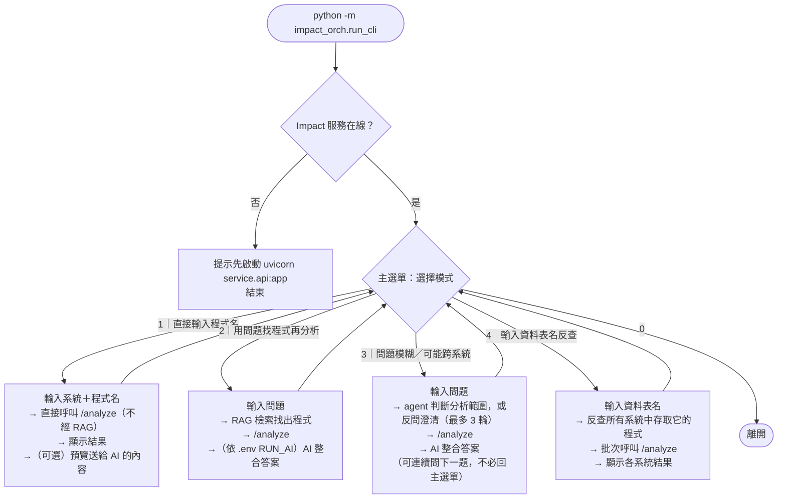
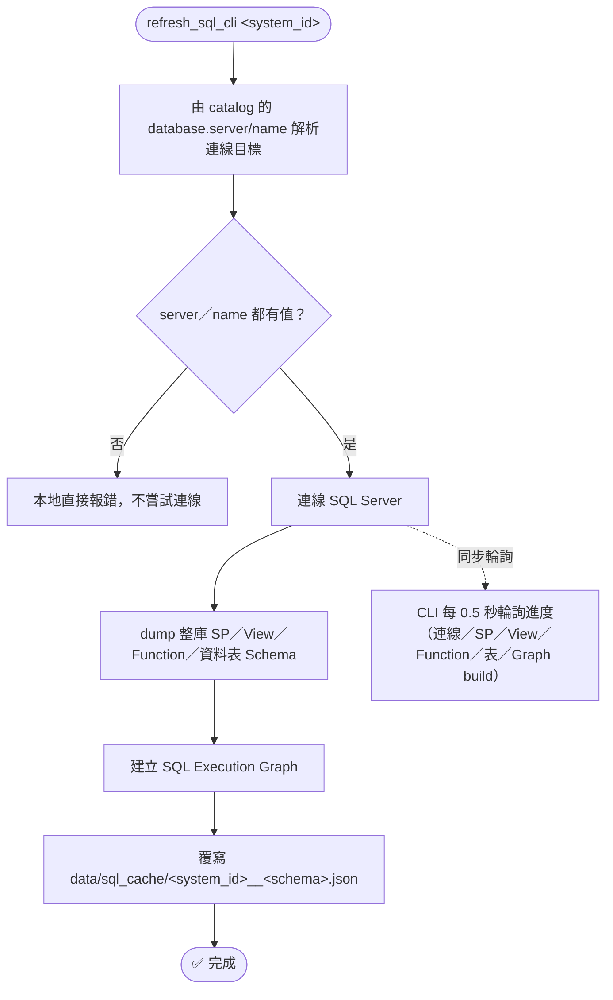

# 🧭 流程圖 — 變更影響分析系統

本文件用 4 張圖說明系統怎麼運作，對應實際程式碼（函式/檔名皆可在原始碼中找到，非示意）。想了解 agentic 模式（模式 3）內部逐步的 AI 介入點、`find_by_table` 的巢狀路徑判斷、或 `refresh_cli`/`refresh_sql_cli` 完整的治理細節（external wrapper contract preflight、atomic commit），見 [流程圖_進階.md](./流程圖_進階.md)。

1. [整體架構](#1-整體架構)
2. [`impact_orch.run_cli` 四種模式](#2-impact_orchrun_cli-四種模式)
3. [更新程式碼快取：`refresh_cli`](#3-更新程式碼快取refresh_cli)
4. [更新 SQL 快取：`refresh_sql_cli`](#4-更新-sql-快取refresh_sql_cli)

---

## 1. 整體架構

同一次「問問題」裡，資料來自兩個完全獨立的更新軸：**程式碼掃描快取**（`refresh_cli` 才會更新）與 **SQL Execution Graph**（`refresh_sql_cli` 才會更新）。兩者在 `CSharpAnalysisGateway` 這一層 join 起來，只有 `proven` 證據才會形成正式的 confirmed relationship。

> 💡 **多子資料夾系統**：一個 `system_id` 若在 catalog 對應到多個子資料夾（`azure.path` 為 list），Impact 會逐一解析每個子路徑，再合併成一個邏輯上的掃描結果，下游比對邏輯不需感知這是多資料夾組成。
>
> 💡 **agentic 模式（run_cli 模式 3）的差異**：不是直接走 RAG 檢索，而是由 `FunctionAgent` 依問題訊號決定要不要呼叫 RAG、SP 反查、資料表反查，符合條件的可以同時呼叫；命中多個系統且問題未明示範圍時，會先反問使用者澄清。詳細步驟見 [流程圖_進階.md](./流程圖_進階.md)。

[⬆ 回目錄](#-流程圖--變更影響分析系統)

---

## 2. `impact_orch.run_cli` 四種模式

> 💡 模式 1、4 完全不經 RAG／AI，是最快的「零 token」路徑；模式 2、3 才會用到規格書檢索與（可選的）AI 整合。是否呼叫 AI、是否顯示送進 AI 的完整內容，一律由 spec-rag 的 `.env`（`RUN_AI`／`SEE_AI_PROMPT`）決定，不受模式選擇影響。
>
> 💡 模式 4 命中不只一個系統時只會警告、不會自動判斷是否真的共用同一張表（純字串比對表名，不驗證跨系統 schema 是否相同）；agentic 模式（模式 3）遇到同樣情況則會直接反問使用者。

[⬆ 回目錄](#-流程圖--變更影響分析系統)

---

## 3. 更新程式碼快取：`refresh_cli`

> ⚠️ `refresh_cli` 本身就會自動覆寫磁碟快取，**不需要手動刪 `data/scan_cache/`**。但若剛編輯過 `code_analyzer/`／`service/` 的解析器程式碼，正在跑的 Impact 服務仍是記憶體裡的舊版本（Python 不會熱重載），必須先重啟服務才能讓 `refresh_cli` 套用新邏輯。
>
> ⚠️ `--program` 局部更新要求該系統所有已解析的子資料夾都已有目前版本的快取，否則會停止並提示先跑一次不帶 `--program` 的完整更新，不會偷偷升級成整包重掃。
>
> 完整的 external wrapper contract 狀態機（`created`/`reused`/`conflicted`/`preflight_failed`）與 atomic two-file commit 細節見 [流程圖_進階.md](./流程圖_進階.md)。

[⬆ 回目錄](#-流程圖--變更影響分析系統)

---

## 4. 更新 SQL 快取：`refresh_sql_cli`

> 📌 `system_id` 不是資料庫名稱——實際連線的主機/資料庫從 catalog 的 `database.server`/`database.name` 解析，缺一即在本地直接報錯，不會誤連到未知資料庫。
>
> ⚠️ 資料庫是**多系統共用資源**，跟 `refresh_cli`（每個系統各自的 git repo）是不同軸的獨立更新指令；資料庫端 SP/View/Function 若被直接修改（未經程式部署），需要重跑這支指令才會反映到之後的問答結果。
>
> ⚠️ 進度顯示 `completed` 只代表 refresh worker 正常結束，**不等於**正式查詢已通過 Graph readiness 驗證；若 cache 缺失、過期或 database scope 不符，正式 API 會回 HTTP 409（`sql_execution_graph_required`）。

[⬆ 回目錄](#-流程圖--變更影響分析系統)
