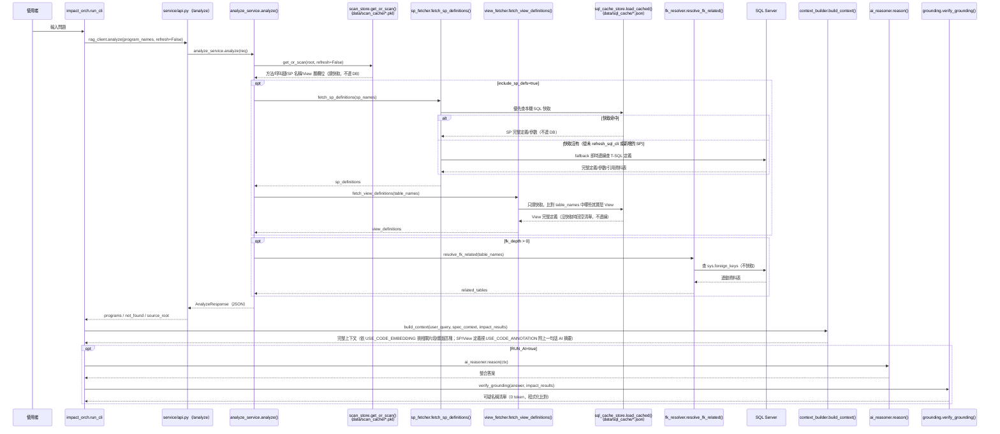
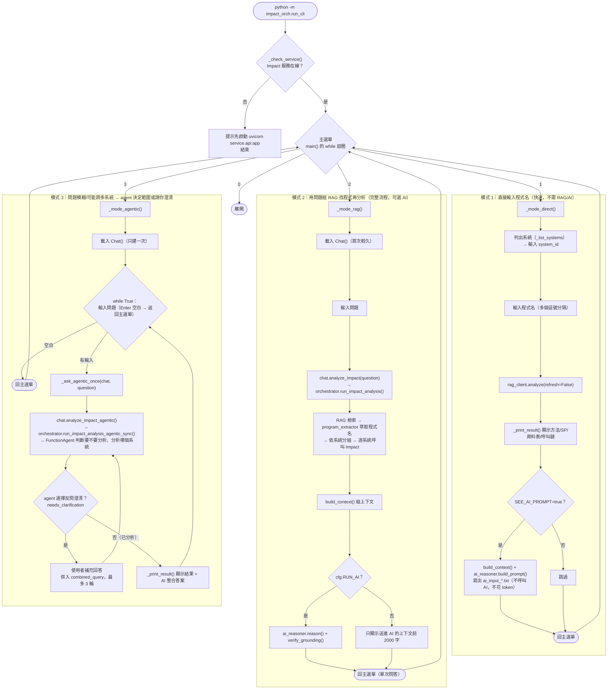
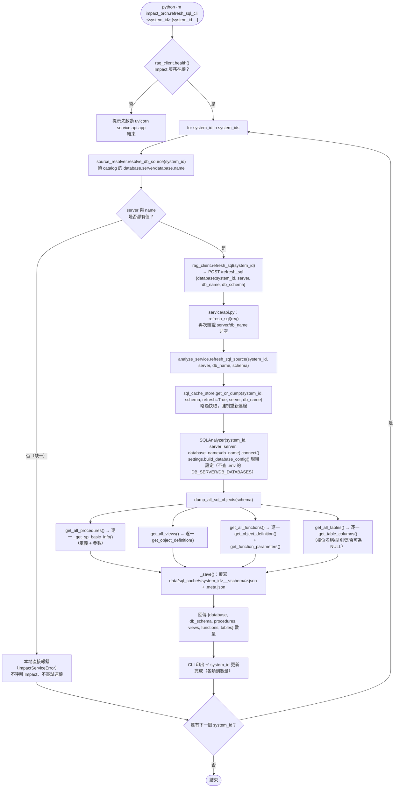

# 🧭 流程圖 — 變更影響分析系統

本文件用圖表整理三個常被問到的流程，對應實際程式碼（函式/檔名皆可在原始碼中找到，非示意）：

1. [整體資料流程](#1-整體資料流程靜態掃描快取-vs-即時資料庫查詢) — 靜態掃描快取 vs 即時資料庫查詢的時機差異
2. [`impact_orch.run_cli` 流程](#2-impact_orchrun_cli-流程互動式-cli) — 三種問答模式的分支與模式 3 的連續問答迴圈
3. [`impact_orch.refresh_cli` 流程](#3-impact_orchrefresh_cli-流程更新指令) — 更新程式碼指令實際做了什麼
4. [`impact_orch.refresh_sql_cli` 流程](#4-impact_orchrefresh_sql_cli-流程更新-sql-快取) — 更新 SQL 快取指令實際做了什麼

---

## 1. 整體資料流程（靜態掃描快取 vs 即時資料庫查詢）

同一次「問問題」裡，資料其實來自兩種完全不同時機的來源：

- **靜態掃描結果**（方法、呼叫鏈、SP/資料表**名稱**、View 層欄位）：來自 [`data/scan_cache/*.pkl`](../data/scan_cache)，只有跑 `refresh_cli` 時才會重新產生。
- **SP/View 完整定義**：優先讀本機 [`data/sql_cache/*.json`](../data/sql_cache)（由獨立指令 `refresh_sql_cli` 落地），快取沒有才 fallback 即時連線 SQL Server。
- **FK 連動表**：每次問問題都**即時連線 SQL Server**現撈，不快取（目前尚未落地化，相對輕量）。

> 💡 **重點**：`refresh_cli` 更新的是**靜態掃描快取**（方法、呼叫鏈、SP/資料表名稱、View 層欄位）；`refresh_sql_cli` 更新的是 **SQL 快取**（SP/View/Function 完整定義、資料表 Schema）——兩者是不同軸的獨立更新指令（資料庫是多系統共用資源，不跟某個 system_id 綁定）。FK 連動表仍然每次即時查，沒有對應的更新指令。

[⬆ 回目錄](#-流程圖--變更影響分析系統)

---

## 2. `impact_orch.run_cli` 流程（互動式 CLI）

> 💡 模式 3 的關鍵設計（2026-07-03 調整）：`Chat()` 只在**進入模式 3 時**載入一次；每次 agent 回答完（不論是分析結果或反問澄清後的最終答案），會**直接再問下一個問題**，不用回主選單重新選「3」，也不用重新等待系統載入——只有直接按 Enter 才會返回主選單。

[⬆ 回目錄](#-流程圖--變更影響分析系統)

---

## 3. `impact_orch.refresh_cli` 流程（更新指令）

> ⚠️ **常見誤解**：`get_or_scan(refresh=True)` 本身就會**自動覆寫**磁碟快取，不需要手動刪除 `data/scan_cache/*.pkl`。但如果你剛編輯過 `code_analyzer/`／`service/` 底下的解析器程式碼，**已在執行的 uvicorn 服務仍是記憶體裡的舊程式碼**（Python 不會熱重載），必須先重啟服務（或加 `--reload`）才能讓 `refresh_cli` 真正套用新邏輯——這點與快取本身無關，詳見 [使用說明書.md](./使用說明書.md) 的常見問題排除。

[⬆ 回目錄](#-流程圖--變更影響分析系統)

---

## 4. `impact_orch.refresh_sql_cli` 流程（更新 SQL 快取）

> 💡 之後問問題時，[`sp_fetcher.py`](../service/sp_fetcher.py)／[`view_fetcher.py`](../service/view_fetcher.py) 會**優先讀這份本機快取**，不必每次都連線 SQL Server；`sp_fetcher.py` 在快取沒有該 SP 時仍會 fallback 即時查詢（此時也需要 `db_server`/`db_name`，安全網），`view_fetcher.py` 則只讀快取（避免逐一表名都連線判斷是否為 View）。
>
> ⚠️ 資料庫是**多系統共用資源**（不像 git repo 是每個系統各自一份），跟 `refresh_cli`（更新程式碼）是不同軸的更新指令，需要個別觸發；資料庫端的 SP/View/Function 若被直接修改（未經程式碼部署），也需要重跑這支指令才會反映到之後的問答結果。
>
> ⚠️ **`system_id` 不是資料庫名稱**：實際連線目標（`server`/`db_name`）從 catalog 的
> `database.server`/`database.name` 解析。若該系統在 catalog 未設定完整（缺一即算），
> `refresh_sql_cli` 會在**本地**直接報錯、不會呼叫 Impact 服務，避免誤連到錯誤或未知的
> 資料庫；`/analyze` 呼叫的 SP/View/FK 部分則維持「盡力而為」，缺 server/db_name 時安全
> 回空，不會讓整個問答失敗。

[⬆ 回目錄](#-流程圖--變更影響分析系統)
