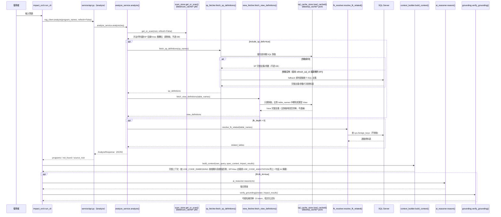
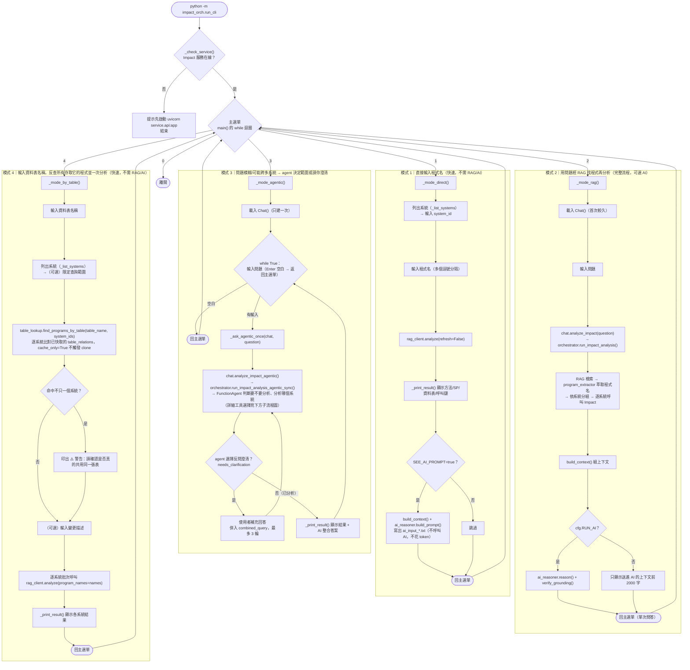
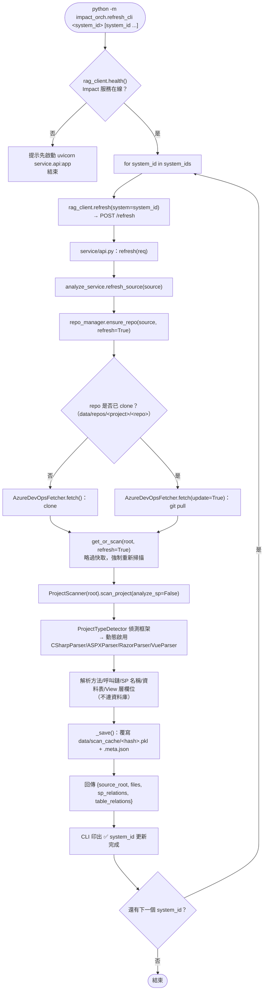
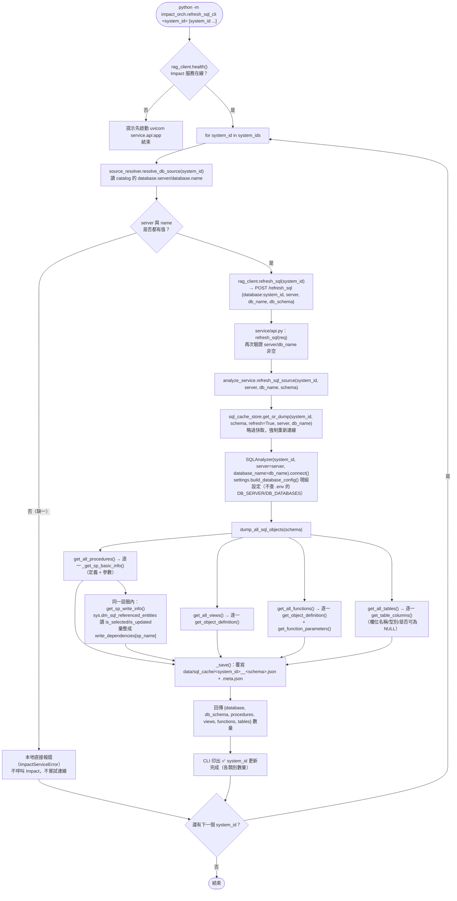
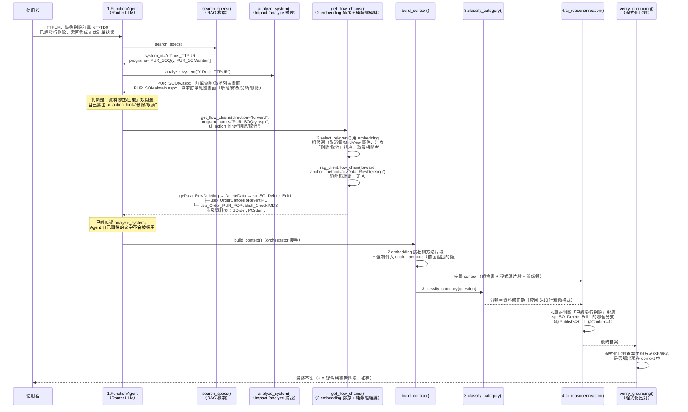
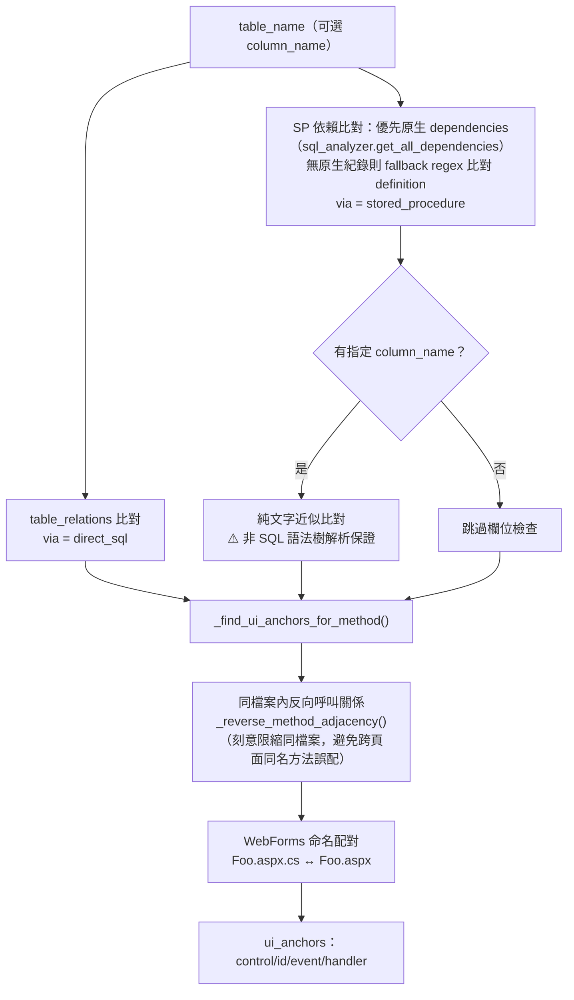
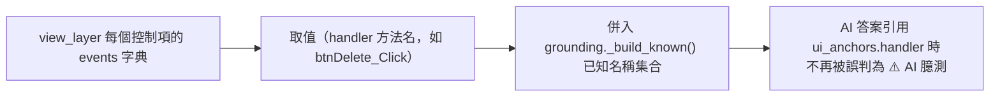
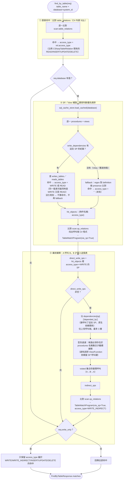

# 🧭 流程圖 — 變更影響分析系統

本文件用圖表整理三個常被問到的流程，對應實際程式碼（函式/檔名皆可在原始碼中找到，非示意）：

1. [整體資料流程](#1-整體資料流程靜態掃描快取-vs-即時資料庫查詢) — 靜態掃描快取 vs 即時資料庫查詢的時機差異
2. [`impact_orch.run_cli` 流程](#2-impact_orchrun_cli-流程互動式-cli) — 四種問答模式的分支、模式 3 的連續問答迴圈與模式 4 的資料表反查
3. [`impact_orch.refresh_cli` 流程](#3-impact_orchrefresh_cli-流程更新指令) — 更新程式碼指令實際做了什麼
4. [`impact_orch.refresh_sql_cli` 流程](#4-impact_orchrefresh_sql_cli-流程更新-sql-快取) — 更新 SQL 快取指令實際做了什麼（含 SP 讀寫資訊採集）
5. [Agentic 模式（模式 3）詳細步驟：AI 介入點](#5-agentic-模式模式-3詳細步驟ai-介入點) — 從輸入問題到吐出答案，逐步標注哪些是 LLM 判斷、哪些是 embedding、哪些是純程式邏輯，含 `get_flow_chains`（forward/backward 呼叫鏈）工具
6. [`find_by_table` 寫入反查流程](#6-find_by_table-寫入反查access_type巢狀展開流程) — 反查結果如何分辨「讀還是寫」這張表、巢狀 SP 呼叫如何展開成間接寫入

---

## 1. 整體資料流程（靜態掃描快取 vs 即時資料庫查詢）

同一次「問問題」裡，資料其實來自兩種完全不同時機的來源：

- **靜態掃描結果**（方法、呼叫鏈、SP/資料表**名稱**、View 層欄位）：來自 [`data/scan_cache/*.pkl`](../data/scan_cache)，只有跑 `refresh_cli` 時才會重新產生。
- **SP/View 完整定義**：優先讀本機 [`data/sql_cache/*.json`](../data/sql_cache)（由獨立指令 `refresh_sql_cli` 落地），快取沒有才 fallback 即時連線 SQL Server。
- **FK 連動表**：每次問問題都**即時連線 SQL Server**現撈，不快取（目前尚未落地化，相對輕量）。
- **SP/資料表反查程式**（`/find_by_sp`、`/find_by_table`）：純比對已存在的 `scan_cache`（`sp_relations`/`table_relations`），`cache_only=True` 時不觸發 clone 或重新掃描；`/find_by_table` 另外會讀 `sql_cache` 的 `write_dependencies`（若已跑過 `refresh_sql_cli`），標示每筆命中是「讀還是寫」這張表（`access_type`），並沿 `dependencies.depended_by` 巢狀展開間接寫入的呼叫端 SP（詳見下方第 6 節）。
- **關係鏈候選清單**（`/flow_chain`）：`forward`（從 UI 動作往下追到 SP/資料表）與 `backward`（從資料表往上追到 SP/C# 方法/UI 事件）兩種方向，同樣純靜態組裝、不連即時 DB（詳見下方「Agentic 模式」一節的 `get_flow_chains` 說明）。



> 💡 **重點**：`refresh_cli` 更新的是**靜態掃描快取**（方法、呼叫鏈、SP/資料表名稱、View 層欄位）；`refresh_sql_cli` 更新的是 **SQL 快取**（SP/View/Function 完整定義、資料表 Schema）——兩者是不同軸的獨立更新指令（資料庫是多系統共用資源，不跟某個 system_id 綁定）。FK 連動表仍然每次即時查，沒有對應的更新指令。
>
> 💡 **多子資料夾系統**：一個 `system_id` 若在 catalog 對應到多個子資料夾（`azure.path` 為 list），`repo_manager.resolve_scan_roots()` 會逐一解析每個子路徑，`analyze_service._merge_scans()` 再把各子資料夾各自獨立的掃描結果（方法/SP/資料表關聯）合併成一個邏輯 `ProjectScanResult` 供後續比對；`/find_by_sp`、`/find_by_table`、`get_flow_chains` 的 `cache_only` 判斷也都改成「每個子路徑各自的 scan_cache 都要存在」（`peek_scan_roots()` + `has_cache()` 逐一檢查），不是只看某一個子資料夾或整個 repo 是否已 clone。
>
> 💡 **SP/View/UDF 的 AI 一句話摘要**：使用獨立的 `domain="sql2"` 標注 prompt（`code_retriever.py` 的 `_ANNO_PROMPTS`），刻意與 C# 方法摘要用的 `domain="csharp"` 分開，避免摘要內容退化成「重複列出參數清單」。
>
> ⚠️ **`scan_store._CACHE_VERSION` 已升至 12**：修正 `ASPXParser`/`ProjectScanner` 對資料表與 SP 呼叫「歸屬」的錯誤（哪個方法呼叫了哪支 SP/存取了哪張表）；`sp_fetcher.py` 的快取路徑（`_from_cache`）也同步修正，之前快取命中時 `tables` 欄位固定回空清單，現在會優先用 SP 快取的原生依賴關係（`dependencies`），沒有原生紀錄才 fallback 用 `extract_tables_from_definition()` 對定義文字做正則分析。跑過舊版本 `refresh_cli` 的系統，建議重新跑一次以套用修正後的歸屬結果。

[⬆ 回目錄](#-流程圖--變更影響分析系統)

---

## 2. `impact_orch.run_cli` 流程（互動式 CLI）



> 💡 模式 3 的關鍵設計（2026-07-03 調整）：`Chat()` 只在**進入模式 3 時**載入一次；每次 agent 回答完（不論是分析結果或反問澄清後的最終答案），會**直接再問下一個問題**，不用回主選單重新選「3」，也不用重新等待系統載入——只有直接按 Enter 才會返回主選單。

### 模式 3 完整內部流程：從問題到答案

`Agent` 節點（`chat.analyze_impact_agentic()` → `orchestrator.run_impact_analysis_agentic_sync()`）內部其實是一整條「工具呼叫 → 資料彙整 → context 組裝 → AI 判斷」的管線，不是一步就出答案：

```mermaid
flowchart TD
    Q(["使用者輸入問題<br/>_ask_agentic_once(chat, question)"]) --> Agent["FunctionAgent 讀取 _AGENT_SYSTEM_PROMPT 規則<br/>逐步決定呼叫哪些工具（可多次、可混用）"]

    subgraph S1["① 搜尋／反查：找出候選 system_id + 程式名"]
        Agent --> T1{"問題主要在問？"}
        T1 -- "畫面/功能名稱" --> ST1["search_specs()<br/>RAG 向量檢索規格書"]
        T1 -- "明確 SP 名稱" --> ST2["search_specs_by_sp()<br/>反查已快取 sp_relations"]
        T1 -- "明確資料表名稱" --> ST3["search_specs_by_table()<br/>反查已快取 table_relations"]
        ST1 --> D1["spec_context_all ← RAG 命中節點文字<br/>（一定寫入，可能為空字串）"]
        ST2 --> D2{"反查找到程式？"}
        ST3 --> D3{"反查找到程式？"}
        D2 -- 是 --> D2a["_load_spec_content_for_programs()<br/>依 frontmatter program_code 精確比對<br/>補進 spec_context_all（若有登記）"]
        D2 -- 否 --> D2b["spec_context_all 不變"]
        D3 -- 是 --> D2a
        D3 -- 否 --> D2b
        D1 --> M["state.grouped[system_id] += programs<br/>state.scores 記分（RAG=相似度／反查=固定 1.0）"]
        D2a --> M
        D2b --> M
        M --> SD["state.search_done = True"]
    end

    subgraph S2["② 決定分析範圍"]
        SD --> E{"grouped 有命中系統？"}
        E -- 沒有 --> F["不分析<br/>依現有規格書內容回答／請使用者補充"]
        E -- "剛好一個系統" --> G["直接呼叫 analyze_system(system_id)<br/>對該系統跑一次程式碼靜態分析（呼叫 Impact /analyze）"]
        E -- "命中多個系統" --> H{"彼此相關，<br/>還是互斥/同名巧合？"}
        H -- 相關 --> G2["逐一呼叫 analyze_system<br/>對每個命中的系統各跑一次分析<br/>（次數上限 max_analyze_calls，避免無上限地重複分析）"]
        H -- "互斥/巧合/問題模糊" --> I(["needs_clarification=True<br/>回傳給 run_cli 反問使用者"])
    end

    subgraph S3["③ 程式碼分析（Impact /analyze）"]
        G --> AZ["rag_client.analyze(program_names, system_id)<br/>實際發出 HTTP 呼叫 Impact 服務的 /analyze API"]
        G2 --> AZ
        AZ --> AZ2["scan_cache（方法/呼叫鏈/SP·表名稱/View 層）<br/>+ sql_cache 優先／DB fallback（SP·View 定義）<br/>+ FK 即時查詢"]
        AZ2 --> IR["state.impact_results 累積<br/>state.analyze_attempted / analyze_calls 更新"]
    end

    subgraph S4["④（可選）get_flow_chains → Impact /flow_chain"]
        IR --> J{"需要 UI 操作／<br/>資料表異動的影響鏈？"}
        J -- forward --> K2["取 view_layer → embedding 選 UI 候選<br/>→ 方法呼叫鏈→SP巢狀展開<br/>→ inline SQL 補表 → FK"]
        J -- backward --> K3["表 → SP/直接SQL → C# 方法<br/>→ UI 事件反查（ui_anchors）"]
        J -- 不需要 --> L2["略過"]
        K2 --> L["state.chain_methods 記錄<br/>state.flow_chain_texts 累積敘述"]
        K3 --> L
    end

    subgraph S5["⑤ Context 組裝：build_context()"]
        L --> BC["build_context(user_query, spec_context_all,<br/>impact_results, chain_methods)<br/>把規格書內容＋程式碼分析結果＋關係鏈彙整成最終要餵給 AI 的完整 context"]
        L2 --> BC
        BC --> BC1["embedding 選相關 C# 方法片段<br/>+ 強制併入 chain_methods（不受挑選上限限制）"]
        BC --> BC2["SP/View/UDF 定義：domain=sql2<br/>一句話 AI 摘要"]
        BC --> BC3["view_layer（grid/form/script）：<br/>embedding 選相關區塊"]
        BC --> BC4["flow_chain_texts 併入<br/>《關係鏈分析》區塊"]
    end

    subgraph S6["⑥ AI 判斷：分類 → 整合 → 驗證"]
        BC1 --> CAT["ai_reasoner.classify_category(question)<br/>低成本 LLM 分類（如「資料修正類」）"]
        BC2 --> CAT
        BC3 --> CAT
        BC4 --> CAT
        CAT --> REASON["ai_reasoner.reason(ctx, question, category)<br/>最終整合 LLM 做語意判斷、寫出答案"]
        REASON --> GROUND["verify_grounding(answer, impact_results)<br/>程式化比對方法/SP/表名是否落地"]
        GROUND --> OUT(["最終答案<br/>（+ ⚠️ 落地驗證警告，如有）"])
    end

    F --> OUT2(["直接以 Agent 文字回答<br/>（無程式碼分析）"])
```



> 💡 **一句話總結**：①②只決定「查哪些系統/程式、要不要反問」，③才第一次真正碰程式碼，④是選配的關係鏈補強，⑤把①③④的產物全部彙整成一份 context（含強制併入的關係鏈方法），⑥才是真正的語意判斷發生的地方——規格書內容能不能進到⑤，完全取決於①走了哪條分支、有沒有找到對應內容。

> 💡 **模式 4（依資料表反查，2026-07-08 新增）**：不經 RAG/AI，純靜態比對，與模式 1 同樣零 token 成本；純字串比對表名，不驗證跨系統的實際資料庫 schema 是否相同，故命中多系統時只警告、不自動判斷。agent 模式（模式 3）有對應工具 `search_specs_by_table`，行為相同但由 agent 自行判斷何時呼叫、命中多系統時改為反問使用者。

[⬆ 回目錄](#-流程圖--變更影響分析系統)

---

## 3. `impact_orch.refresh_cli` 流程（更新指令）



> ⚠️ **常見誤解**：`get_or_scan(refresh=True)` 本身就會**自動覆寫**磁碟快取，不需要手動刪除 `data/scan_cache/*.pkl`。但如果你剛編輯過 `code_analyzer/`／`service/` 底下的解析器程式碼，**已在執行的 uvicorn 服務仍是記憶體裡的舊程式碼**（Python 不會熱重載），必須先重啟服務（或加 `--reload`）才能讓 `refresh_cli` 真正套用新邏輯——這點與快取本身無關，詳見 [使用說明書.md](./使用說明書.md) 的常見問題排除。

[⬆ 回目錄](#-流程圖--變更影響分析系統)

---

## 4. `impact_orch.refresh_sql_cli` 流程（更新 SQL 快取）



> 💡 之後問問題時，[`sp_fetcher.py`](../service/sp_fetcher.py)／[`view_fetcher.py`](../service/view_fetcher.py) 會**優先讀這份本機快取**，不必每次都連線 SQL Server；`sp_fetcher.py` 在快取沒有該 SP 時仍會 fallback 即時查詢（此時也需要 `db_server`/`db_name`，安全網），`view_fetcher.py` 則只讀快取（避免逐一表名都連線判斷是否為 View）。
>
> 💡 **`write_dependencies`（`_SQL_CACHE_VERSION` v4 新增）**：`P1` 迴圈內每支 SP 額外呼叫一次 `get_sp_write_info()`（同一套 `sys.dm_sql_referenced_entities`，多讀 `is_selected`/`is_updated`/欄位層級資訊），彙整成 `{sp_name: {writes_tables, reads_tables, writes_columns}}` 落地進快取；`find_by_table()` 反查時優先讀這份資料判斷「這支 SP 到底是讀還是寫這張表」，取代原本純靠 regex 對定義文字做 presence 比對（無法分讀寫）。舊版快取（v3 以前）沒有這個欄位，`find_by_table()` 會安全 fallback 回 regex 比對（見第 6 節）。
>
> ⚠️ 資料庫是**多系統共用資源**（不像 git repo 是每個系統各自一份），跟 `refresh_cli`（更新程式碼）是不同軸的更新指令，需要個別觸發；資料庫端的 SP/View/Function 若被直接修改（未經程式碼部署），也需要重跑這支指令才會反映到之後的問答結果。
>
> ⚠️ **`system_id` 不是資料庫名稱**：實際連線目標（`server`/`db_name`）從 catalog 的
> `database.server`/`database.name` 解析。若該系統在 catalog 未設定完整（缺一即算），
> `refresh_sql_cli` 會在**本地**直接報錯、不會呼叫 Impact 服務，避免誤連到錯誤或未知的
> 資料庫；`/analyze` 呼叫的 SP/View/FK 部分則維持「盡力而為」，缺 server/db_name 時安全
> 回空，不會讓整個問答失敗。

[⬆ 回目錄](#-流程圖--變更影響分析系統)

---

## 5. Agentic 模式（模式 3）詳細步驟：AI 介入點

模式 3（`run_impact_analysis_agentic`，位於 spec-rag 端 `impact_orch/orchestrator.py`／`impact_orch/agent_tools.py`，與這個 Impact 服務是分開的兩個 repo）內部其實有 **四種完全不同性質的「AI/模型」角色**，很容易被混為一談。以「TTPUR 恢復刪除訂單」這個真實問題為例，把每一步標注清楚：

| 角色 | 使用的模型 | 是不是真正的「推理判斷」 | 出現在下面哪一步 |
|---|---|---|---|
| 1. Router Agent | `cfg.AGENT_ROUTER_MODEL`（`FunctionAgent`） | ✅ 真的 LLM 推理 | Step 1、3、4（決定呼叫哪個工具、傳什麼參數，包含自己寫出 `ui_action_hint`） |
| 2. Embedding 相似度 | `cfg.OPENAI_EMBEDDING_MODEL`（`text-embedding-3-small`，spec-rag 端 `impact_orch/code_retriever.py`） | ❌ 不是推理，是固定的向量 cosine 相似度計算 | Step 5、8（候選錨點排序、程式碼片段/畫面區塊挑選） |
| 3. 片段一句話摘要 | `cfg.OPENAI_LOW_MODEL`（便宜模型） | ✅ 是 LLM，但只做摘要不做決策 | SP/View/UDF/前端 script 的「AI 摘要」（`USE_CODE_ANNOTATION=true` 時，圖中未展開） |
| 4. 最終整合答案 | `cfg.OPENAI_MODEL`（`ai_reasoner.reason()`） | ✅✅ 真正做「這是哪個分支/這條鏈才對」的實質判斷 | Step 10 |



### 逐步文字說明（含程式簡述）

1. **Router Agent 啟動（1.LLM）**：讀完 `_AGENT_SYSTEM_PROMPT` 規則，判斷這是圍繞某個畫面/功能的一般情況 → 決定第一步呼叫 `search_specs()`。
2. **`search_specs()`（RAG 檢索，非 LLM）**：對規格書向量庫檢索，命中〈訂單維護〉規格書，`extract_program_refs()`/`group_by_system()` 萃取出 `system_id="Y-Docs_TTPUR"`，`programs=["PUR_SOQry","PUR_SOMaintain"]`。回傳給 Agent 的只是純文字摘要，還沒有任何程式碼內容。
3. **Agent 呼叫 `analyze_system("Y-Docs_TTPUR")`（1.LLM 判斷 + 純靜態查表）**：Impact `/analyze` 回傳這兩支程式的方法/SP/資料表摘要：
   - **`PUR_SOQry.aspx`**：訂單查詢/取消列表畫面（`gvData` 這張 GridView，可查詢、匯出、對單筆訂單按「取消」）。
   - **`PUR_SOMaintain.aspx`**：單筆訂單維護畫面（新增/修改/分納/刪除，含「刪除並新增下筆訂單」按鈕）。
4. **Agent 判斷這是「資料修正/回復」類問題 → 呼叫 `get_flow_chains`（1.LLM 決定要呼叫 + 組出 `ui_action_hint`）**：依規則「誤刪/回復成正式狀態」這類字眼要用 forward 鏈，Agent 自己組出：
   ```python
   get_flow_chains(
       system_id="Y-Docs_TTPUR",
       direction="forward",
       program_name="PUR_SOQry.aspx",
       ui_action_hint="刪除/取消",
   )
   ```
   `ui_action_hint="刪除/取消"` 這幾個字是 Agent 讀完問題後自己寫出來的，不是程式算出來的。
5. **工具內部：抓畫面控制項 + embedding 排序候選（2.Embedding，非 LLM）**：取得 `view_layer` 後攤平出候選（例如 `{control:"asp:Button", id:"btnDelete", text:"取消", event:"OnRowDeleting", handler:"gvData_RowDeleting"}`），`select_relevant(candidates, "刪除/取消", domain="view")` 純用向量 cosine 相似度排序，「取消」這個候選被選中——**這裡才是真正的 embedding**。
6. **逐一候選呼叫 `rag_client.flow_chain(forward, anchor_method="gvData_RowDeleting")`（純靜態組裝，非 AI）**：組出實際呼叫鏈：`gvData_RowDeleting → DeleteData → sp_SO_Delete_Edit1`（`DeleteData`：判斷 SP 回傳值決定直接刪除/暫定取消/整批取消；`sp_SO_Delete_Edit1`：依 `OrderCancel`/`@Publish`/`@Confirm` 決定刪除或取消訂單並連動 `POWork`/`POrder` 的核心 SP），並記錄進 `state.chain_methods`。
7. **Agent 收工**：因為已經呼叫過 `analyze_system`，Agent 自己事後生成的文字不會被採用（規則 6）。
8. **`build_context()` 組裝最終 context（純程式邏輯，含2.Embedding 選片段）**：`_select_snippets()` 一樣跑 embedding 挑相關方法，外加把 Step 6 記下的 `chain_methods`（`DeleteData` 等）強制併入；並把 `state.flow_chain_texts` 整段附加在 `## 關係鏈分析` 區塊。
9. **`ai_reasoner.classify_category()`（3.低成本 LLM）**：判斷問題屬於哪個分類（本例為「資料修正類」），決定套用哪種回答格式模板。
10. **`ai_reasoner.reason(ctx, question, category)`（4.最終整合 LLM，真正做判斷的地方）**：讀完整組 context 後，**在這裡才真正判斷**「已經發行刪除」對應 SP 裡的哪個分支（`@Publish<>0` 且 `@Confirm=1`）、該開哪張表改哪個欄位（`SOrder.OrderCancel`/`CancelBy`/`CancelTime`），寫出最終答案。
11. **`verify_grounding()`（程式化比對，非 AI）**：把答案裡提到的方法名/SP名/表名，逐一比對 context 中的所有已知名稱（含 `flow_chain_texts`），有對不上的才附加 `⚠️ 落地驗證` 警告區塊。

> 💡 **一句話總結**：1.（Router Agent）決定「要查什麼、去哪查」→ 2.（Embedding）在候選裡做快速篩選/排序 → 3.（低成本 LLM）分類問題格式 → 4.（最終整合 LLM）在所有素材備齊後才真正做語意判斷、寫出答案 → 程式化 grounding 收尾。中間的靜態掃描查表（Step 2、3）與呼叫鏈組裝（Step 6）都是純規則式比對，執行結果 100% 可重現，不受 AI 隨機性影響。

### `get_flow_chains` 工具：forward／backward 兩種呼叫方向

上面範例只展示了 `direction="forward"`（從畫面操作往下追呼叫鏈，適合「這個按鈕/操作會動到什麼」）。`agent_tools.py` 的 `get_flow_chains` 實際上支援兩種方向，Agent 依問題性質自行選擇（`_AGENT_SYSTEM_PROMPT` 規則 7）：

| 方向 | 觸發時機（規則 7） | 需要的參數 | 內部行為 |
|---|---|---|---|
| `forward` | 使用者問「某個畫面操作／UI 動作」的影響（含「回復/修正」類問題，即使問句是回溯語氣） | `program_name` + Agent 自己判斷的 `ui_action_hint` | 先呼叫 `rag_client.analyze(include_view_layer=True, include_snippets=False)` 取得 `view_layer` → `_flatten_ui_field_events()` 攤平候選（`_GRID_ROW_COMMAND_EVENTS` 處理 GridView 列命令按鈕，見下方說明）→ `select_relevant(domain="view")` 依 `ui_action_hint` 排序，取前 5 名候選 → 逐一呼叫 `rag_client.flow_chain(forward, anchor_method=...)` |
| `backward` | 使用者問「異動某張資料表/欄位」會影響哪些程式（由誰寫入/誰依賴這張表） | `table_name` | 直接呼叫 `rag_client.flow_chain(direction="backward")`，把回傳的每個 `(program, method)` 記錄進 `state.chain_methods` |

兩種方向都只有在**已經對該 system 呼叫過 `analyze_system` 之後**才允許呼叫（規則 7 第一條），且都受 `max_flow_chain_calls` 呼叫次數上限保護。

`_flatten_ui_field_events()` 對 GridView 列命令按鈕的處理（呼應 `Impact_analysis_system.md` 記憶中 2026-07-13 的修復）：一般控制項直接用自己的 `events` 產生候選；但當某個 grid 容器層級的事件屬於 `_GRID_ROW_COMMAND_EVENTS`（`OnRowDeleting`/`OnRowEditing`/`OnRowUpdating`/`OnRowCancelingEdit`/`OnRowCommand`——這類事件語法上只掛在 grid 容器本身，不在按鈕自己的 `events` 裡）時，會把該 grid 底下「有文字但沒有自己事件」的每個欄位（如按鈕 `Text="取消"`）都跟這個容器層級的 handler 配對，合成出「真實按鈕文字 + 真實 handler」的候選——這正是上面範例中 `gvData_RowDeleting` 能被 `ui_action_hint="刪除/取消"` 正確選中的原因。

`get_flow_chains` 的 `cache_only` 判斷邏輯與 `find_by_sp`/`find_by_table` 相同：用 `peek_scan_roots()` + `has_cache()` 逐一檢查該系統**每個**已解析子路徑（多子資料夾系統）是否都已有掃描快取，而非只看 repo 是否已 clone——同樣是為了避免「共用同一個 repo 但不同 `path` 的兄弟系統」誤判為已就緒。

Impact 端對應的是新增的 `POST /flow_chain` 端點（`FlowChainRequest`/`FlowChainResponse`，`direction="forward"` 時驗證 `program_name`/`anchor_method` 必填，`direction="backward"` 時驗證 `table_name` 必填），實際組鏈邏輯在新模組 `service/flow_chain_builder.py`（`build_forward_chain()`/`build_backward_chains()`）——這一段是純靜態組裝，完全不判斷「這條鏈跟問題相不相關」，那個判斷留給 Agent 自己做。

### `build_forward_chain()`：從錨點方法展開到資料表


### `build_backward_chains()`：從資料表反查程式與 UI 觸發點



### grounding 同步更新：事件處理方法名稱也算已知名稱



[⬆ 回目錄](#-流程圖--變更影響分析系統)

---

## 6. `find_by_table` 寫入反查（access_type／巢狀展開）流程

`/find_by_table`（`service/analyze_service.py` 的 `find_by_table()`）原本只能回答「哪些程式碰過這張表」，不分讀寫。這裡補上「這支程式到底是讀還是寫這張表」的分類（`access_type`），並支援「A 呼叫 B、B 才真的寫這張表」這種巢狀情況的間接偵測。



> 💡 **讀寫資訊來源**：`write_dependencies`（`sql_analyzer.get_sp_write_info()` 包一層 `sys.dm_sql_referenced_entities`，讀 `is_selected`/`is_updated`/欄位層級）由 `refresh_sql_cli` 落地進 `data/sql_cache/<system_id>__dbo.json`（`_SQL_CACHE_VERSION` v4 新增，詳見第 4 節）。**未重新跑過 `refresh_sql_cli` 的系統，快取裡不會有這個欄位**，`find_by_table()` 會安全 fallback 回原本的 regex 純文字比對（`access_type` 留空，等同舊行為）。
>
> 💡 **`write_dependencies` 與既有 `dependencies` 欄位並存、刻意不合併**：`dependencies`（`sys.sql_expression_dependencies`）不分讀寫、混雜 SP/View/Function 呼叫關係，`service/sp_fetcher.py`／`service/flow_chain_builder.py`（見第 5 節 `build_backward_chains()`）／`service/dependency_fetcher.py` 都依賴它包含「完整讀寫」的物件觸及清單；若把其中的寫入表移除只留讀取，會讓這三個既有功能漏掉寫入 SP（尤其 `flow_chain_builder.py` 的 backward chain，正是「復原刪除」類問題最需要追到的寫入 SP）。因此兩個欄位之間存在的表名重複，是刻意接受的取捨。
>
> 💡 **`write_only` 篩選涵蓋兩種來源**：C# 直接內嵌 SQL 寫入（`INSERT`/`UPDATE`/`DELETE`，來自 `table_relations`）與透過 SP 反查到的寫入（`WRITE`/`WRITE_INDIRECT`，來自 `write_dependencies`）；spec-rag 側 `impact_orch/rag_client.py`／`impact_orch/table_lookup.py` 的 `find_by_table()`/`find_programs_by_table()` 均已加上 `write_only` 透傳參數，但目前**互動式 CLI 模式 4與 agent 的 `search_specs_by_table` 工具尚未在使用者介面上暴露這個開關**（預設 `write_only=False`，回傳讀寫都算命中，與呼叫 API/函式庫時可選 `write_only=True` 不同）。

[⬆ 回目錄](#-流程圖--變更影響分析系統)
