# 🧭 流程圖 — 變更影響分析系統

本文件用圖表整理六個常被問到的流程，對應實際程式碼（函式/檔名皆可在原始碼中找到，非示意）：

1. [整體資料流程](#1-整體資料流程程式碼快取-sql-execution-graph-vs-正式路徑證據) — 程式碼快取、SQL Execution Graph 與正式路徑證據
2. [`impact_orch.run_cli` 流程](#2-impact_orchrun_cli-流程互動式-cli) — 四種問答模式的分支、模式 3 的連續問答迴圈與模式 4 的資料表反查
3. [`impact_orch.refresh_cli` 流程](#3-impact_orchrefresh_cli-流程更新指令) — 更新程式碼指令實際做了什麼
4. [`impact_orch.refresh_sql_cli` 流程](#4-impact_orchrefresh_sql_cli-流程更新-sql-快取) — 更新 SQL 快取、建立 Graph 與輪詢進度
5. [Agentic 模式（模式 3）詳細步驟：AI 介入點](#5-agentic-模式模式-3詳細步驟ai-介入點) — 從輸入問題到吐出答案，逐步標注哪些是 LLM 判斷、哪些是 embedding、哪些是純程式邏輯，含 `get_flow_chains`（forward/backward 呼叫鏈）工具
6. [`find_by_table` 寫入反查流程](#6-find_by_table-寫入反查access_type巢狀路徑evidence流程) — 以 Graph query 分辨讀寫、巢狀路徑與 evidence

---

## 1. 整體資料流程（程式碼快取、SQL Execution Graph 與正式路徑證據）

同一次「問問題」裡，資料其實來自兩種完全不同時機的來源：

- **靜態掃描結果**（方法、inline SQL、View 層欄位、source snapshot）：來自 [`data/scan_cache/*.pkl`](../data/scan_cache)，只有跑 `refresh_cli` 時才會重新產生。
- **SP/View/Function 完整定義**：由獨立指令 `refresh_sql_cli` 從 SQL Server dump 整庫物件與資料表 Schema，建立 database-scoped `SQL Execution Graph`，再寫入 [`data/sql_cache`](../data/sql_cache)。正式 consumer 只使用經 `sql_cache_store.py` 驗證的 Graph cache，不以即時逐物件查詢或 legacy dependency dictionary 補洞。
- **FK 連動表**：只有明確要求且具備可用資料庫設定時才查詢；它是近似輔助 evidence，不等同 SQL Execution Graph relationship。
- **SP/資料表反查程式**（`/find_by_sp`、`/find_by_table`）：由 `CSharpAnalysisGateway` 將 source invocation 與 database-scoped `SQL Execution Graph` join；`cache_only=True` 時不觸發 clone 或重新掃描。正式命中分為 `proven`、`likely`、`unresolved`，只有 `proven` 形成 confirmed relationship；資料表查詢由 `query_table_accesses()` 提供 typed operation、巢狀 call 與 `WRITE_INDIRECT`。
- **關係鏈候選清單**（`/flow_chain`）：`forward`（從 UI 動作往下追到 SP/資料表）與 `backward`（從資料表往上追到 SP/C# 方法/UI 事件）兩種方向，是可選的 deterministic candidate tool；正式回答使用 shared `PathSelectionCoordinator` 選出 `path_id`，再由 `/path_evidence` 取得單一路徑證據。

在進入 Impact `/analyze` 前，spec-rag 端先完成「問題路由與分析範圍發現」。一般 `Chat.analyze_impact()` 與 Agentic `Chat.analyze_impact_agentic()` 是兩條不同入口：前者由 `chat.py` 直接查詢或進入語意 RAG，後者由 `FunctionAgent` 依問題中實際出現的訊號，條件式呼叫 RAG、SP 反查與資料表反查；符合條件的結果會先合併，再進行 system scope / ambiguity 判斷。

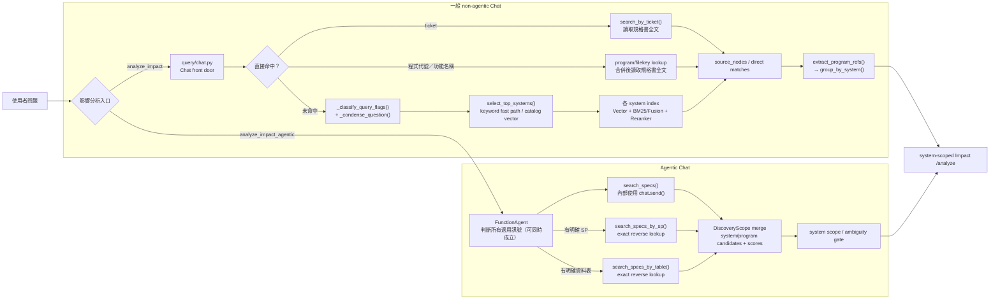

> 💡 `search_specs_by_sp()` 與 `search_specs_by_table()` 不是一般 non-agentic `analyze_impact()` 的自動步驟；它們是 Agentic mode 的條件式 exact lookup。反查命中的是候選 system/program，若同名物件命中多個系統且問題未明示 system，必須先澄清，不能直接視為同一個系統。

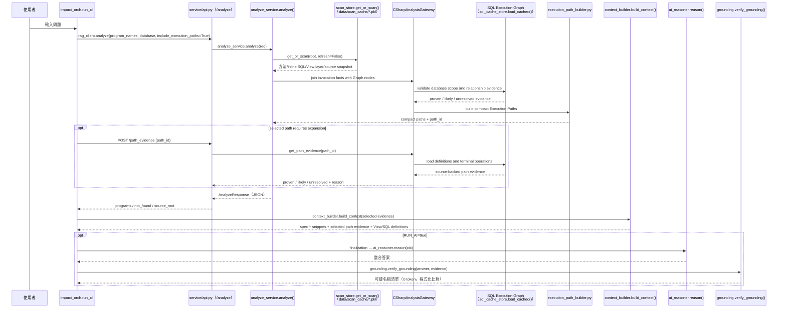

> 💡 **重點**：`refresh_cli` 更新的是**程式碼 scan cache**；`refresh_sql_cli` 更新的是 **SQL object dump 與 database-scoped SQL Execution Graph**——兩者是不同軸的獨立更新指令。正式 path/lineage/reverse lookup 在查詢邊界驗證 Graph readiness；progress `completed` 不等於 Graph 已可用。
>
> 💡 **多子資料夾系統**：一個 `system_id` 若在 catalog 對應到多個子資料夾（`azure.path` 為 list），`repo_manager.resolve_scan_roots()` 會逐一解析每個子路徑，`analyze_service._merge_scans()` 再把各子資料夾各自獨立的掃描結果（方法/inline SQL/View layer）合併成一個邏輯 `ProjectScanResult` 供後續比對；`/find_by_sp`、`/find_by_table`、`get_flow_chains` 的 `cache_only` 判斷也都改成「每個子路徑各自的 scan_cache 都要存在」（`peek_scan_roots()` + `has_cache()` 逐一檢查），不是只看某一個子資料夾或整個 repo 是否已 clone。
>
> 💡 **SP/View/UDF 的 AI 一句話摘要**：使用獨立的 `domain="sql2"` 標注 prompt（`code_retriever.py` 的 `_ANNO_PROMPTS`），刻意與 C# 方法摘要用的 `domain="csharp"` 分開，避免摘要內容退化成「重複列出參數清單」。
>
> ⚠️ **掃描快取版本化**：`scan_store._CACHE_VERSION` 變更時，舊 pickle 會被視為過期並在 `refresh_cli` 或明確掃描時重建。SQL 關係則另外受 `sql_cache_store.py` 的 Graph version、database scope 與 cache version 守門；掃描快取完成不代表 Graph 已就緒。

[⬆ 回目錄](#-流程圖--變更影響分析系統)

---

## 2. `impact_orch.run_cli` 流程（互動式 CLI）

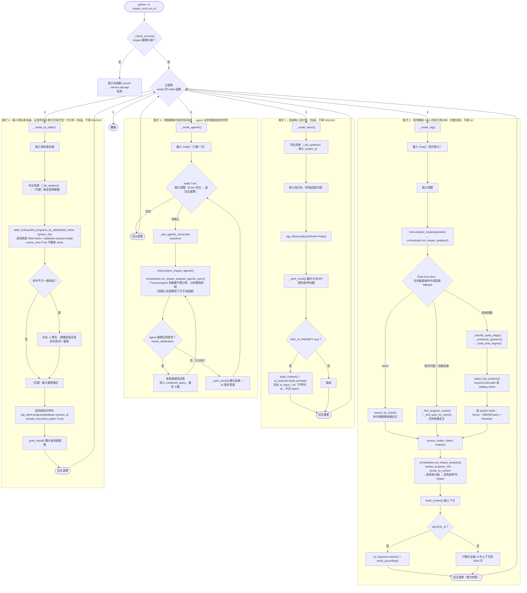

> 💡 模式 3 的關鍵設計（2026-07-03 調整）：`Chat()` 只在**進入模式 3 時**載入一次；每次 agent 回答完（不論是分析結果或反問澄清後的最終答案），會**直接再問下一個問題**，不用回主選單重新選「3」，也不用重新等待系統載入——只有直接按 Enter 才會返回主選單。

### 模式 3 完整內部流程：從問題到答案

`Agent` 節點（`chat.analyze_impact_agentic()` → `orchestrator.run_impact_analysis_agentic_sync()`）內部其實是一整條「工具呼叫 → 資料彙整 → context 組裝 → AI 判斷」的管線，不是一步就出答案：

```mermaid
flowchart TD
    Q(["使用者輸入問題<br/>_ask_agentic_once(chat, question)"]) --> Agent["FunctionAgent 讀取 _AGENT_SYSTEM_PROMPT 規則<br/>逐步決定呼叫哪些工具（可多次、可混用）"]

    subgraph S1["① 搜尋／反查：找出候選 system_id + 程式名"]
        Agent --> T1["先辨識問題中的可用訊號<br/>以下條件可同時成立，不是三選一"]
        T1 --> C1{"有畫面／功能／程式線索？"}
        T1 --> C2{"有明確 SP 名稱？"}
        T1 --> C3{"有明確資料表名稱？"}

        C1 -- 是 --> ST1["search_specs()<br/>內部呼叫 chat.send()<br/>direct ticket/program/filekey 或 semantic RAG"]
        C1 -- 否 --> SK1["略過 search_specs"]
        C2 -- 是 --> ST2["search_specs_by_sp()<br/>精確 SP 名稱反查<br/>Gateway + database-scoped Graph"]
        C2 -- 否 --> SK2["略過 SP 反查"]
        C3 -- 是 --> ST3["search_specs_by_table()<br/>精確資料表名稱反查<br/>query_table_accesses() + inline facts"]
        C3 -- 否 --> SK3["略過資料表反查"]

        ST1 --> D1["spec_context_all ← RAG 命中節點文字<br/>（一定寫入，可能為空字串）"]
        ST2 --> D2{"反查找到程式？"}
        ST3 --> D3{"反查找到程式？"}
        D2 -- 是 --> D2a["_load_spec_content_for_programs()<br/>依 frontmatter program_code 精確比對<br/>補進 spec_context_all（若有登記）"]
        D2 -- 否 --> D2b["spec_context_all 不變"]
        D3 -- 是 --> D3a["_load_spec_content_for_programs()<br/>依 frontmatter program_code 精確比對<br/>補進 spec_context_all（若有登記）"]
        D3 -- 否 --> D3b["spec_context_all 不變"]

        D1 --> M["候選結果寫入 DiscoveryScope"]
        D2a --> M
        D2b --> M
        D3a --> M
        D3b --> M
        SK1 --> M
        SK2 --> M
        SK3 --> M
        M --> Merge["合併同一 system 的 programs<br/>state.grouped + state.scores<br/>RAG=相似度／exact lookup=固定 1.0"]
        Merge --> SD["state.search_done = True"]
    end

    subgraph S2["② 決定分析範圍"]
        SD --> E{"grouped 有命中系統？"}
        E -- 沒有 --> F["不分析<br/>依現有規格書內容回答／請使用者補充"]
        E -- 有 --> Scope{"system scope gate<br/>明示 system 優先；檢查 exact lookup ambiguity"}
        Scope -- "SP/table 多系統且未明示 system" --> I(["needs_clarification=True<br/>回傳給 run_cli 反問使用者"])
        Scope -- "唯一命中／已明示 system" --> G["呼叫 analyze_system(system_id)<br/>對該系統跑一次程式碼靜態分析（呼叫 Impact /analyze）"]
        Scope -- "多系統且 exact scope 可判定" --> H{"候選系統彼此相關？"}
        H -- 是（同一問題的不同面向） --> G2["依選定 system_id 分析<br/>同一 system 的命中程式一次合併<br/>受 max_analyze_calls 限制"]
        H -- "互斥/同名巧合/問題模糊" --> I
    end

    subgraph S3["③ 程式碼分析（Impact /analyze）"]
        G --> AZ["rag_client.analyze(program_names, system_id,<br/>database, include_execution_paths=True)<br/>→ POST /analyze"]
        G2 --> AZ
        AZ --> Scan["scan_cache：方法、inline SQL、View layer、snapshot"]
        Scan --> Gateway["CSharpAnalysisGateway<br/>join source invocation 與 Graph"]
        Gateway --> GraphReady{"database-scoped<br/>SQL Execution Graph ready？"}
        GraphReady -- 否 --> Graph409["HTTP 409<br/>sql_execution_graph_required"]
        GraphReady -- 是 --> Evidence["proven / likely / unresolved<br/>保留 reason、target、branch context"]
        Evidence --> Paths["execution_path_builder.py<br/>建立 compact Execution Paths + path_id"]
        Paths --> IR["state.impact_results 累積<br/>state.analyze_attempted / analyze_calls 更新"]
    end

    subgraph S4["④ shared path selection + optional candidate tools"]
        IR --> Select["PathSelectionCoordinator<br/>answer / expand / clarify"]
        Select --> J{"需要補充 UI 操作／<br/>資料表異動的候選鏈？"}
        J -- forward --> K2["get_flow_chains(forward)<br/>view_layer + embedding 選 UI 候選<br/>→ flow_chain candidate"]
        J -- backward --> K3["get_flow_chains(backward)<br/>表 → SP/inline SQL → C# 方法/UI anchor<br/>→ flow_chain candidate"]
        J -- 不需要 --> L2["直接使用 compact path candidates"]
        K2 --> L["PathSelectionCoordinator 選 path_id<br/>candidate 仍不是 confirmed evidence"]
        K3 --> L
        L2 --> L
    end

    subgraph S5["⑤ Context 組裝：build_context()"]
        L --> BC["context_builder.build_context(user_query,<br/>spec_context_all, selected evidence)<br/>把規格書＋程式碼＋selected path 彙整成 context"]
        BC --> BC1["embedding 選相關 C# 方法片段<br/>+ 強制併入 flow-chain candidate methods（chain_methods，不受挑選上限限制）"]
        BC --> BC2["SP/View/UDF 定義：domain=sql2<br/>一句話 AI 摘要"]
        BC --> BC3["view_layer（grid/form/script）：<br/>embedding 選相關區塊"]
        BC --> BC4["selected path evidence / flow_chain candidate<br/>分開標示，避免候選冒充 confirmed fact"]
    end

    subgraph S6["⑥ AI 判斷：分類 → 整合 → 驗證"]
        BC1 --> CAT["ai_reasoner.classify_category(question)<br/>低成本 LLM 分類（如「資料修正類」）"]
        BC2 --> CAT
        BC3 --> CAT
        BC4 --> CAT
        CAT --> REASON["ai_reasoner.reason(ctx, question, category)<br/>最終整合 LLM 做語意判斷、寫出答案"]
        REASON --> GROUND["verify_grounding(answer, impact_results)<br/>程式化比對方法/SP/表名是否落地"]
        GROUND --> OUT(["最終答案<br/>（+ ⚠️ 落地驗證警告，如有）"])
    end

    F --> OUT2(["直接以 Agent 文字回答<br/>（無程式碼分析）"])
```

> 💡 **一句話總結**：①②只決定「查哪些系統/程式、要不要反問」，③才第一次真正碰程式碼，④是選配的關係鏈補強，⑤把①③④的產物全部彙整成一份 context（含強制併入的關係鏈方法），⑥才是真正的語意判斷發生的地方——規格書內容能不能進到⑤，完全取決於①走了哪條分支、有沒有找到對應內容。

> 💡 **模式 4（依資料表反查，2026-07-08 新增）**：不經 RAG/AI，純靜態比對，與模式 1 同樣零 token 成本；純字串比對表名，不驗證跨系統的實際資料庫 schema 是否相同，故命中多系統時只警告、不自動判斷。agent 模式（模式 3）有對應工具 `search_specs_by_table`，行為相同但由 agent 自行判斷何時呼叫、命中多系統時改為反問使用者。

[⬆ 回目錄](#-流程圖--變更影響分析系統)

---

## 3. `impact_orch.refresh_cli` 流程（更新指令）

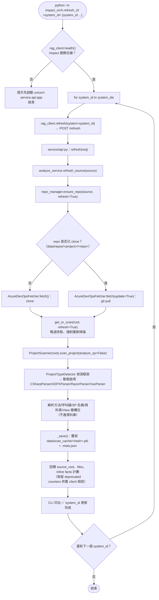

> ⚠️ **常見誤解**：`get_or_scan(refresh=True)` 本身就會**自動覆寫**磁碟快取，不需要手動刪除 `data/scan_cache/*.pkl`。但如果你剛編輯過 `code_analyzer/`／`service/` 底下的解析器程式碼，**已在執行的 uvicorn 服務仍是記憶體裡的舊程式碼**（Python 不會熱重載），必須先重啟服務（或加 `--reload`）才能讓 `refresh_cli` 真正套用新邏輯——這點與快取本身無關，詳見 [使用說明書.md](./使用說明書.md) 的常見問題排除。

[⬆ 回目錄](#-流程圖--變更影響分析系統)

---

## 4. `impact_orch.refresh_sql_cli` 流程（更新 SQL 快取）

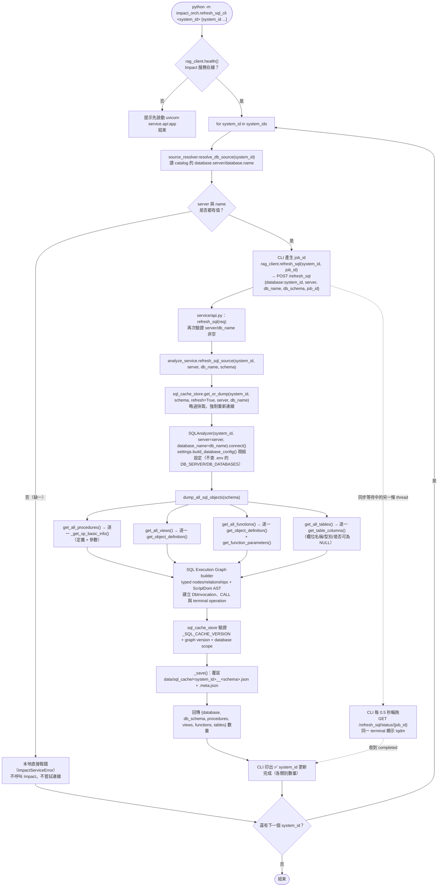

> 💡 之後問問題時，`sp_fetcher.py`／`view_fetcher.py`／`udf_fetcher.py` 讀取已驗證的本機 SQL cache；正式 Graph/path consumer 不會因為缺少某個物件而退回逐物件即時查詢。若 cache 不存在、過期或 database scope 不符，正式 Graph operation 會回報 `sql_execution_graph_required`，而不是猜測 relationship。
>
> 💡 **正式 relationship 的 evidence contract**：`CSharpAnalysisGateway` 將 source invocation 與 Graph node/edge join；`proven` 才能進入 confirmed relationship，`likely` 只能作為 candidate/risk evidence，`unresolved` 必須保留 reason 與 target。未展開的 path 是 uncertainty，不代表不存在。
>
> ⚠️ 資料庫是**多系統共用資源**（不像 git repo 是每個系統各自一份），跟 `refresh_cli`（更新程式碼）是不同軸的更新指令，需要個別觸發；資料庫端的 SP/View/Function 若被直接修改（未經程式碼部署），也需要重跑這支指令才會反映到之後的問答結果。
>
> ⚠️ **`system_id` 不是資料庫名稱**：實際連線目標（`server`/`db_name`）從 catalog 的
> `database.server`/`database.name` 解析。若該系統在 catalog 未設定完整（缺一即算），
> `refresh_sql_cli` 會在**本地**直接報錯、不會呼叫 Impact 服務，避免誤連到錯誤或未知的
> 資料庫；`/analyze` 呼叫的 SP/View/FK 部分則維持「盡力而為」，缺 server/db_name 時安全
> 回空，不會讓整個問答失敗。

[⬆ 回目錄](#-流程圖--變更影響分析系統)

---

## 5. Agentic 模式（模式 3）詳細步驟：AI 介入點

模式 3（`run_impact_analysis_agentic`，位於 spec-rag 端 `impact_orch/orchestrator.py`／`impact_orch/agent_tools.py`，與這個 Impact 服務是分開的兩個 repo）內部其實有 **四種完全不同性質的「AI/模型」角色**，很容易被混為一談。以「TTPUR 恢復刪除訂單」這個真實問題為例，把每一步標注清楚：

| 角色 | 使用的模型 | 是不是真正的「推理判斷」 | 出現在下面哪一步 |
|---|---|---|---|
| 1. Router Agent | `cfg.AGENT_ROUTER_MODEL`（`FunctionAgent`） | ✅ 真的 LLM 推理 | 工具選擇、system scope／澄清判斷與工具參數（包含自己寫出 `ui_action_hint`） |
| 2. Embedding 相似度 | `cfg.OPENAI_EMBEDDING_MODEL`（`text-embedding-3-small`，spec-rag 端 `impact_orch/code_retriever.py`） | ❌ 不是推理，是固定的向量 cosine 相似度計算 | 候選錨點、程式碼片段與畫面區塊挑選 |
| 3. 片段一句話摘要 | `cfg.OPENAI_LOW_MODEL`（便宜模型） | ✅ 是 LLM，但只做摘要不做決策 | SP/View/UDF/前端 script 的「AI 摘要」（`USE_CODE_ANNOTATION=true` 時，圖中未展開） |
| 4. 最終整合答案 | `cfg.OPENAI_MODEL`（`ai_reasoner.reason()`） | ✅✅ 真正做「這是哪個分支/這條鏈才對」的實質判斷 | 完整 context 組裝後 |

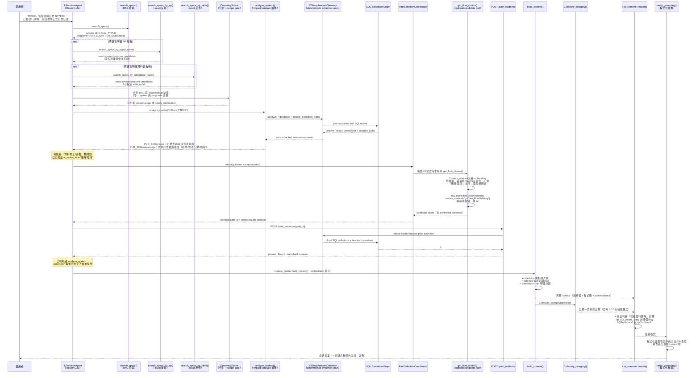

### 逐步文字說明（含程式簡述）

1. **Router Agent 啟動（1.LLM）**：讀完 `_AGENT_SYSTEM_PROMPT` 規則，辨識問題中的畫面/功能/程式、明確 SP、明確資料表等訊號；符合條件的工具可以同時呼叫，不是三選一。
2. **`search_specs()`（RAG 檢索，非 LLM）**：對規格書向量庫檢索，命中〈訂單維護〉規格書，`extract_program_refs()`/`group_by_system()` 萃取出 `system_id="Y-Docs_TTPUR"`，`programs=["PUR_SOQry","PUR_SOMaintain"]`。回傳給 Agent 的只是純文字摘要，還沒有任何程式碼內容。
3. **條件式 exact lookup 與合併（純程式查表）**：若問題明確點名 SP，呼叫 `search_specs_by_sp()`；若明確點名資料表，呼叫 `search_specs_by_table()`。兩者都可與 `search_specs()` 同時使用，結果合併進 `DiscoveryScope` 的 system/program candidates；若 exact lookup 命中多個系統且問題沒有明示 system，先進入澄清，不可直接把同名物件當成同一個系統。
4. **Agent 呼叫 `analyze_system("Y-Docs_TTPUR")`（1.LLM 判斷 + 純靜態查表）**：Impact `/analyze` 回傳這兩支程式的方法/SP/資料表摘要：
   - **`PUR_SOQry.aspx`**：訂單查詢/取消列表畫面（`gvData` 這張 GridView，可查詢、匯出、對單筆訂單按「取消」）。
   - **`PUR_SOMaintain.aspx`**：單筆訂單維護畫面（新增/修改/分納/刪除，含「刪除並新增下筆訂單」按鈕）。
5. **Agent 判斷這是「資料修正/回復」類問題 → 交給 `PathSelectionCoordinator`（1.LLM 決定工具意圖）**：Agent 可提供 `ui_action_hint` 作為候選排序輸入；`get_flow_chains` 只在需要 UI/資料表候選時呼叫，不能直接把候選鏈當成正式 evidence。
   ```python
   get_flow_chains(
       system_id="Y-Docs_TTPUR",
       direction="forward",
       program_name="PUR_SOQry.aspx",
       ui_action_hint="刪除/取消",
   )
   ```
   `ui_action_hint="刪除/取消"` 這幾個字是 Agent 讀完問題後自己寫出來的，不是程式算出來的。
6. **候選排序（2.Embedding，非 LLM）**：取得 `view_layer` 後攤平出候選，`select_relevant(candidates, "刪除/取消", domain="view")` 純用向量相似度排序；embedding 只負責排序，不負責確認 relationship。
7. **`flow_chain`（純靜態組裝，非 AI）**：`rag_client.flow_chain(forward, anchor_method="gvData_RowDeleting")` 可組出 `gvData_RowDeleting → DeleteData → sp_SO_Delete_Edit1` 候選鏈，並標記為 candidate context；它不判斷問題相關性，也不取代 `/path_evidence`。
8. **`PathSelectionCoordinator`（deterministic orchestration）**：依 compact path、candidate chain 與問題狀態選擇 `answer`、`expand` 或 `clarify`；需要精確內容時呼叫 `/path_evidence`，未展開的 path 仍是 uncertainty。
9. **`context_builder` / `finalization` 組裝 context（純程式邏輯，含 2.Embedding 選片段）**：把規格書、程式碼片段、View layer、SQL definitions、selected path evidence 與 candidate chain 分區整理，避免 candidate 被當成 confirmed fact。
10. **`ai_reasoner.classify_category()`（3.低成本 LLM）**：判斷問題屬於哪個分類（本例為「資料修正類」），決定套用哪種回答格式模板。
11. **`ai_reasoner.reason(ctx, question, category)`（4.最終整合 LLM，真正做語意判斷的地方）**：只在完整 context 中解讀 branch condition、欄位與變更建議；它不能把 `likely`/`unresolved` 改寫成 `proven`。
12. **`verify_grounding()`（程式化比對，非 AI）**：把答案裡提到的方法名/SP 名/表名逐一比對 evidence 與 context 中的已知名稱，有對不上的才附加 `⚠️ 落地驗證` 警告區塊。

> 💡 **一句話總結**：Router Agent 決定工具意圖 → deterministic scan/Gateway/Graph 產生 evidence → embedding 只做候選排序 → `PathSelectionCoordinator` 決定回答、展開或澄清 → `/path_evidence` 提供 selected path 的 source-backed details → finalization/最終 LLM 組答案 → grounding 收尾。`proven`、`likely`、`unresolved` 的界線不能由 LLM 改寫。

### `get_flow_chains` 工具：forward／backward 兩種呼叫方向

上面範例只展示了 `direction="forward"`（從畫面操作往下追呼叫鏈，適合「這個按鈕/操作會動到什麼」）。`agent_tools.py` 的 `get_flow_chains` 實際上支援兩種方向，Agent 依問題性質自行選擇（`_AGENT_SYSTEM_PROMPT` 規則 7）：

| 方向 | 觸發時機（規則 7） | 需要的參數 | 內部行為 |
|---|---|---|---|
| `forward` | 使用者問「某個畫面操作／UI 動作」的影響（含「回復/修正」類問題，即使問句是回溯語氣） | `program_name` + Agent 自己判斷的 `ui_action_hint` | 先呼叫 `rag_client.analyze(include_view_layer=True, include_snippets=False)` 取得 `view_layer` → `_flatten_ui_field_events()` 攤平候選（`_GRID_ROW_COMMAND_EVENTS` 處理 GridView 列命令按鈕，見下方說明）→ `select_relevant(domain="view")` 依 `ui_action_hint` 排序，取前 5 名候選 → 逐一呼叫 `rag_client.flow_chain(forward, anchor_method=...)` |
| `backward` | 使用者問「異動某張資料表/欄位」會影響哪些程式（由誰寫入/誰依賴這張表） | `table_name` | 直接呼叫 `rag_client.flow_chain(direction="backward")`，把回傳的每個 `(program, method)` 記錄進 candidate `state.chain_methods` |

兩種方向都只有在**已經對該 system 呼叫過 `analyze_system` 之後**才允許呼叫（規則 7 第一條），且都受 `max_flow_chain_calls` 呼叫次數上限保護。

`_flatten_ui_field_events()` 對 GridView 列命令按鈕的處理（呼應 `Impact_analysis_system.md` 記憶中 2026-07-13 的修復）：一般控制項直接用自己的 `events` 產生候選；但當某個 grid 容器層級的事件屬於 `_GRID_ROW_COMMAND_EVENTS`（`OnRowDeleting`/`OnRowEditing`/`OnRowUpdating`/`OnRowCancelingEdit`/`OnRowCommand`——這類事件語法上只掛在 grid 容器本身，不在按鈕自己的 `events` 裡）時，會把該 grid 底下「有文字但沒有自己事件」的每個欄位（如按鈕 `Text="取消"`）都跟這個容器層級的 handler 配對，合成出「真實按鈕文字 + 真實 handler」的候選——這正是上面範例中 `gvData_RowDeleting` 能被 `ui_action_hint="刪除/取消"` 正確選中的原因。

`get_flow_chains` 的 `cache_only` 判斷邏輯與 `find_by_sp`/`find_by_table` 相同：用 `peek_scan_roots()` + `has_cache()` 逐一檢查該系統**每個**已解析子路徑（多子資料夾系統）是否都已有掃描快取，而非只看 repo 是否已 clone——同樣是為了避免「共用同一個 repo 但不同 `path` 的兄弟系統」誤判為已就緒。

Impact 端對應的是新增的 `POST /flow_chain` 端點（`FlowChainRequest`/`FlowChainResponse`，`direction="forward"` 時驗證 `program_name`/`anchor_method` 必填，`direction="backward"` 時驗證 `table_name` 必填），實際組鏈邏輯在新模組 `service/flow_chain_builder.py`（`build_forward_chain()`/`build_backward_chains()`）——這一段是純靜態組裝，完全不判斷「這條鏈跟問題相不相關」，那個判斷留給 Agent 自己做。

### `build_forward_chain()`：從錨點方法展開到資料表

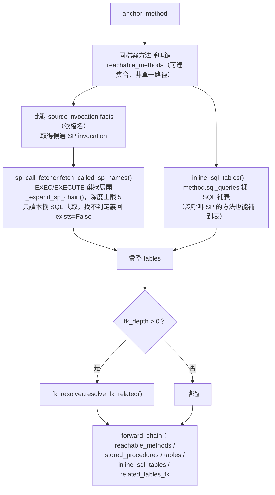

### `build_backward_chains()`：從資料表反查程式與 UI 觸發點

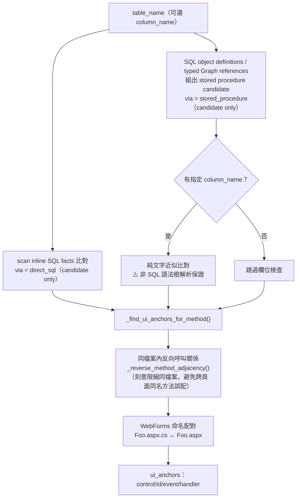

### grounding 同步更新：事件處理方法名稱也算已知名稱

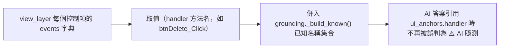

[⬆ 回目錄](#-流程圖--變更影響分析系統)

---

## 6. `find_by_table` 寫入反查（access_type／巢狀路徑／evidence）流程

`/find_by_table`（`service/analyze_service.py` 的 `find_by_table()`）同時處理 C# inline SQL facts 與 database-scoped `SQL Execution Graph`。`query_table_accesses()` 依 typed operation、lineage 與 nested CALL branch 回傳 `access_type`、`path_id` 與 evidence；`proven` 才是 confirmed relationship，`likely`/`unresolved` 只留在 diagnostics 或 candidate context。

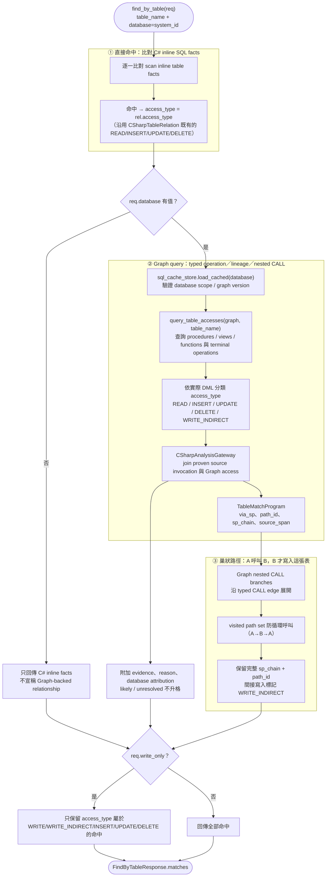

> 💡 **Graph readiness 是查詢前置條件**：`database` 對應的 SQL cache 必須通過 `_SQL_CACHE_VERSION`、Graph version 與 database scope 驗證；缺失或過期時正式 endpoint 回 HTTP `409`、code `sql_execution_graph_required`。`refresh_sql/status/{job_id}` 的 `completed` 只表示 refresh worker 結束，不取代這個 readiness gate。
>
> 💡 **`write_only` 篩選**：C# inline SQL 的 `INSERT`/`UPDATE`/`DELETE` 與 Graph 的 `WRITE`/`WRITE_INDIRECT`/具體 DML operation 都可納入寫入篩選；無法判斷的 evidence 不會因 `write_only` 而被猜成寫入。API 與 spec-rag adapter 可傳 `write_only=True`，CLI/Agent 若未暴露該欄位則維持 `false`。
>
> 💡 **Legacy facts 的位置**：migration comparison 可以保留舊 dependency-shaped records 作為 review artifact，但它們不是正式 SQL cache、Graph relationship、path evidence 或 reverse lookup 的資料來源。`flow_chain` 也只提供 candidate chain；需要 confirmed fact 時必須回到 Gateway + Graph + `/path_evidence`。

[⬆ 回目錄](#-流程圖--變更影響分析系統)
