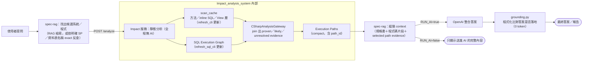
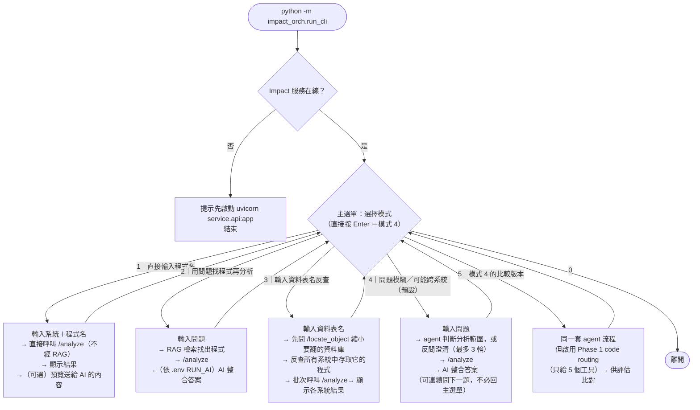
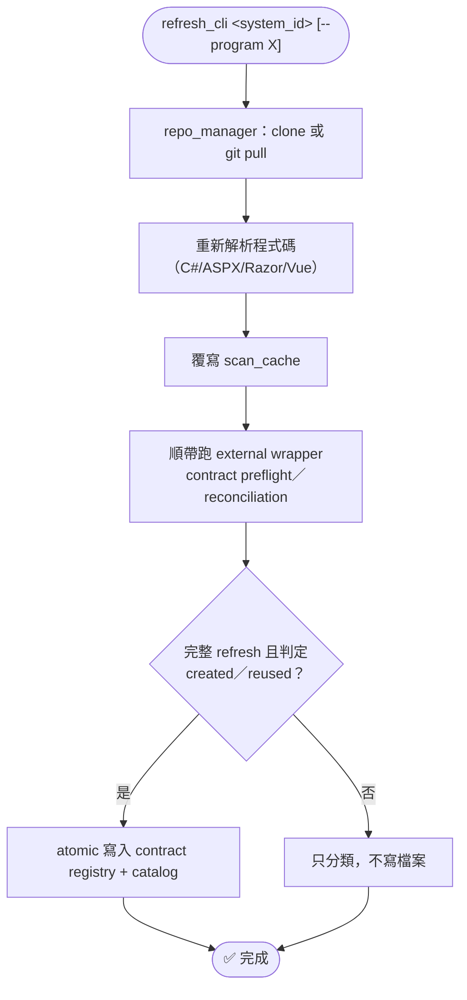
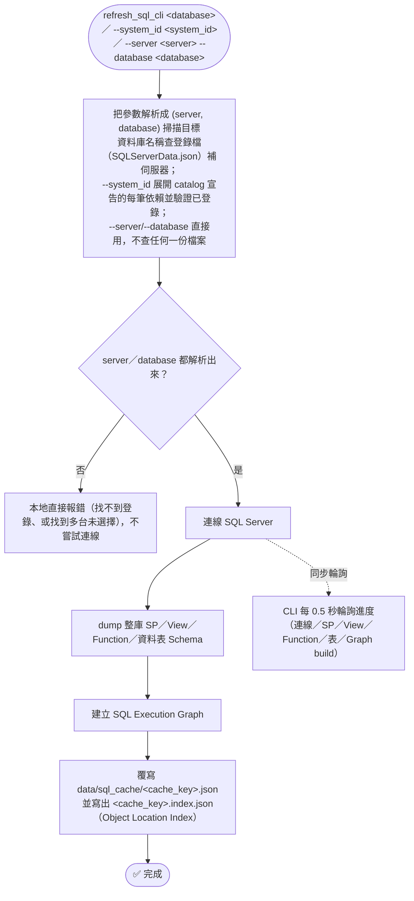

# 🧭 流程圖 — 變更影響分析系統

本文件用 4 張圖說明系統怎麼運作，對應實際程式碼（函式/檔名皆可在原始碼中找到，非示意）。想了解 agentic 模式（模式 4／5）內部逐步的 AI 介入點、`find_by_table` 的巢狀路徑判斷、或 `refresh_cli`/`refresh_sql_cli` 完整的治理細節（external wrapper contract preflight、atomic commit），見 [流程圖_進階.md](./流程圖_進階.md)。

> 🔖 **文件對照基準**：`Impact_analysis_system` 的 `6254661`、`llamaindex-spec-rag` 的 `2bfe29e`（都是 2026-08-31）。見 [使用說明書.md § 文件對照基準](./使用說明書.md#-文件對照基準更新文件前先看這裡)。

1. [整體架構](#1-整體架構)
2. [`impact_orch.run_cli` 五種模式](#2-impact_orchrun_cli-五種模式)
3. [更新程式碼快取：`refresh_cli`](#3-更新程式碼快取refresh_cli)
4. [更新 SQL 快取：`refresh_sql_cli`](#4-更新-sql-快取refresh_sql_cli)

---

## 1. 整體架構

同一次「問問題」裡，資料來自兩個完全獨立的更新軸：**程式碼掃描快取**（`refresh_cli` 才會更新）與 **SQL Execution Graph**（`refresh_sql_cli` 才會更新）。兩者在 `CSharpAnalysisGateway` 這一層 join 起來，只有 `proven` 證據才會形成正式的 confirmed relationship。

> 💡 **多子資料夾系統**：一個 `system_id` 若在 catalog 對應到多個子資料夾（`azure.path` 為 list），Impact 會逐一解析每個子路徑，再合併成一個邏輯上的掃描結果，下游比對邏輯不需感知這是多資料夾組成。
>
> 💡 **agentic 模式（run_cli 模式 4／5）的差異**：不是直接走 RAG 檢索，而是由 `FunctionAgent` 依問題訊號決定要不要呼叫 RAG、SP 反查、資料表反查，符合條件的可以同時呼叫；命中多個系統且問題未明示範圍時，會先反問使用者澄清。詳細步驟見 [流程圖_進階.md](./流程圖_進階.md)。
>
> 💡 **反查前的剪枝**：`/find_by_sp`、`/find_by_table` 在真正逐資料庫發請求之前，spec-rag 會先問一次 `/locate_object`，把要翻的資料庫縮小成 Candidate Database Set（見第 4 節下方說明）。結果一樣，只是少開幾份快取；`/locate_object` 失敗或逾時時自動退回今天的全量查詢。

[⬆ 回目錄](#-流程圖--變更影響分析系統)

---

## 2. `impact_orch.run_cli` 五種模式

> ⚠️ **模式編號已對調**：舊文件的「模式 3＝agent、模式 4＝資料表反查」現在是「模式 3＝資料表反查、模式 4＝agent」，且 agent 模式成為**預設**（直接按 Enter）。這個選擇來自一次 30 題×兩種模式×3 次重複的基準測試（`evaluation/Impact_analysis/`）：兩種模式都沒漏掉必要目標，但模式 4 在多餘候選、澄清正確率、一致性與耗時上全面勝出。
>
> 💡 模式 1、3 完全不經 RAG／AI，是最快的「零 token」路徑；模式 2、4、5 才會用到規格書檢索與（可選的）AI 整合。是否呼叫 AI、是否顯示送進 AI 的完整內容，一律由 spec-rag 的 `.env`（`RUN_AI`／`SEE_AI_PROMPT`）決定，不受模式選擇影響。
>
> 💡 模式 3 命中不只一個系統時只會警告、不會自動判斷是否真的共用同一張表（純字串比對表名，不驗證跨系統 schema 是否相同）；agentic 模式（模式 4／5）遇到同樣情況則會直接反問使用者。
>
> 💡 agentic 模式還會在「一個名稱可能是預存程序、也可能是資料表或程式代號」時停下來反問（Object Kind Ambiguity），在 terminal 裡用上下鍵選、Enter 確認。

[⬆ 回目錄](#-流程圖--變更影響分析系統)

---

## 3. 更新程式碼快取：`refresh_cli`

> ⚠️ `refresh_cli` 本身就會自動覆寫磁碟快取，**不需要手動刪 `data/scan_cache/`**。但若剛編輯過 `code_analyzer/`／`service/` 的解析器程式碼，正在跑的 Impact 服務仍是記憶體裡的舊版本（Python 不會熱重載），必須先重啟服務才能讓 `refresh_cli` 套用新邏輯。
>
> ⚠️ `--program` 局部更新要求該系統所有已解析的子資料夾都已有目前版本的快取，否則會停止並提示先跑一次不帶 `--program` 的完整更新，不會偷偷升級成整包重掃。
>
> 完整的 external wrapper contract 狀態機（`created`/`reused`/`conflicted`/`preflight_failed`）與 atomic two-file commit 細節見 [流程圖_進階.md](./流程圖_進階.md)。

[⬆ 回目錄](#-流程圖--變更影響分析系統)

---

## 4. 更新 SQL 快取：`refresh_sql_cli`

> 📌 位置參數是**資料庫名稱**，不是系統代號：`refresh_sql_cli STC` 掃的是名叫 `STC` 的資料庫，要掃「STC 系統宣告依賴的每個資料庫」請改用 `--system_id STC`。同名資料庫登錄在多台伺服器時會列出候選讓你選；沒有 terminal 時直接報錯並附上可執行的 `--server`/`--database` 指令。三種寫法不能混用。
>
> ⚠️ 資料庫是**多系統共用資源**，跟 `refresh_cli`（每個系統各自的 git repo）是不同軸的獨立更新指令；資料庫端 SP/View/Function 若被直接修改（未經程式部署），需要重跑這支指令才會反映到之後的問答結果。
>
> ⚠️ 進度顯示 `completed` 只代表 refresh worker 正常結束，**不等於**正式查詢已通過 Graph readiness 驗證；若 cache 缺失、過期或 database scope 不符，正式 API 會回 HTTP 409（`sql_execution_graph_required`）。
>
> 💡 每次更新都會順手在快取旁邊寫一張 **Object Location Index**（`<cache_key>.index.json`），記錄這份快取能回答哪些 SP／View／Function 與資料表名稱，讓反查可以跳過確定用不到的資料庫。升級前就存在的舊快取需要跑一次 `python tools\backfill_object_location_indexes.py` 補建（見 [使用說明書.md § 一次性維護指令](./使用說明書.md#-一次性維護指令)）；沒補只會慢，不會錯。

[⬆ 回目錄](#-流程圖--變更影響分析系統)
