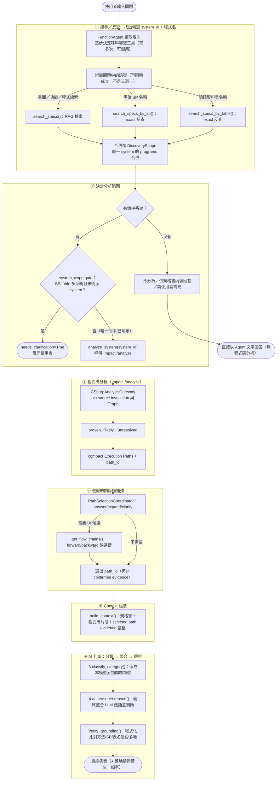
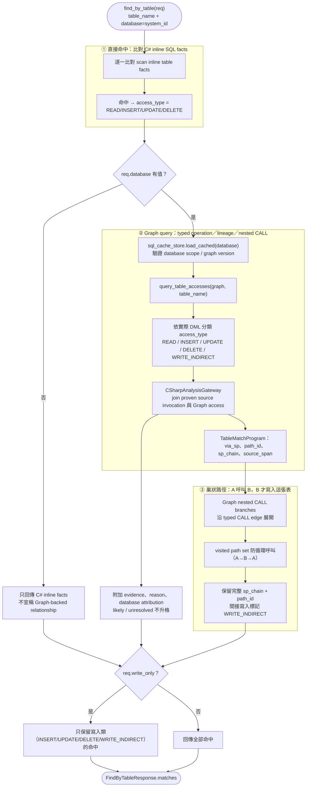

# 🧭 流程圖（進階）— 內部治理與逐步機制

本文件收錄 [流程圖.md](./流程圖.md) 省略的內部細節：`refresh_cli`／`refresh_sql_cli` 完整治理流程、agentic 模式（run_cli 模式 3）逐步的 AI 介入點、`find_by_table` 的讀寫判斷與巢狀路徑機制。日常操作看主文件即可，這裡是給要維護/除錯這套系統的人看的。

1. [`refresh_cli` 完整流程（含 external wrapper contract preflight 與 atomic commit）](#1-refresh_cli-完整流程含-external-wrapper-contract-preflight-與-atomic-commit)
2. [`refresh_sql_cli` 完整流程](#2-refresh_sql_cli-完整流程)
3. [Agentic 模式（run_cli 模式 3）詳細步驟：AI 介入點](#3-agentic-模式run_cli-模式-3詳細步驟ai-介入點)
4. [`find_by_table` 寫入反查（access_type／巢狀路徑／evidence）流程](#4-find_by_table-寫入反查access_type巢狀路徑evidence流程)

---

## 1. `refresh_cli` 完整流程（含 external wrapper contract preflight 與 atomic commit）

```mermaid
flowchart TD
    Start(["python -m impact_orch.refresh_cli &lt;system_id&gt; [system_id ...]"]) --> Health{"rag_client.health()<br/>Impact 服務在線？"}
    Health -- 否 --> Fail["提示先啟動 uvicorn service.api:app<br/>結束"]
    Health -- 是 --> Loop["for system_id in system_ids"]

    Loop --> Call["rag_client.refresh(system=system_id)<br/>→ POST /refresh"]
    Call --> Api["service/api.py：refresh(req)"]
    Api --> RS["analyze_service.refresh_source(source)"]

    RS --> Ensure["repo_manager.ensure_repo(source, refresh=True)"]
    Ensure --> Cloned{"repo 是否已 clone？<br/>（data/repos/&lt;project&gt;/&lt;repo&gt;）"}
    Cloned -- 否 --> Clone["AzureDevOpsFetcher.fetch()：clone"]
    Cloned -- 是 --> Pull["AzureDevOpsFetcher.fetch(update=True)：git pull"]
    Clone --> Scan
    Pull --> Scan

    Scan["get_or_scan(root, refresh=True)<br/>略過快取，強制重新掃描"] --> Parser["ProjectScanner(root).scan_project(analyze_sp=False)"]
    Parser --> Detect["ProjectTypeDetector 偵測框架<br/>→ 動態啟用 CSharpParser/ASPXParser/RazorParser/VueParser"]
    Detect --> Extract["解析方法/呼叫鏈/SP 名稱/資料表/View 層欄位<br/>（不連資料庫）"]
    Extract --> Save["_save()：覆寫 data/scan_cache/&lt;hash&gt;.pkl + .meta.json"]

    Save --> Preflight["run_contract_preflight()<br/>依本次 scans + system 目前設定的 selector 比對 external wrapper contract registry<br/>onboarding_status：selected／not_required／created／reused／conflicted／preflight_failed"]
    Preflight --> Reconcile["reconcile_refresh_wrappers()<br/>用 preflight 判定的 formal selector/registry<br/>分類本次觀察到的 external wrapper 呼叫 → wrapper_summary"]
    Reconcile --> GuardCheck{"完整 system refresh（非 --program 局部更新）<br/>且有 database（system_id）<br/>且 onboarding_status ∈ {created, reused}？"}
    GuardCheck -- 否 --> SkipCommit["contract_transaction = not_required<br/>（不 onboard 新 contract，僅回傳分類結果）"]
    GuardCheck -- 是 --> Commit["commit_staged_contract_transaction()<br/>registry.json + system_catalog.json<br/>atomic two-file commit：先寫 transaction manifest，<br/>依序替換兩個檔案並驗證 hash，任一步失敗即 rollback"]
    SkipCommit --> Resp
    Commit --> Resp["回傳 source_root、files、inline facts 計數、<br/>wrapper_summary、contract_transaction、<br/>analysis_manifest.contract_revision_reference"]
    Resp --> Print["CLI 印出 ✅ system_id 更新完成"]
    Print --> NextCheck{"還有下一個 system_id？"}
    NextCheck -- 是 --> Loop
    NextCheck -- 否 --> End(["結束"])
```



> ⚠️ **常見誤解**：`get_or_scan(refresh=True)` 本身就會**自動覆寫**磁碟快取，不需要手動刪除 `data/scan_cache/*.pkl`。但如果剛編輯過 `code_analyzer/`／`service/` 底下的解析器程式碼，**已在執行的 uvicorn 服務仍是記憶體裡的舊程式碼**（Python 不會熱重載），必須先重啟服務才能讓 `refresh_cli` 真正套用新邏輯。
>
> 💡 **preflight／atomic commit**：`refresh_source()` 每次 refresh 都會跑 contract preflight 與 wrapper reconciliation，不需另外觸發；`onboarding_status=preflight_failed` **不會**讓整個 refresh 失敗，只會讓對應的 wrapper 呼叫留在 unresolved/review，其餘分析照常完成。只有「完整 system refresh（`--program` 局部更新一律不會）＋ 該 system 有 `database`＋ `onboarding_status` 為 `created` 或 `reused`」三個條件同時成立時，才會呼叫 `commit_staged_contract_transaction(trigger="refresh")` 把 staged 的 registry／catalog 正式寫入磁碟。人工的 `accept_external_wrapper_contract.py`（見 [進階手冊.md](./進階手冊.md#external-wrapper-contract-維護)）的 `--apply` 路徑現在也走同一個 `commit_staged_contract_transaction()`，只是傳入 `trigger="manual_acceptance"`——兩條入口在**何時觸發**上仍互不取代（refresh 是「自動偵測到足夠證據就自動沿用/建立」，`accept_*` 工具是「人工審核後明確套用」），但在**如何寫入**兩個檔案這件事上已共用同一套 atomic two-file commit／recovery 機制；manifest 裡的 `trigger` 欄位就是唯一用來分辨是哪條入口寫入的依據。

[⬆ 回目錄](#-流程圖進階--內部治理與逐步機制)

---

## 2. `refresh_sql_cli` 完整流程

```mermaid
flowchart TD
    Start(["python -m impact_orch.refresh_sql_cli &lt;database&gt; [database ...]<br/>／ --system_id &lt;system_id&gt;（可重複）<br/>／ --server &lt;server&gt; --database &lt;database&gt;（三選一，不可混用）"]) --> Health{"rag_client.health()<br/>Impact 服務在線？"}
    Health -- 否 --> Fail["提示先啟動 uvicorn service.api:app<br/>結束"]
    Health -- 是 --> Resolve["resolve_targets()：把命令列參數解析成掃描目標清單"]

    Resolve --> Direct{"給的是<br/>--server／--database？"}
    Direct -- 是 --> DirectTarget["直接用這一組 (server, database)<br/>不查 catalog、不查登錄檔（ADR-0006）"]

    Direct -- 否，給的是資料庫名稱 --> LookupName["source_resolver.resolve_registered_servers(name)<br/>查登錄檔（SQLServerData.json）"]
    LookupName --> NameCount{"登錄在幾台伺服器？"}
    NameCount -- 零台 --> NameErr["❌ TargetResolutionError<br/>附上可直接跑的 --server/--database 指令<br/>（不會順手寫進登錄檔）"]
    NameCount -- 一台 --> NameOne["直接用那一台，不必互動"]
    NameCount -- 多台 --> Tty{"有 terminal？<br/>sys.stdin.isatty()"}
    Tty -- 是 --> Prompt["列出候選（server／database／上次掃描時間<br/>← 惰性呼叫 GET /scan_records，只有這裡才打）<br/>照 (server, database) 排序，讓操作者選一個"]
    Tty -- 否 --> MultiErr["❌ TargetResolutionError<br/>列出每台候選各自可直接跑的指令，改用 --server 指定"]
    Prompt --> NameOne

    Direct -- 否，給的是 --system_id --> Expand["source_resolver.resolve_databases(system_id)<br/>展開該系統宣告依賴的每一筆 {server, name}（ADR-0003）"]
    Expand --> Validate["逐筆呼叫 source_resolver.is_registered(server, name)<br/>核對是否登錄在 SQLServerData.json"]
    Validate --> ValidCheck{"每一筆都登錄過？"}
    ValidCheck -- 否 --> SysErr["❌ TargetResolutionError<br/>點名系統、那筆宣告、登錄檔路徑；不掃描任何一筆"]
    ValidCheck -- 是 --> SysTargets["展開成每筆宣告各自的 (server, name)"]

    DirectTarget --> Loop
    NameOne --> Loop
    SysTargets --> Loop

    Loop["for target in targets"] --> Cred["source_resolver.resolve_scan_credentials(target.server)<br/>讀 uid_env/pwd_env 指名的 .env 變數（ADR-0004）；<br/>半填或讀不到值直接報錯，不退回全域身分"]
    Cred --> Call["rag_client.refresh_sql_database(server, db_name, schema)<br/>→ POST /refresh_sql {database: cache_key(server,db_name,schema), server, db_name, db_schema, db_user_id, db_password, job_id}"]
    Call -.同步等待中的另一條 thread.-> Poll["CLI 每 0.5 秒輪詢<br/>GET /refresh_sql/status/{job_id}<br/>同一 terminal 顯示 tqdm"]

    Call --> Api["service/api.py：refresh_sql(req)<br/>再次驗證 server/db_name 非空"]
    Api --> RS["analyze_service.refresh_sql_source(cache_key, server, db_name, schema, user_id, password)"]

    RS --> Dump["sql_cache_store.get_or_dump(..., refresh=True)<br/>略過快取，強制重新連線"]
    Dump --> Connect["SQLAnalyzer(server=server, database_name=db_name).connect()<br/>settings.build_database_config() 現組設定"]
    Connect --> DumpAll["dump_all_sql_objects(schema)"]

    DumpAll --> P1["get_all_procedures() → 逐一 _get_sp_basic_info()<br/>（定義 + 參數）"]
    P1 --> GraphBuild["SQL Execution Graph builder<br/>typed nodes/relationships + ScriptDom AST<br/>建立 DbInvocation、CALL 與 terminal operation"]
    DumpAll --> P2["get_all_views() → 逐一 get_object_definition()"]
    DumpAll --> P3["get_all_functions() → 逐一 get_object_definition()<br/>+ get_function_parameters()"]
    DumpAll --> P4["get_all_tables() → 逐一 get_table_columns()"]

    P2 --> GraphBuild
    P3 --> GraphBuild
    P4 --> GraphBuild
    GraphBuild --> ValidateCache["sql_cache_store 驗證<br/>_SQL_CACHE_VERSION + graph version + database scope"]
    ValidateCache --> Save

    Save["_save()：覆寫<br/>data/sql_cache/&lt;cache_key&gt;.json + .meta.json"] --> Resp["回傳 {database, db_schema, procedures, views, functions, tables} 數量"]
    Resp --> Print["CLI 印出 ✅ target.label 更新完成（各類別數量）"]
    Poll -.收到 completed.-> Print
    Print --> NextCheck{"還有下一個 target？"}
    NextCheck -- 是 --> Loop
    NextCheck -- 否 --> End(["結束"])
```

> 💡 之後問問題時，`sp_fetcher.py`／`view_fetcher.py`／`udf_fetcher.py` 讀取已驗證的本機 SQL cache；正式 Graph/path consumer 不會因為缺少某個物件而退回逐物件即時查詢。若 cache 不存在、過期或 database scope 不符，正式 Graph operation 會回報 `sql_execution_graph_required`，而不是猜測 relationship。
>
> ⚠️ 資料庫是**多系統共用資源**（不像 git repo 是每個系統各自一份），跟 `refresh_cli`（更新程式碼）是不同軸的更新指令，需要個別觸發。
>
> 📌 **位置參數是資料庫名稱，不是系統代號**（ADR-0006）：`refresh_sql_cli STC` 掃的是名叫 `STC` 的資料庫，要掃「STC 系統宣告依賴的每個資料庫」請改用 `--system_id STC`。三種寫法（資料庫名稱、`--system_id`、`--server`/`--database`）不能混用；`--system_id` 展開前會先核對每筆宣告是否真的登錄過（ADR-0003），核對失敗時不掃描任何一筆。`GET /scan_records`（Impact 端新端點）只在真的要列出多台候選時才會被打一次，一台候選或沒有 terminal 的報錯路徑完全不碰它。

[⬆ 回目錄](#-流程圖進階--內部治理與逐步機制)

---

## 3. Agentic 模式（run_cli 模式 3）詳細步驟：AI 介入點

模式 3（`run_impact_analysis_agentic`，位於 spec-rag 端 `impact_orch/orchestrator.py`／`impact_orch/agent_tools.py`）內部有**四種完全不同性質的「AI/模型」角色**，很容易被混為一談：

| 角色 | 使用的模型 | 是不是真正的「推理判斷」 | 出現在哪一步 |
|---|---|---|---|
| 1. Router Agent | `cfg.AGENT_ROUTER_MODEL`（`FunctionAgent`） | ✅ 真的 LLM 推理 | 工具選擇、system scope／澄清判斷與工具參數 |
| 2. Embedding 相似度 | `cfg.OPENAI_EMBEDDING_MODEL` | ❌ 不是推理，是固定的向量 cosine 相似度計算 | 候選錨點、程式碼片段與畫面區塊挑選 |
| 3. 片段一句話摘要 | `cfg.OPENAI_LOW_MODEL` | ✅ 是 LLM，但只做摘要不做決策 | SP/View/UDF/前端 script 的「AI 摘要」（`USE_CODE_ANNOTATION=true` 時） |
| 4. 最終整合答案 | `cfg.OPENAI_MODEL`（`ai_reasoner.reason()`） | ✅✅ 真正做「這是哪個分支/這條鏈才對」的實質判斷 | 完整 context 組裝後 |



> 💡 **一句話總結**：①②只決定「查哪些系統/程式、要不要反問」，③才第一次真正碰程式碼，④是選配的關係鏈補強，⑤把①③④的產物彙整成一份 context，⑥才是真正的語意判斷發生的地方——`proven`、`likely`、`unresolved` 的界線不能由 LLM 改寫。

### `get_flow_chains`：forward／backward 兩種方向

| 方向 | 觸發時機 | 需要的參數 | 內部行為 |
|---|---|---|---|
| `forward` | 問「某個畫面操作／UI 動作」的影響（含回復/修正類問題） | `program_name` + agent 判斷的 `ui_action_hint` | 取得 `view_layer` → 攤平候選 → embedding 依 `ui_action_hint` 排序取前 5 → 逐一組鏈到 SP/資料表 |
| `backward` | 問「異動某張資料表/欄位」會影響哪些程式 | `table_name` | 直接反查 `(program, method)` 候選 |

兩種方向都只有在**已經對該 system 呼叫過 `analyze_system` 之後**才允許呼叫，且都受 `AGENT_MAX_FLOW_CHAIN_CALLS` 呼叫次數上限保護。`forward` 對 GridView 列命令按鈕（`OnRowDeleting`/`OnRowEditing`/`OnRowUpdating`/`OnRowCancelingEdit`/`OnRowCommand`）有特別處理：這類事件語法上只掛在 grid 容器本身，`_flatten_ui_field_events()` 會把該 grid 底下「有文字但沒有自己事件」的每個欄位（如按鈕文字「取消」）跟容器層級的 handler 配對，合成出「真實按鈕文字 + 真實 handler」的候選。

[⬆ 回目錄](#-流程圖進階--內部治理與逐步機制)

---

## 4. `find_by_table` 寫入反查（access_type／巢狀路徑／evidence）流程

`/find_by_table` 同時處理 C# inline SQL facts 與 database-scoped `SQL Execution Graph`。`query_table_accesses()` 依 typed operation、lineage 與 nested CALL branch 回傳 `access_type`、`path_id` 與 evidence；`proven` 才是 confirmed relationship，`likely`/`unresolved` 只留在 diagnostics 或 candidate context。



> 💡 **Graph readiness 是查詢前置條件**：`database` 對應的 SQL cache 必須通過版本、Graph version 與 database scope 驗證；缺失或過期時正式 endpoint 回 HTTP 409（`sql_execution_graph_required`）。`/refresh_sql/status/{job_id}` 的 `completed` 只表示 refresh worker 結束，不取代這個 readiness gate。
>
> 💡 **`write_only` 篩選**：C# inline SQL 的 `INSERT`/`UPDATE`/`DELETE` 與 Graph 的 `WRITE`/`WRITE_INDIRECT`/具體 DML operation 都可納入寫入篩選；無法判斷的 evidence 不會因 `write_only` 而被猜成寫入。CLI 模式 4 目前不暴露這個開關（維持回傳讀寫命中），API 與 Agent tool 可傳 `write_only=True`。

[⬆ 回目錄](#-流程圖進階--內部治理與逐步機制)
