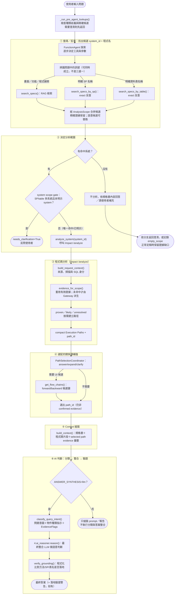
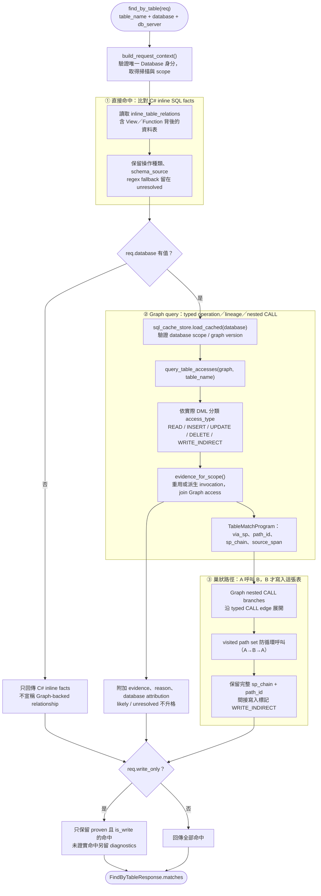
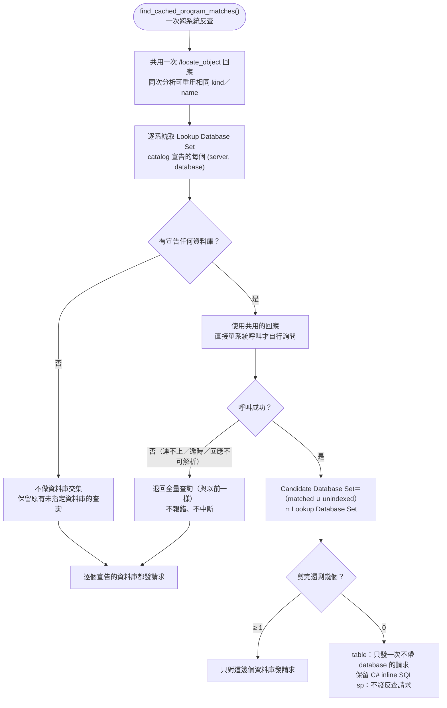
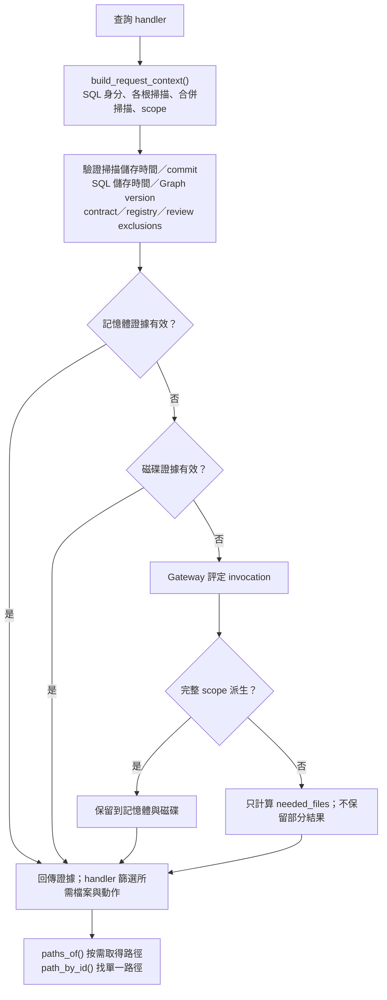

# 🧭 流程圖（進階）— 內部治理與逐步機制

本文件收錄 [流程圖.md](./流程圖.md) 省略的內部細節：`refresh_cli`／`refresh_sql_cli` 完整治理流程、agentic 模式（run_cli 模式 4／5）逐步的 AI 介入點、`find_by_table` 的讀寫判斷與巢狀路徑機制。日常操作看主文件即可，這裡是給要維護/除錯這套系統的人看的。

> 🔖 **文件對照基準**：`Impact_analysis_system` 的 `2308e91`、`llamaindex-spec-rag` 的 `7889375`（都是 2026-10-05）。見 [使用說明書.md § 文件對照基準](./使用說明書.md#-文件對照基準更新文件前先看這裡)。

## 📑 目錄

1. [`refresh_cli` 完整流程（含 external wrapper contract preflight 與 atomic commit）](#1-refresh_cli-完整流程含-external-wrapper-contract-preflight-與-atomic-commit)
2. [`refresh_sql_cli` 完整流程](#2-refresh_sql_cli-完整流程)
3. [Agentic 模式（run_cli 模式 4／5）詳細步驟：AI 介入點](#3-agentic-模式run_cli-模式-45詳細步驟ai-介入點)
4. [`find_by_table` 寫入反查（access_type／巢狀路徑／evidence）流程](#4-find_by_table-寫入反查access_type巢狀路徑evidence流程)

---

## 1. `refresh_cli` 完整流程（含 external wrapper contract preflight 與 atomic commit）

```mermaid
flowchart TD
    Start(["python -m impact_orch.refresh_cli &lt;system_id&gt; [system_id ...]"]) --> Health{"rag_client.health()<br/>Impact 服務在線？"}
    Health -- 否 --> Fail["提示先啟動 uvicorn service.api:app<br/>結束"]
    Health -- 是 --> Loop["for system_id in system_ids"]

    Loop --> Call["rag_client.refresh(system=system_id)<br/>→ POST /refresh"]
    Call --> Api["service/api.py：refresh(req)"]
    Api --> RS["analyze_service.refresh_source(source)"]

    RS --> Ensure["repo_manager.ensure_repo(source, refresh=True)"]
    Ensure --> Cloned{"repo 是否已 clone？<br/>（data/repos/&lt;project&gt;/&lt;repo&gt;）"}
    Cloned -- 否 --> Clone["AzureDevOpsFetcher.fetch()：clone"]
    Cloned -- 是 --> Pull["AzureDevOpsFetcher.fetch(update=True)：git pull"]
    Clone --> Scan
    Pull --> Scan

    Scan["get_or_scan(root, refresh=True)<br/>略過快取，強制重新掃描"] --> Parser["ProjectScanner(root).scan_project(analyze_sp=False)"]
    Parser --> Detect["依實際檔案類型啟用 CSharpParser/ASPXParser/RazorParser/VueParser<br/>ProjectTypeDetector 另回報框架標籤"]
    Detect --> Extract["解析方法/呼叫鏈/SP 名稱/資料表/View 層欄位<br/>（不連資料庫）"]
    Extract --> Save["_save()：覆寫 data/scan_cache/&lt;hash&gt;.pkl + .meta.json"]

    Save --> Decompile["_populate_decompilation_proposals()<br/>完整 refresh 且未設定 selector 才嘗試<br/>按被引用 DLL 產生可驗證的 proposal"]
    Decompile --> Preflight["run_contract_preflight()<br/>依 scans、selector 與 registry 判定<br/>onboarding_status：selected／not_required／created／reused／conflicted／preflight_failed"]
    Preflight --> Reconcile["reconcile_refresh_wrappers()<br/>用 preflight 判定的 formal selector/registry<br/>分類本次觀察到的 external wrapper 呼叫 → wrapper_summary"]
    Reconcile --> GuardCheck{"完整 system refresh（非 --program 局部更新）<br/>且有 database（system_id）<br/>且 onboarding_status ∈ {created, reused}？"}
    GuardCheck -- 否 --> SkipCommit["依停止條件回報 transaction status<br/>program_scope／no_system_id／preflight_failed／not_required"]
    GuardCheck -- 是 --> Commit["commit_staged_contract_transaction()<br/>registry.json + system_catalog.json<br/>atomic two-file commit：先寫 transaction manifest，<br/>依序替換兩個檔案並驗證 hash，任一步失敗即 rollback"]
    SkipCommit --> Resp
    Commit --> Resp["回傳 source_root、files、inline facts 計數、<br/>wrapper_summary、contract_transaction、<br/>analysis_manifest.contract_revision_reference"]
    Resp --> Print["CLI 印出 ✅ system_id 更新完成"]
    Print --> NextCheck{"還有下一個 system_id？"}
    NextCheck -- 是 --> Loop
    NextCheck -- 否 --> End(["結束"])
```

> ⚠️ **常見誤解**：`get_or_scan(refresh=True)` 本身就會**自動覆寫**磁碟快取，不需要手動刪除 `data/scan_cache/*.pkl`。但如果剛編輯過 `code_analyzer/`／`service/` 底下的解析器程式碼，**已在執行的 uvicorn 服務仍是記憶體裡的舊程式碼**（Python 不會熱重載），必須先重啟服務才能讓 `refresh_cli` 真正套用新邏輯。
>
> 💡 **preflight／atomic commit**：`refresh_source()` 每次 refresh 都會跑 contract preflight 與 wrapper reconciliation，不需另外觸發；`onboarding_status=preflight_failed` **不會**讓整個 refresh 失敗，只會讓對應的 wrapper 呼叫留在 unresolved/review，其餘分析照常完成。只有「完整 system refresh（`--program` 局部更新一律不會）＋ 該 system 有 `database`＋ `onboarding_status` 為 `created` 或 `reused`」三個條件同時成立時，才會呼叫 `commit_staged_contract_transaction(trigger="refresh")` 把 staged 的 registry／catalog 正式寫入磁碟。人工的 `accept_external_wrapper_contract.py`（見 [進階手冊.md](./進階手冊.md#external-wrapper-contract-維護)）的 `--apply` 路徑現在也走同一個 `commit_staged_contract_transaction()`，只是傳入 `trigger="manual_acceptance"`——兩條入口在**何時觸發**上仍互不取代（refresh 是「自動偵測到足夠證據就自動沿用/建立」，`accept_*` 工具是「人工審核後明確套用」），但在**如何寫入**兩個檔案這件事上已共用同一套 atomic two-file commit／recovery 機制；manifest 裡的 `trigger` 欄位就是唯一用來分辨是哪條入口寫入的依據。

[⬆ 回目錄](#-目錄)

---

## 2. `refresh_sql_cli` 完整流程

```mermaid
flowchart TD
    Start(["python -m impact_orch.refresh_sql_cli &lt;database&gt; [database ...]<br/>／ --system_id &lt;system_id&gt;（可重複）<br/>／ --server &lt;server&gt; --database &lt;database&gt;（三選一，不可混用）"]) --> Health{"rag_client.health()<br/>Impact 服務在線？"}
    Health -- 否 --> Fail["提示先啟動 uvicorn service.api:app<br/>結束"]
    Health -- 是 --> Resolve["resolve_targets()：把命令列參數解析成掃描目標清單"]

    Resolve --> Direct{"給的是<br/>--server／--database？"}
    Direct -- 是 --> DirectTarget["直接用這一組 (server, database)<br/>不查 catalog、不查登錄檔（ADR-0006）"]

    Direct -- "否，給的是資料庫名稱" --> LookupName["source_resolver.resolve_registered_servers(name)<br/>查登錄檔（SQLServerData.json）"]
    LookupName --> NameCount{"登錄在幾台伺服器？"}
    NameCount -- 零台 --> NameErr["❌ TargetResolutionError<br/>附上可直接跑的 --server/--database 指令<br/>（不會順手寫進登錄檔）"]
    NameCount -- 一台 --> NameOne["直接用那一台，不必互動"]
    NameCount -- 多台 --> Tty{"有 terminal？<br/>sys.stdin.isatty()"}
    Tty -- 是 --> Prompt["列出候選（server／database／上次掃描時間<br/>← 惰性呼叫 GET /scan_records，只有這裡才打）<br/>照 (server, database) 排序，讓操作者選一個"]
    Tty -- 否 --> MultiErr["❌ TargetResolutionError<br/>列出每台候選各自可直接跑的指令，改用 --server 指定"]
    Prompt --> NameOne

    Direct -- "否，給的是 --system_id" --> Expand["source_resolver.resolve_databases(system_id)<br/>展開該系統宣告依賴的每一筆 {server, name}（ADR-0003）"]
    Expand --> Validate["逐筆呼叫 source_resolver.is_registered(server, name)<br/>核對是否登錄在 SQLServerData.json"]
    Validate --> ValidCheck{"每一筆都登錄過？"}
    ValidCheck -- 否 --> SysErr["❌ TargetResolutionError<br/>點名系統、那筆宣告、登錄檔路徑；不掃描任何一筆"]
    ValidCheck -- 是 --> SysTargets["展開成每筆宣告各自的 (server, name)"]

    DirectTarget --> Loop
    NameOne --> Loop
    SysTargets --> Loop

    Loop["for target in targets"] --> Cred["source_resolver.resolve_scan_credentials(target.server)<br/>讀 uid_env/pwd_env 指名的 .env 變數（ADR-0004）；<br/>半填或讀不到值直接報錯，不退回全域身分"]
    Cred --> Call["rag_client.refresh_sql_database(server, db_name)<br/>→ POST /refresh_sql {database: cache_key(server,db_name), server, db_name, db_user_id, db_password, job_id}"]
    Call -.同步等待中的另一條 thread.-> Poll["CLI 每 0.5 秒輪詢<br/>GET /refresh_sql/status/{job_id}<br/>同一 terminal 顯示 tqdm"]

    Call --> Api["service/api.py：refresh_sql(req)<br/>再次驗證 server/db_name 非空"]
    Api --> RS["analyze_service.refresh_sql_source()<br/>建立 CacheIdentity(server, database)<br/>一份涵蓋庫內全部 schema"]

    RS --> Dump["sql_cache_store.get_or_dump(..., refresh=True)<br/>略過快取，強制重新連線"]
    Dump --> Connect["SQLAnalyzer(server=server, database_name=db_name).connect()<br/>settings.build_database_config() 現組設定"]
    Connect --> DumpAll["dump_all_sql_objects()<br/>list_objects() 一次列出每個 schema 的物件"]

    DumpAll --> P1["各 SP（帶自己的 schema）→ 逐一 _get_sp_basic_info()<br/>（定義 + 參數）"]
    P1 --> GraphBuild["SQL Execution Graph builder<br/>typed nodes/relationships + ScriptDom AST<br/>建立 DbInvocation、CALL 與 terminal operation"]
    DumpAll --> P2["各 View → 逐一 get_object_definition()"]
    DumpAll --> P3["各 Function → 逐一 get_object_definition()<br/>+ get_function_parameters()"]
    DumpAll --> P4["各資料表 → 逐一 get_table_columns()"]

    P2 --> GraphBuild
    P3 --> GraphBuild
    P4 --> GraphBuild
    GraphBuild --> Lineage["展開暫存表 lineage（資料來源追蹤）"]
    Lineage --> ValidateCache["sql_cache_store 驗證<br/>_SQL_CACHE_VERSION + graph version + database scope"]
    ValidateCache --> Save

    Save["_save()：覆寫<br/>data/sql_cache/&lt;cache_key&gt;.json + .meta.json<br/>接著建置並寫出 &lt;cache_key&gt;.index.json<br/>（Object Location Index；寫索引失敗不會回滾已成功的快取）"] --> Resp["回傳 {database, procedures, views, functions, tables} 數量"]
    Resp --> Print["CLI 印出 ✅ target.label 更新完成（各類別數量）"]
    Poll -.收到 completed.-> Print
    Print --> NextCheck{"還有下一個 target？"}
    NextCheck -- 是 --> Loop
    NextCheck -- 否 --> End(["結束"])
```

> 💡 之後問問題時，`sp_fetcher.py`／`view_fetcher.py`／`udf_fetcher.py` 讀取已驗證的本機 SQL cache；正式 Graph/path consumer 不會因為缺少某個物件而退回逐物件即時查詢。若 cache 不存在、過期或 database scope 不符，正式 Graph operation 會回報 `sql_execution_graph_required`，而不是猜測 relationship。
>
> ⚠️ 資料庫是**多系統共用資源**（不像 git repo 是每個系統各自一份），跟 `refresh_cli`（更新程式碼）是不同軸的更新指令，需要個別觸發。
>
> 📌 **位置參數是資料庫名稱，不是系統代號**（ADR-0006）：`refresh_sql_cli STC` 掃的是名叫 `STC` 的資料庫，要掃「STC 系統宣告依賴的每個資料庫」請改用 `--system_id STC`。三種寫法（資料庫名稱、`--system_id`、`--server`/`--database`）不能混用；`--system_id` 展開前會先核對每筆宣告是否真的登錄過（ADR-0003），核對失敗時不掃描任何一筆。`GET /scan_records`（Impact 端新端點）只在真的要列出多台候選時才會被打一次，一台候選或沒有 terminal 的報錯路徑完全不碰它。

[⬆ 回目錄](#-目錄)

---

## 3. Agentic 模式（run_cli 模式 4／5）詳細步驟：AI 介入點

模式 4／5 都走 `run_impact_analysis_agentic()`。`AgentRoutingPolicy`（代理路由政策）控制已標記名稱的查詢時機。`AnalysisScope`（分析範圍管理器）控制探索與鎖定。下表使用預設 `SCOPE_LOCK_POLICY=full`。

| 階段 | 模式 4 | 模式 5 |
|------|--------|--------|
| Agent 前置查詢 | 檢查未標記名稱的種類歧義，查明程式檔名 | 同左；另對已標記 SP／資料表執行精確反查 |
| 第一輪工具 | `search_specs`、`search_specs_by_sp`、`search_specs_by_table`、`analyze_system`、`get_flow_chains`、`collect_path_evidence`（6 支） | 移除兩支精確反查工具（4 支） |
| 鎖定後補證據 | 使用獨立 Locked Phase（鎖定階段）agent | 同左；兩模式共用 4 支工具 |

鎖定階段工具為 `search_specs_scoped`、`analyze_system`、`get_flow_chains`、`collect_path_evidence`。`search_specs()` 呼叫 `Chat.retrieve_spec_sources()`，只取得規格書來源，不先生成答案。

內部有**五種完全不同性質的「AI/模型」角色**，很容易被混為一談：

| 角色 | 使用的模型 | 是不是真正的「推理判斷」 | 出現在哪一步 |
|---|---|---|---|
| 1. Router Agent | `cfg.AGENT_ROUTER_MODEL`（`FunctionAgent`） | ✅ 真的 LLM 推理 | 工具選擇、system scope／澄清判斷與工具參數 |
| 2. Embedding 相似度 | `cfg.OPENAI_EMBEDDING_MODEL` | ❌ 不是推理，是固定的向量 cosine 相似度計算 | 候選錪點、程式碼片段、畫面區塊與規格書分段挑選 |
| 3. 片段一句話摘要 | `cfg.OPENAI_LOW_MODEL` | ✅ 是 LLM，但只做摘要不做決策 | SP/View/UDF/前端 script 的「AI 摘要」（`USE_CODE_ANNOTATION=true` 時） |
| 4. 證據充分性裁決 | `cfg.OPENAI_LOW_MODEL` | ✅ 是 LLM，但只判「還缺什麼類型的證據」，不改寫 evidence | 每一輪 agent 跑完之後（見下方證據充分性迴圈） |
| 5. 最終整合答案 | `cfg.OPENAI_MODEL`（`ai_reasoner.reason()`） | ✅✅ 真正做「這是哪個分支/這條鏈才對」的實質判斷 | 完整 context 組裝後 |

Router Agent 始終使用模型。證據裁決由 `SUFFICIENCY_JUDGE` 控制。路徑選擇另由 `PATH_SELECTION` 控制。問題意圖分類與最終整合只在 `ANSWER_SYNTHESIS=llm` 執行。Embedding 與注記另讀各自設定。

```mermaid
flowchart TD
    Q(["使用者輸入問題"]) --> Pre["_run_pre_agent_lookups()<br/>檢查種類歧義與精確候選<br/>需要澄清則先返回"]
    Pre --> Agent["FunctionAgent 探索<br/>逐步決定工具與參數"]

    subgraph S1["① 搜尋／反查：找出候選 system_id + 程式名"]
        Agent --> T1["辨識問題中的訊號（可同時成立，不是三選一）"]
        T1 -->|"畫面／功能／程式線索"| ST1["search_specs()：RAG 檢索"]
        T1 -->|"明確 SP 名稱"| ST2["search_specs_by_sp()：exact 反查"]
        T1 -->|"明確資料表名稱"| ST3["search_specs_by_table()：exact 反查"]
        ST1 --> Merge["經 AnalysisScope 合併候選<br/>精確證據保留；語意候選可替換"]
        ST2 --> Merge
        ST3 --> Merge
    end

    subgraph S2["② 決定分析範圍"]
        Merge --> E{"有命中系統？"}
        E -- 沒有 --> F["不分析，依規格書內容回答／請使用者補充"]
        E -- 有 --> Scope{"system scope gate：<br/>SP/table 多系統且未明示 system？"}
        Scope -- 是 --> I(["needs_clarification=True<br/>反問使用者"])
        Scope -- 否（唯一命中/已明示） --> G["analyze_system(system_id)<br/>呼叫 Impact /analyze"]
    end

    subgraph S3["③ 程式碼分析（Impact /analyze）"]
        G --> Prepare["build_request_context()<br/>來源、掃描與 SQL 身分"]
        Prepare --> Gateway["evidence_for_scope()<br/>重用有效證據；未命中才由 Gateway 派生"]
        Gateway --> Evidence["proven／likely／unresolved<br/>按需建立路徑"]
        Evidence --> Paths["compact Execution Paths + path_id"]
    end

    subgraph S4["④ 選配的關係鏈補強"]
        Paths --> Select["PathSelectionCoordinator：answer/expand/clarify"]
        Select -->|"需要 UI 候選"| Flow["get_flow_chains()：forward/backward 候選鏈"]
        Flow --> L["選出 path_id（仍非 confirmed evidence）"]
        Select -->|"不需要"| L
    end

    subgraph S5["⑤ Context 組裝"]
        L --> BC["build_context()：規格書＋程式碼片段＋selected path evidence 彙整"]
    end

    subgraph S6["⑥ AI 判斷：分類 → 整合 → 驗證"]
        BC --> Synthesis{"ANSWER_SYNTHESIS=llm？"}
        Synthesis -- 是 --> CAT["classify_query_intent()<br/>問題意圖＋物件種類指示＋EvidenceFlags"]
        Synthesis -- 否 --> PromptOnly(["只組裝 prompt／報告<br/>不執行分類與答案整合"])
        CAT --> REASON["4.ai_reasoner.reason()：最終整合 LLM 做語意判斷"]
        REASON --> GROUND["verify_grounding()：程式化比對方法/SP/表名是否落地"]
        GROUND --> OUT(["最終答案（+ 落地驗證警告，如有）"])
    end

    F --> OUT2(["依分支返回澄清，或記錄 empty_scope<br/>正常定稿時保留證據缺口"])
```

> 💡 **一句話總結**：①②只決定「查哪些系統/程式、要不要反問」，③才第一次真正碰程式碼，④是選配的關係鏈補強，⑤把①③④的產物彙整成一份 context，⑥才是真正的語意判斷發生的地方——`proven`、`likely`、`unresolved` 的界線不能由 LLM 改寫。

### 環繞在外的三道閘門

上圖的 ①～⑥ 是「一輪」。實際跑起來還有三道環繞在外面的機制，都在 spec-rag 端，不改變 evidence 判定：

| 機制 | 什麼時候發生 | 做的事 |
|---|---|---|
| **Object Kind Ambiguity（物件種類歧義）** | ① 之前，程式化判斷，不呼叫 agent | 問題裡出現一個沒有標示種類的名稱，而它同時可能是預存程序、資料表或程式代號時，直接列出每一種解讀請使用者選（terminal 用上下鍵，非 terminal 改成輸入關鍵字），不猜、也不同時全查 |
| **Locked Analysis Scope（分析範圍鎖定）** | 預設政策下，第一輪 agent 結束後 | `AnalysisScope.lock()` 保存候選身分。後續使用獨立鎖定階段 agent，只深化既有範圍；backward 範圍外程式記成 Evidence Gap |
| **Evidence Sufficiency Loop（證據充分性迴圈）** | 每一輪 ①～④ 跑完之後 | 用低成本模型判斷「證據夠不夠」；不夠就指出缺哪一類（規格書／C# 原始碼／SP 定義／關係鏈／path evidence），對應到該呼叫的工具，再跑一輪。最多 `AGENT_MAX_SUFFICIENCY_ROUNDS` 輪；某一輪完全沒有新增證據就直接停（不再多花一次裁決） |

> 💡 停止原因（`sufficient`／`round_limit`／`no_progress`／`empty_scope` 等）與每一次 HTTP 重試，都會寫進最終報告末尾的「證據蒐集」附錄，不經過 AI 改寫。查不到的東西會列成 **Evidence Gap**，並附一句「換句話怎麼問」的建議。

`SUFFICIENCY_JUDGE=deterministic` 固定回報足夠，不再追加裁決輪次。跨系統反查與重試也使用同次 `RequestBudget`（請求額度）。額度耗盡時保留已讀結果，並列出未讀系統。未證實命中不會擴大正式範圍。

### `get_flow_chains`：forward／backward 兩種方向

| 方向 | 觸發時機 | 需要的參數 | 內部行為 |
|---|---|---|---|
| `forward` | 問「某個畫面操作／UI 動作」的影響（含回復/修正類問題） | `program_name` + agent 判斷的 `ui_action_hint` | 取得 `view_layer` → 攤平候選 → embedding 依 `ui_action_hint` 排序取前 5 → 逐一組鏈到 SP/資料表 |
| `backward` | 問「異動某張資料表/欄位」會影響哪些程式 | `table_name` | 直接反查 `(program, method)` 候選 |

兩種方向都只有在**已經對該 system 呼叫過 `analyze_system` 之後**才允許呼叫，且都受 `AGENT_MAX_FLOW_CHAIN_CALLS` 呼叫次數上限保護。`forward` 對 GridView 列命令按鈕（`OnRowDeleting`/`OnRowEditing`/`OnRowUpdating`/`OnRowCancelingEdit`/`OnRowCommand`）有特別處理：這類事件語法上只掛在 grid 容器本身，`_flatten_ui_field_events()` 會把該 grid 底下「有文字但沒有自己事件」的每個欄位（如按鈕文字「取消」）跟容器層級的 handler 配對，合成出「真實按鈕文字 + 真實 handler」的候選。

[⬆ 回目錄](#-目錄)

---

## 4. `find_by_table` 寫入反查（access_type／巢狀路徑／evidence）流程

`/find_by_table` 同時處理 C# inline SQL 與資料庫 Graph。`inline_table_relations.py`（內嵌資料表關係模組）提供直接與間接關係。`query_table_accesses()` 查詢 Graph 路徑。回應使用 `evidence_status`；服務同時計算 `is_write`。只有 `proven` 進入正式關係。

```mermaid
flowchart TD
    Start(["find_by_table(req)<br/>table_name + database + db_server"]) --> Prepare["build_request_context()<br/>驗證唯一 Database 身分，取得掃描與 scope"]
    Prepare --> Direct

    subgraph Step1["① 直接命中：比對 C# inline SQL facts"]
        Direct["讀取 inline_table_relations<br/>含 View／Function 背後的資料表"] --> DirectHit["保留操作種類、schema_source<br/>regex fallback 留在 unresolved"]
    end

    DirectHit --> HasDb{"req.database 有值？"}
    HasDb -- 否 --> InlineOnly["只回傳 C# inline facts<br/>不宣稱 Graph-backed relationship"]
    HasDb -- 是 --> LoadCache["sql_cache_store.load_cached(database)<br/>驗證 database scope / graph version"]

    subgraph Step2["② Graph query：typed operation／lineage／nested CALL"]
        LoadCache --> Query["query_table_accesses(graph, table_name)"]
        Query --> Classify["依實際 DML 分類 access_type<br/>READ / INSERT / UPDATE / DELETE / WRITE_INDIRECT"]
        Classify --> Join["evidence_for_scope()<br/>重用或派生 invocation，join Graph access"]
        Join --> HitObjects["TableMatchProgram：via_sp、path_id、sp_chain、source_span"]
    end

    Join --> Evidence["附加 evidence、reason、database attribution<br/>likely / unresolved 不升格"]

    subgraph Step3["③ 巢狀路徑：A 呼叫 B，B 才寫入這張表"]
        HitObjects --> Nested["Graph nested CALL branches<br/>沿 typed CALL edge 展開"]
        Nested --> Visited["visited path set 防循環呼叫（A→B→A）"]
        Visited --> Indirect["保留完整 sp_chain + path_id<br/>間接寫入標記 WRITE_INDIRECT"]
    end

    InlineOnly --> WriteOnly{"req.write_only？"}
    Evidence --> WriteOnly
    Indirect --> WriteOnly
    WriteOnly -- 是 --> Filter["只保留 proven 且 is_write 的命中<br/>未證實命中另留 diagnostics"]
    WriteOnly -- 否 --> AllMatches["回傳全部命中"]
    Filter --> Resp(["FindByTableResponse.matches"])
    AllMatches --> Resp
```

> 💡 **Graph readiness 是查詢前置條件**：`database` 對應的 SQL cache 必須通過版本、Graph version 與 database scope 驗證；缺失或過期時正式 endpoint 回 HTTP 409（`sql_execution_graph_required`）。`/refresh_sql/status/{job_id}` 的 `completed` 只表示 refresh worker 結束，不取代這個 readiness gate。
>
> 💡 **`write_only` 篩選**：C# inline SQL 的 `INSERT`/`UPDATE`/`DELETE` 與 Graph 的 `WRITE`/`WRITE_INDIRECT`/具體 DML operation 都可納入寫入篩選；無法判斷的 evidence 不會因 `write_only` 而被猜成寫入。CLI 模式 3（資料表反查）目前不暴露這個開關（維持回傳讀寫命中），API 與 Agent tool 可傳 `write_only=True`。

### 發請求之前：Candidate Database Set（候選資料庫集合）

上圖是 **一個資料庫** 的處理流程。一個 System 可能宣告好幾個資料庫，舊做法是逐個都發一次請求、逐個都把快取整份讀開（最大一份約 105 MB）。現在 spec-rag 先做一步剪枝：

```mermaid
flowchart TD
    Q(["find_cached_program_matches()<br/>一次跨系統反查"]) --> Shared["共用一次 /locate_object 回應<br/>同次分析可重用相同 kind／name"]
    Shared --> Declared["逐系統取 Lookup Database Set<br/>catalog 宣告的每個 (server, database)"]
    Declared --> Empty{"有宣告任何資料庫？"}
    Empty -- 否 --> AsIs["不做資料庫交集<br/>保留原有未指定資料庫的查詢"]
    Empty -- 是 --> Locate["使用共用的回應<br/>直接單系統呼叫才自行詢問"]
    Locate --> Fail{"呼叫成功？"}
    Fail -- "否（連不上／逾時／回應不可解析）" --> AsIs2["退回全量查詢（與以前一樣）<br/>不報錯、不中斷"]
    Fail -- 是 --> Intersect["Candidate Database Set＝<br/>（matched ∪ unindexed）∩ Lookup Database Set"]
    Intersect --> Pruned{"剪完還剩幾個？"}
    Pruned -- "≥ 1" --> Fan["只對這幾個資料庫發請求"]
    Pruned -- "0" --> InlineOne["table：只發一次不帶 database 的請求<br/>保留 C# inline SQL<br/>sp：不發反查請求"]
    AsIs --> Fan2["逐個宣告的資料庫都發請求"]
    AsIs2 --> Fan2
```

> 💡 **剪枝是權威的，但只會變慢不會變錯**：`/locate_object` 只看 Object Location Index，完全不開 SQL 快取。`matched`＝索引新鮮且持有這個名稱；`unindexed`＝索引缺席／過期／版本不符，服務不能代答，必須整份讀；**兩份都沒出現的資料庫才是真的被剪掉**。索引建立時寧可多報不可少報，所以一份過期的索引只會少剪一點（多讀一份快取），不會把真正的答案剪掉。見 `docs/adr/0012-object-location-index-authoritative-pruning.md`。

### 服務端的派生證據重用

`derived_execution_evidence.evidence_for_scope()` 管理 Derived Execution Evidence（派生執行證據）。五條查詢共用它：`analyze`、`find_by_sp`、`find_by_table`、`flow_chain`、`get_path_evidence`。

```mermaid
flowchart TD
    Request["查詢 handler"] --> Context["build_request_context()<br/>SQL 身分、各根掃描、合併掃描、scope"]
    Context --> Stamp["驗證掃描儲存時間／commit<br/>SQL 儲存時間／Graph version<br/>contract／registry／review exclusions"]
    Stamp --> Memory{"記憶體證據有效？"}
    Memory -- 是 --> Serve["回傳證據；handler 篩選所需檔案與動作"]
    Memory -- 否 --> Disk{"磁碟證據有效？"}
    Disk -- 是 --> Serve
    Disk -- 否 --> Rate["Gateway 評定 invocation"]
    Rate --> Full{"完整 scope 派生？"}
    Full -- 是 --> Store["保留到記憶體與磁碟"]
    Full -- 否 --> Partial["只計算 needed_files；不保留部分結果"]
    Store --> Serve
    Partial --> Serve
    Serve --> Paths["paths_of() 按需取得路徑<br/>path_by_id() 找單一路徑"]
```

`refresh=True` 跳過兩層重用。程式碼、SQL 或治理設定改變時，舊證據失效。記憶體採 LRU（優先淘汰最久未使用資料）；預設保留 100 個 scope。磁碟重用可跨服務重啟。

[⬆ 回目錄](#-目錄)
